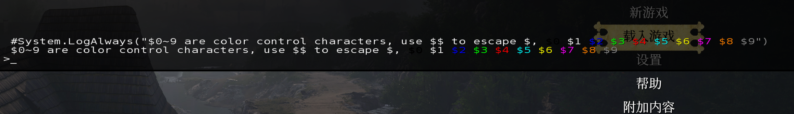

# Console

## Console Color


## Console Commands

### `System.AddCCommand`
[中文](#中文)
```cpp
int AddCCommand(IFunctionHandler* pH);
System.AddCCommand(sCCommandName, sCommand, sHelp)

//! <param name="sCCommandName">Command name to be registered.</param>
//! <param name="sCommand">Command string with placeholders for dynamic parameter substitution.</param>
//! <param name="sHelp">Help string, will be displayed when typing in console "command ?"</param>
```
#### Parameters in `sCommand`
Three placeholder types are supported:

1. **Global Argument List (`%%`)**
    - Replaced with a comma-separated, **quoted** list of all parameters from the second argument onward (index `1`).
    - Example: `args = ["cmd", "a", "b"]` → `"a","b"`.

2. **Inline Text Replacement (`%line`)**
    - Replaced with the substring **after the first space** in the input string `str`, wrapped in quotes.
      If `args.size() ≤ 1`, it is replaced with an empty string.
    - Example: `str = "command sample text"` → `"sample text"` (requires `args` to have additional parameters).

3. **Positional Arguments (`%1`, `%2`, ...)**
    - Replaced with the corresponding parameter in `args` (quoted). Mismatched counts trigger warnings:
        - Too many arguments: `ConsoleWarning("Too many arguments...")`.
        - Too few arguments: `ConsoleWarning("Not enough arguments...")`.
    - Example: `%1` → `"arg1"` if `args[1] = "arg1"`.

#### Example
```cpp
// Usage: "mycommand arg1 arg2"
System.AddCCommand("mycommand", "Script.Func(%%);"); // Expands to Script.Func("arg1","arg2");
```

#### Notes
- **Script Execution**: The final command string is executed via `ExecuteBuffer(...)`.
- **Lua Escape Handling**: `string.format` will escape the string for Lua, so you need to escape `%` with `%%` in the command string, 
  e.g., `System.AddCCommand(cmdName, string.format("CmdTool.commands[\"%s\"].proxy(%%%%)", cmdName), cmd.help())`

### `System.AddCCommand`
<a name="中文"></a>
```cpp
int AddCCommand(IFunctionHandler* pH);
System.AddCCommand(sCCommandName, sCommand, sHelp)

//! <param name="sCCommandName">要注册的命令名称。</param>
//! <param name="sCommand">带有占位符的命令字符串，用于动态参数替换。</param>
//! <param name="sHelp">帮助字符串，当在控制台输入“command ?”时会显示。</param>
```
#### `sCommand` 中的参数替换规则
支持以下三种占位符：

1. **全局参数列表 (`%%`)**
    - 替换为从第二个参数（索引 `1`）开始的所有参数组成的**双引号包裹**、逗号分隔的字符串。
    - 示例：`args = ["cmd", "a", "b"]` → `"a","b"`。

2. **行内文本替换 (`%line`)**
    - 替换为输入字符串 `str` 中**第一个空格后的内容**（包裹双引号）。若参数不足（`args.size() ≤ 1`），替换为空字符串。
    - 示例：`str = "command 示例文本"` → `"示例文本"`（需 `args` 有额外参数时生效）。

3. **位置参数 (`%1`, `%2`, ...)**
    - 替换为 `args` 中对应位置的参数（双引号包裹）。占位符与参数数量不匹配时触发警告：
        - 参数过多：`ConsoleWarning("Too many arguments...")`。
        - 参数不足：`ConsoleWarning("Not enough arguments...")`。
    - 示例：`%1` → `"参数1"`（若 `args[1] = "参数1"`）。

#### 示例
```cpp
// 调用："mycommand 参数1 参数2"
System.AddCCommand("mycommand", "Script.Func(%%);"); // 展开为 Script.Func("参数1","参数2");
```

#### 注意事项
- **脚本执行**：最终生成的命令字符串通过 `ExecuteBuffer(...)` 执行。
- **Lua 转义处理**：`string.format` 会对字符串进行 Lua 转义，因此你需要在命令字符串中使用 `%%` 来转义 `%`，
  例如：`System.AddCCommand(cmdName, string.format("CmdTool.commands[\"%s\"].proxy(%%%%)", cmdName), cmd.help())`