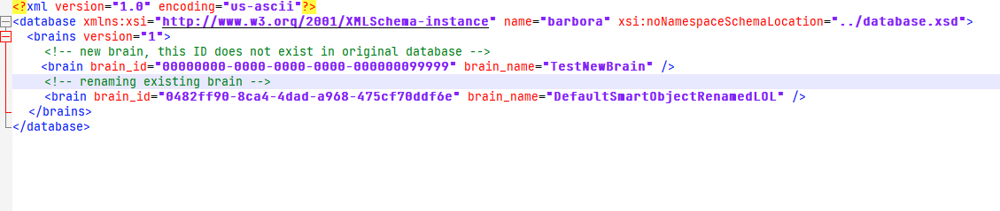
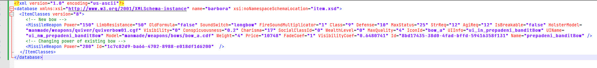
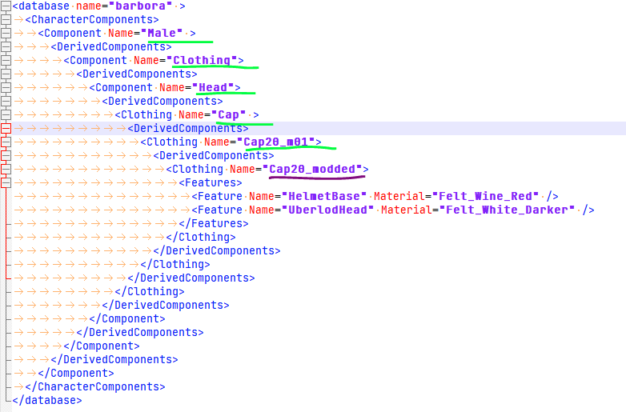

# Database tables
KCD2 uses a database of 300+ tables to hold most of the game data - items, buffs, perks, NPCs, etc... (see below for full list). These tables are loaded on startup and can never change during gameplay.
For organizational purposes, tables can be split into multiple parts, which is then called *tableName__partName.xml*. These table parts are loaded together with the table (order in which they are loaded doesn't matter).
As all game files, tables, and even table parts, can be overwritten by placing identically named file in the mod. However, since many mods need to modify the same tables, this would create conflicts. Therefore we created a special process for patching a table - surgically modifying only a tiny part of the table.

## Patching tables

Patching tables uses the same file format and naming scheme as table parts., except the table part name is identical to **modid**. Such table part is then reffered to as "table patch". Table patches are loaded after all regular table parts are loaded, and are loaded in exact order - the loading order of mods, specified by mod_order.txt.
There is one more difference - normal table parts must contain only new entires, while table patches can contain entries with same primary keys as the original table. When this happens, the entry is not added, but replaces (or changes) the original entry. How exactly this works depends on table type.

## Old tables

Simple table format used in KCD1, still used for many tables that didn't change since then. It has a flat structure - each file has just a list of table rows. Relations between tables are handled by junction tables.
If patching an old table, the table patch must contain the entire row - all properties, even those that the mod doesn't change.

## New tables

These are new tables we changed in KCD2. They allow for more complex data structures (lists, maps) directly in one file, without the need for junction tables. Also it is possible for each row to be of different data type (e.g. weapons and armors in same item table - they have some common properties, and some that are unique for each type).
When patching new table, the entry only needs to have the primary key, and properties that the mod wishes to change. For whatever properties, that are not specified, the value from base game is used (or previously loaded mod, if multiple mods change same table entry).

Some tables also contain lists, that can be patched on per-item basis, notably the CharacterComponent table, which defines all clothing and armor in game. When patching such list, the original list is retained and new entires are added to the end of the list.

(Existing primary keys in green, new unique primary key in purple)

## Other tables

Some tables don't support patching at all. You can still replace the entire file, but this will clash with any other mods that change the same file. Other tables should not be changed at all - some of their values are hardcored in game, and if values in database differ from the ones in code, it will likely introduce bugs. Finally, some tables are left over from previous game, or cut features, and are not used by game at all.

## Full list of tables and their types

| table name | table type |
| --- | --- |
| 	action/actor_action_fragment_id_mapping	 | 	old	 |
| 	action/actor_action_standup	 | 	old	 |
| 	action/actor_action_transition_to_combat	 | 	old	 |
| 	action/actor_action_type	 | 	do not change	 |
| 	action/actor_action_type_group	 | 	old	 |
| 	action/actor_anim_action	 | 	old	 |
| 	action/actor_side	 | 	do not change	 |
| 	action/actor_state	 | 	old	 |
| 	action/ActorStanceGroups	 | 	new	 |
| 	action/dog_action	 | 	old	 |
| 	action/hit_reaction	 | 	old	 |
| 	action/hit_reaction_type	 | 	do not change	 |
| 	ai/ai_body	 | 	old	 |
| 	ai/ai_body2brain_sensor	 | 	unused	 |
| 	ai/ai_body2npc_reference_point	 | 	unused	 |
| 	ai/ai_enums	 | 	new	 |
| 	ai/ai_types	 | 	new	 |
| 	ai/ai_variable_form	 | 	do not change	 |
| 	ai/ai_variable_sync	 | 	do not change	 |
| 	ai/AIConceptSignalDatabase	 | 	new, supported since 1.2	 |
| 	ai/brain	 | 	old	 |
| 	ai/brain_interpreter	 | 	unused	 |
| 	ai/brain_interpreter_type	 | 	unused	 |
| 	ai/brain_interpreter2brain_message_type	 | 	unused	 |
| 	ai/brain_message_type	 | 	unused	 |
| 	ai/brain_sensor	 | 	unused	 |
| 	ai/brain_sensor_type	 | 	unused	 |
| 	ai/brain_variable	 | 	old	 |
| 	ai/brain2brain_interpreter	 | 	unused	 |
| 	ai/brain2mailbox	 | 	old	 |
| 	ai/brain2mainbox	 | 	old	 |
| 	ai/brain2subbrain	 | 	old	 |
| 	ai/DecisionLabelDatabase	 | 	new	 |
| 	ai/DeltaMovementParamsDatabase	 | 	new	 |
| 	ai/DoorAnimSetDatabase	 | 	unsupported, must replace whole	 |
| 	ai/EventSet	 | 	new	 |
| 	ai/mailbox	 | 	old	 |
| 	ai/mailbox_action_type	 | 	do not change	 |
| 	ai/mailbox_filter	 | 	old	 |
| 	ai/mailbox_group	 | 	old	 |
| 	ai/mailbox_group2mailbox	 | 	old	 |
| 	ai/npc_reference_point	 | 	unused	 |
| 	ai/NPCStateActionDatabase	 | 	unsupported, must replace whole	 |
| 	ai/NPCStateAnyElementPresetDatabase	 | 	new	 |
| 	ai/NPCStateStanceAnimDatabase	 | 	unsupported, must replace whole	 |
| 	ai/NPCStateUnstanceDatabase	 | 	new	 |
| 	ai/NPCStateUnstanceTransitionDatabase	 | 	unsupported, must replace whole	 |
| 	ai/positioning_shape	 | 	old	 |
| 	ai/positioning_vertex	 | 	old	 |
| 	ai/ScriptContext	 | 	new	 |
| 	ai/ScriptContextPreset	 | 	new	 |
| 	ai/ScriptParams	 | 	new	 |
| 	ai/se_condition_type	 | 	do not change	 |
| 	ai/SchedulerAlias	 | 	new	 |
| 	ai/Signature	 | 	new	 |
| 	ai/situation	 | 	old	 |
| 	ai/situation_frequency	 | 	old	 |
| 	ai/situation_global_condition	 | 	old	 |
| 	ai/situation_role	 | 	old	 |
| 	ai/situation_role_behavior	 | 	old	 |
| 	ai/situation_role_condition	 | 	old	 |
| 	ai/situation_variant	 | 	old	 |
| 	ai/subbrain	 | 	old	 |
| 	ai/subbrain_behaviour_tree	 | 	old	 |
| 	ai/subbrain_dialog	 | 	old	 |
| 	ai/subbrain_situation	 | 	old	 |
| 	ai/subbrain_smart_area	 | 	old	 |
| 	ai/subbrain_smart_object	 | 	old	 |
| 	ai/subbrain_switching	 | 	old	 |
| 	ai/subbrain_type	 | 	do not change	 |
| 	ai/smartentity/smartEntity	 | 	new	 |
| 	animation/ai_fragment_exclude	 | 	old	 |
| 	animation/anim_fragment	 | 	old	 |
| 	animation/anim_fragment_do_not_interrupt	 | 	unused	 |
| 	animation/anim_fragment_events	 | 	unsupported, must replace whole	 |
| 	animation/FragmentIdleStateDatabase	 | 	unsupported, must replace whole	 |
| 	animation/jump	 | 	old	 |
| 	animation/ladder	 | 	old	 |
| 	animation/picking	 | 	old	 |
| 	combat/CombatAnimationStep	 | 	unsupported, must replace whole	 |
| 	combat/CombatCombos	 | 	unsupported, must replace whole	 |
| 	combat/combat_action_fragment_id_mapping	 | 	old	 |
| 	combat/combat_action_trigger	 | 	old	 |
| 	combat/combat_action_type	 | 	old	 |
| 	combat/combat_action_type_group	 | 	old	 |
| 	combat/combat_action_type_mapping	 | 	old	 |
| 	combat/combat_attack_config	 | 	old	 |
| 	combat/combat_attack_hit_statistics	 | 	old	 |
| 	combat/combat_attack_type	 | 	old	 |
| 	combat/combat_attack_type_tag	 | 	old	 |
| 	combat/combat_damage_type_mapping	 | 	old	 |
| 	combat/combat_death_action_type_mapping	 | 	unsupported, must replace whole	 |
| 	combat/combat_fragment_meta	 | 	unsupported, must replace whole	 |
| 	combat/combat_guard_stance	 | 	old	 |
| 	combat/combat_guard_type	 | 	old	 |
| 	combat/combat_hit_origin	 | 	old	 |
| 	combat/combat_hit_type	 | 	old	 |
| 	combat/combat_input_class	 | 	old	 |
| 	combat/combat_native_guard_zone	 | 	unsupported, must replace whole	 |
| 	combat/combat_riposte_chain	 | 	unused	 |
| 	combat/combat_riposte_chain_step	 | 	unused	 |
| 	combat/combat_side	 | 	old	 |
| 	combat/combat_tag	 | 	do not change	 |
| 	combat/combat_weapon_combination	 | 	unsupported, must replace whole	 |
| 	combat/combat_weapon_group	 | 	old	 |
| 	combat/combat_weapon_group_to_class	 | 	old	 |
| 	combat/combat_zone	 | 	do not change	 |
| 	combat/combat_zone_config	 | 	old	 |
| 	combat/combat_zone_distance	 | 	old	 |
| 	combat/combat_zone_mapping	 | 	unsupported, must replace whole	 |
| 	combat/combat_zone_tag	 | 	unsupported, must replace whole	 |
| 	ControllerFeedback/TriggerEffects	 | 	unsupported, must replace whole	 |
| 	GameAudio/SkaldAtlRtpc	 | 	unsupported, must replace whole	 |
| 	GameAudio/SkaldAtlTrigger	 | 	unsupported, must replace whole	 |
| 	character/bloodMask	 | 	new, supported since 1.2	 |
| 	character/ClothingConfig	 | 	new, supported since 1.2	 |
| 	character/ClothingFeature	 | 	new	 |
| 	character/ClothingHidingGroup	 | 	new, supported since 1.2	 |
| 	character/ClothingMaterial	 | 	new, supported since 1.2	 |
| 	character/ClothingMorph	 | 	new, supported since 1.2	 |
| 	character/CharacterComponent	 | 	new	 |
| 	character/CharacterUberlod	 | 	unsupported, must replace whole	 |
| 	item/clothing_preset	 | 	new	 |
| 	item/InventoryPreset	 | 	new	 |
| 	item/item	 | 	new	 |
| 	item/ItemManipulationType	 | 	new	 |
| 	item/weapon_class	 | 	new	 |
| 	item/weapon_preset	 | 	new	 |
| 	item/ammo_class	 | 	do not change	 |
| 	item/armor_archetype	 | 	old	 |
| 	item/armor_archetype2body_subpart	 | 	old	 |
| 	item/armor_surface	 | 	do not change	 |
| 	item/armor_type	 | 	old	 |
| 	item/attachment_slot	 | 	old	 |
| 	item/body_layer	 | 	old	 |
| 	item/body_layer_type	 | 	do not change	 |
| 	item/body_material2subpart	 | 	old	 |
| 	item/body_part	 | 	old	 |
| 	item/body_subpart	 | 	old	 |
| 	item/carry_item_piles	 | 	unsupported, must replace whole	 |
| 	item/crafting_material_subtype	 | 	old	 |
| 	item/crafting_material_type	 | 	old	 |
| 	item/dice_badge_subtype	 | 	old	 |
| 	item/dice_badge_type	 | 	old	 |
| 	item/document_class	 | 	old	 |
| 	item/DocumentVisualCategory	 | 	do not change	 |
| 	item/equipment_part	 | 	old	 |
| 	item/equipment_slot	 | 	unsupported, must replace whole	 |
| 	item/EquipmentPresetFilter	 | 	unsupported, must replace whole	 |
| 	item/food_subtype	 | 	old	 |
| 	item/food_type	 | 	old	 |
| 	item/key_subtype	 | 	unused	 |
| 	item/key_type	 | 	unused	 |
| 	item/misc_subtype	 | 	old	 |
| 	item/misc_type	 | 	old	 |
| 	item/npc_tool_subtype	 | 	old	 |
| 	item/npc_tool_type	 | 	old	 |
| 	item/ointment_item_subtype	 | 	old	 |
| 	item/ointment_item_type	 | 	old	 |
| 	item/pickable_area_desc	 | 	old	 |
| 	item/pickable_area_material	 | 	old	 |
| 	item/weapon_attachment_slot	 | 	do not change	 |
| 	item/weapon_attachment_slot_category	 | 	do not change	 |
| 	item/weapon_sub_class	 | 	old	 |
| 	LEVEL/catwaypoints	 | 	new	 |
| 	LEVEL/dogpoints	 | 	new	 |
| 	LEVEL/scheduler	 | 	new	 |
| 	LEVEL/smartobjectanimations	 | 	new	 |
| 	LEVEL/weatherprofiles	 | 	new	 |
| 	minigame/AlchemyCrushableSpecialIngredient	 | 	new	 |
| 	minigame/AlchemyFeedback	 | 	new	 |
| 	minigame/AlchemyPotionBase	 | 	unsupported, must replace whole	 |
| 	minigame/AlchemyRecipe	 | 	new	 |
| 	minigame/AlchemyRecipeStepType	 | 	unsupported, must replace whole	 |
| 	minigame/BlacksmithRecipes	 | 	new	 |
| 	minigame/BlacksmithWorkpieces	 | 	new	 |
| 	music/blacksmith	 | 	unsupported, must replace whole	 |
| 	music/music_address_keyword	 | 	unsupported, must replace whole	 |
| 	music/music_matrix	 | 	unsupported, must replace whole	 |
| 	music/music_world_quantity	 | 	unsupported, must replace whole	 |
| 	music/music_world_state_toggle	 | 	unsupported, must replace whole	 |
| 	music/PostProcessPreset	 | 	unused	 |
| 	prefab/prefab_phase	 | 	old	 |
| 	prefab/prefab_phase_category	 | 	old	 |
| 	RandomEvent/RandomEventOption	 | 	new	 |
| 	RandomEvent/RandomEventOptionSet	 | 	new	 |
| 	RandomEvent/RandomEventTag	 | 	new	 |
| 	rpg/angriness_enum	 | 	old	 |
| 	rpg/angriness_flag	 | 	old	 |
| 	rpg/renown_flag	 | 	old	 |
| 	rpg/nervousness_flag	 | 	old	 |
| 	rpg/relationship_flag	 | 	old	 |
| 	rpg/angriness_type	 | 	do not change	 |
| 	rpg/barber_option	 | 	old	 |
| 	rpg/buff	 | 	old	 |
| 	rpg/buff_ai_tag	 | 	new, supported since 1.2	 |
| 	rpg/buff_class	 | 	old	 |
| 	rpg/buff_exclusivity	 | 	do not change	 |
| 	rpg/buff_family	 | 	unused	 |
| 	rpg/buff_implementation	 | 	do not change	 |
| 	rpg/buff_lifetime	 | 	do not change	 |
| 	rpg/buff_ui_type	 | 	unused	 |
| 	rpg/buff_ui_visibility	 | 	do not change	 |
| 	rpg/combat_shout_type	 | 	old	 |
| 	rpg/companion_type	 | 	do not change	 |
| 	rpg/crime	 | 	new, supported since 1.2	 |
| 	rpg/dialogue_sequence_type_reward	 | 	old	 |
| 	rpg/document_required_skill	 | 	old	 |
| 	rpg/document_requirement	 | 	old	 |
| 	rpg/document_reward	 | 	old	 |
| 	rpg/document_reward_perks	 | 	old	 |
| 	rpg/DocumentRarities	 | 	new, supported since 1.2	 |
| 	rpg/faction_label	 | 	old	 |
| 	rpg/FactionTree	 | 	new, supported since 1.2	 |
| 	rpg/game_over	 | 	old	 |
| 	rpg/game_over_type	 | 	do not change	 |
| 	rpg/gender	 | 	do not change	 |
| 	rpg/horse_irritation	 | 	old	 |
| 	rpg/hunting_role	 | 	do not change	 |
| 	rpg/location	 | 	old	 |
| 	rpg/location_category	 | 	do not change	 |
| 	rpg/location2perk	 | 	old	 |
| 	rpg/metarole	 | 	old	 |
| 	rpg/money_change	 | 	unsupported, must replace whole	 |
| 	rpg/morale_change	 | 	old	 |
| 	rpg/perk	 | 	old	 |
| 	rpg/perk_buff	 | 	old	 |
| 	rpg/perk_buff_override	 | 	old	 |
| 	rpg/perk_codex	 | 	old	 |
| 	rpg/perk_combat_technique	 | 	old	 |
| 	rpg/perk_companion	 | 	old	 |
| 	rpg/perk_recipe	 | 	old	 |
| 	rpg/perk_rpg_param_override	 | 	old	 |
| 	rpg/perk_script	 | 	old	 |
| 	rpg/perk_soul_ability	 | 	old	 |
| 	rpg/perk_visibility	 | 	do not change	 |
| 	rpg/perk2perk_exclusivity	 | 	old	 |
| 	rpg/poi_type	 | 	old	 |
| 	rpg/poi_type2perk	 | 	old	 |
| 	rpg/race	 | 	do not change	 |
| 	rpg/reading_spot_type	 | 	old	 |
| 	rpg/relationship_flag	 | 	old	 |
| 	rpg/renown_flag	 | 	old	 |
| 	rpg/reputation_condition	 | 	old	 |
| 	rpg/reputation_change	 | 	old	 |
| 	rpg/reputation_change_target	 | 	unused	 |
| 	rpg/role	 | 	old	 |
| 	rpg/rpg_context_tag	 | 	old	 |
| 	rpg/rpg_context_type	 | 	old	 |
| 	rpg/rpg_damage_type	 | 	unused	 |
| 	rpg/rpg_movement_type	 | 	unsupported, must replace whole	 |
| 	rpg/rpg_param	 | 	old	 |
| 	rpg/rpg_sound	 | 	old	 |
| 	rpg/skill	 | 	old	 |
| 	rpg/skill_category	 | 	do not change	 |
| 	rpg/skill_check_difficulty	 | 	old	 |
| 	rpg/skill_lesson_level	 | 	new, supported since 1.2	 |
| 	rpg/skill_teacher	 | 	new, supported since 1.2	 |
| 	rpg/skill2item_category	 | 	old	 |
| 	rpg/skiptime_type	 | 	do not change	 |
| 	rpg/skirmisheventtypes	 | 	new, supported since 1.2	 |
| 	rpg/sleeping_spot_type	 | 	old	 |
| 	rpg/social_class	 | 	old	 |
| 	rpg/soul	 | 	old	 |
| 	rpg/SoulPool	 | 	new, supported since 1.2	 |
| 	rpg/SoulStateEffectContext	 | 	new, supported since 1.2	 |
| 	rpg/stance	 | 	unused	 |
| 	rpg/stat	 | 	old	 |
| 	rpg/statistic	 | 	old	 |
| 	rpg/statistic_group	 | 	old	 |
| 	rpg/statistic_type	 | 	do not change	 |
| 	rpg/statistic_unit	 | 	unused	 |
| 	rpg/xp_change	 | 	old	 |
| 	shop/shop	 | 	new	 |
| 	ui/cutscene	 | 	new	 |
| 	ui/skiptime	 | 	old	 |
| 	ui/achievement_rule_action	 | 	unused	 |
| 	ui/codex_ui_layout	 | 	unused	 |
| 	ui/codex_ui_page	 | 	unused	 |
| 	ui/compass_mark_type	 | 	unused	 |
| 	ui/credit_layout	 | 	old	 |
| 	ui/credit_people	 | 	old	 |
| 	ui/credit_role	 | 	old	 |
| 	ui/credit_role2language_excl	 | 	old	 |
| 	ui/ExtraRewardData	 | 	unsupported, must replace whole	 |
| 	ui/infotext_category	 | 	unused	 |
| 	ui/menu_buttons	 | 	unsupported, must replace whole	 |
| 	ui/menu_confirmations	 | 	unsupported, must replace whole	 |
| 	ui/menu_choices	 | 	unsupported, must replace whole	 |
| 	ui/menu_pages	 | 	unsupported, must replace whole	 |
| 	ui/skiptime	 | 	old	 |
| 	ui/trophy_group	 | 	unused	 |
| 	ui/PopupTutorial	 | 	unsupported, must replace whole	 |
| 	ui/ui_local_maps	 | 	old	 |
| 	ui/ui_map_label	 | 	old	 |
| 	ui/video_language2audio_track	 | 	old	 |
| 	/ContentFilterSubstitution	 | 	unsupported, must replace whole	 |
| 	/CVarOverride	 | 	new, supported since 1.2	 |
| 	/dlc	 | 	old	 |
| 	/editor_object	 | 	unsupported, must replace whole	 |
| 	/editor_object_binding	 | 	unsupported, must replace whole	 |
| 	/game_mode	 | 	old	 |
| 	/Level	 | 	new, supported since 1.2	 |
| 	/LevelSwitch	 | 	new, supported since 1.2	 |
| 	/PlatformActivity	 | 	unsupported, must replace whole	 |
| 	/player	 | 	new, supported since 1.2	 |
| 	/time_of_day_profile	 | 	new, supported since 1.2	 |
