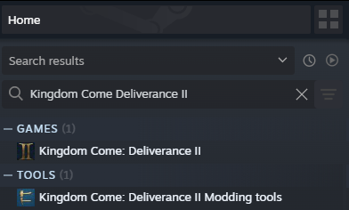

# The Modding Tools
Modding Tools are installed through Steam, it is a separate application on Steam called [Kingdom Come: Deliverance II Modding tools](steam://open/games/details/2429020 "Link to Modding tools app in Steam client"), available for anyone with activated KCD2 key. As of now, they are only available through Steam and need KCD2 key to use (once you have KCD2 steam key activated, modding tools will automatically be added to your Steam library).

The modding tools have identical folder structure to the published game. They are intended to be used as a separate game installation, which you can experiment on. The game can be launched from the folder, after setup.

### Installation

IMPORTANT Install the modding tools to a SteamLibrary folder that is as close as possible to filesystem root (Ex. Z:\\SteamLibrary\\...). Windows has a limit of 255 characters for file path length. Our quest system has deep paths (the longest is 192 characters) from game root. Adding the Steam folder structure (SteamLibrary/steamapps/common/KCD2Mod), and the mod file structure (mods/*yourmodname*), there are very little characters left in the limit.

### Dependencies

Workspace Setup and Steam Uploader depend on Windows Runtime 6 (if needed, download from <https://dotnet.microsoft.com/en-us/download/dotnet/6.0>, section .NET Desktop Runtime). Skald and Smid depend on .Net Framework 4.8 (<https://dotnet.microsoft.com/en-us/download/dotnet-framework/thank-you/net481-web-installer>).

### Workspace setup

Tools\\ModdingWorkspaceSetup\\WorkspaceSetup.exe is a tool that copies or links all PAKs from installed game to the modding tools. It requires administrative privileges to be able create links (it uses [symbolic links](https://en.wikipedia.org/wiki/Symbolic_link)). Using links is preffered to copying paks, as it is near instant, and doesn't take up any space on hard drive. If for some reason you are unable or unwilling to grant administrative privileges to the app, you can setup workspace manually by just copying all .PAK files in Data/, Localization/ and Levels/\*/ folders to identical folders in the modding tools.

Beware that Developer.pak is not published with the game, instead it is provided in Data/ folder of the modding tools. If you delete this pak, Workspace setup will not be able to link/copy it from the game.

### Development version of the game

In **Bin\Win64ReleaseSteamLTO_DLL** there is a development build of the game. It has some important differences from the published build of the game:

* It contains all debug commands and functions (as a side effect it runs slower)
* It runs an internal web server that you can connect to, which has several major debug features
* It loads loose files from Data/ folder and mods/ folders (published games loads only files in PAKs and loose .cfg files)
* It contains Editor.exe, our build of the Cryengine Sandbox
* It does NOT load mods subscribed to on Steam - that is because the mods are in the workshop of "Kingdom Come: Deliverance 2", while this game runs as "KCD2 modding tools" - different Steam app has different sets of subscribed mods

The game can be played in this build, and saves are compatible between this and the published version.

### Online debug

Both the game and the editor run an internal server that allows for reading and modifying some game states, data, etc... The server runs on port 1403 and accepts connections only from localhost. This server serves the Data/libs/CryHttp folder. In addition, /api folder is bound to the game API, which can directly access some game code. On the landing page (<http://localhost:1403>) you can find a list of all the debug pages we have. API browser (<http://localhost:1403/static/apiBrowser.html>) allows you to interactively view all accessible bindings.

### Other tools and data

* Data/Levels/ - sources for both the main levels in game (editor cannot open exported level, it needs these files to open the levels)
* Data/Libs/CryHttp/ - root folder for the internal web server (See [Online Debug](#%20Online%20debug) above)
* Data/objects/enviro_asset_template/ - example assets
* Data/objects/characters/ - skeletons for characters and horse used in game
* Data/Quests/Debug/ - Sources for Haste debug (works in development game, hotkey H)
* Data/Developer.pak - some additional source files, mostly needed for Skald
* Editor/ - Assets needed for editor to run (UI icons, toolbar layouts, etc...)
* Engine/ - Shader sources and precompiled shaders. This is the same folder as in the published game
* Tools/enviro/ - plugin for 3ds max, see [KM-A-42](../../KM-A-38 Modding - Visuals/KM-A-40 Environment Art/KM-A-42 How to set up your 3ds max/README.md)
* Tools/GeneratedDatabase/ - a dll with structure of the game database. It is used by several other tools
* Tools/maya/ - plugin for maya, see [KM-A-66](../../KM-A-38 Modding - Visuals/KM-A-39 Character Art/KM-A-66 Maya setup/README.md)
* Tools/modding/3dsmax/ - further files for 3ds max plugin, see [KM-A-42](../../KM-A-38 Modding - Visuals/KM-A-40 Environment Art/KM-A-42 How to set up your 3ds max/README.md)
* Tools/modding/docs/ - documentation for all Lua bindings
* Tools/modding/excelAddin/ - an addon for MS Excel that allows for convenient editing of some game tables, see [KM-A-86](../../KM-A-37 Modding - Game Data/KM-A-19 Modifying game data/KM-A-86 Excel Addin/README.md)
* Tools/modding/Maya/ - further files for maya plugin, see [KM-A-66](../../KM-A-38 Modding - Visuals/KM-A-39 Character Art/KM-A-66 Maya setup/README.md)
* Tools/modding/USER_ShaderCacheGen/ - shader lists needed to generate shader cache, see [KM-A-82](../../KM-A-38 Modding - Visuals/KM-A-82 Building shader cache/README.md)
* Tools/ModdingWorkspaceSetup/ - tool for linking or copying, see [Workspace setup](#%20Workspace%20setup) above)
* Tools/rc/ - ResourceCompiler, needed for Editor to run, used to compile game data (animations, textures, etc...), and to create PAK files
* Tools/RemoteConsole/ - tool allowing to connect to running game's console from outside
* Tools/ShaderCacheGen/ - tool for generating shader cache, see [KM-A-82](../../KM-A-38 Modding - Visuals/KM-A-82 Building shader cache/README.md)
* Tools/Skald/ - editor for quest scripts and dialogues, see [KM-A-18](../../KM-A-83 Walkthroughs/KM-A-18 Skald/README.md)
* Tools/Smid/ - editor for NPC clothing, body parts, inventories, see [KM-A-14](../../KM-A-38 Modding - Visuals/KM-A-39 Character Art/KM-A-22 Clothing - technical overview/KM-A-14 Smid/README.md)
* Tools/SteamWorkshopUploader/ - tool for uploading mods to steam workshop, see [KM-A-85](../KM-A-58 Publishing a mod/KM-A-85 Publishing to Steam workshop/README.md)
* Tools/TraceServer/ - tool for analyzing live game log, started automatically by development game or editor
* Tools/WH_ArtDotNetTools/ - further files for 3dsmax plugin, see [KM-A-42](../../KM-A-38 Modding - Visuals/KM-A-40 Environment Art/KM-A-42 How to set up your 3ds max/README.md)
* Tools/SettingsMgr.exe - Setup for some CryEngine tools to run correctly

Tools/ folder contains all the other tools, many of which are documented elsewhere in this wiki.