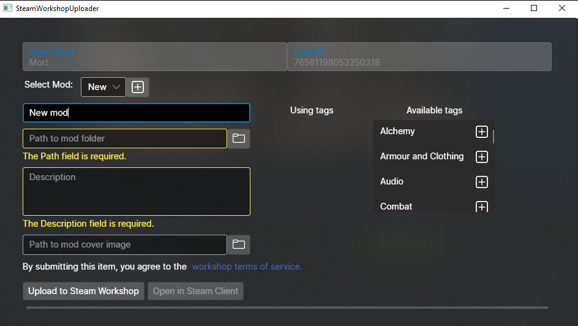
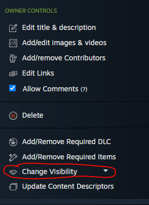

# Publishing to Steam workshop
To upload a mod to Steam workshop, you have to use our custom tool (there is no way to upload mod with just the steam client). It is located in Tools/SteamWorkshopUploader/SteamWorkshopUploader.exe (or just use the launch option from Steam client).

To use the Steam Workshop Uploader, you need to have an activated steam key for KCD2. If you have KCD2 through some sharing program, or free weekend, etc... the upload might not work (this is determined by Steam and is subject to future change outside our control).

You can create a new mod with the + button. The name of the mod is the displayed mod on steam, and can differ from the name in manifest (although for clarity it's better to use the same name)

Path to mod folder should be the exact folder in which mod.manifest is placed. Steam will automatically create a dedicated folder for your mod when users download it.

Cover image must be at most 1MB big, otherwise the upload will fail.

You need to agree to [Steam workshop term of service](https://steamcommunity.com/sharedfiles/workshoplegalagreement) - this must be done once per Steam account, so you might already have agreed to this previously.

If your upload fails, you can check for slightly more information about the error in [Steamworks documentation](https://partner.steamgames.com/doc/api/steam_api#EResult).

### Visibility on Steam
When you first upload your mod, it is hidden. While hidden, only you can subscribe to it. You can change the visibility in the Steam client:
