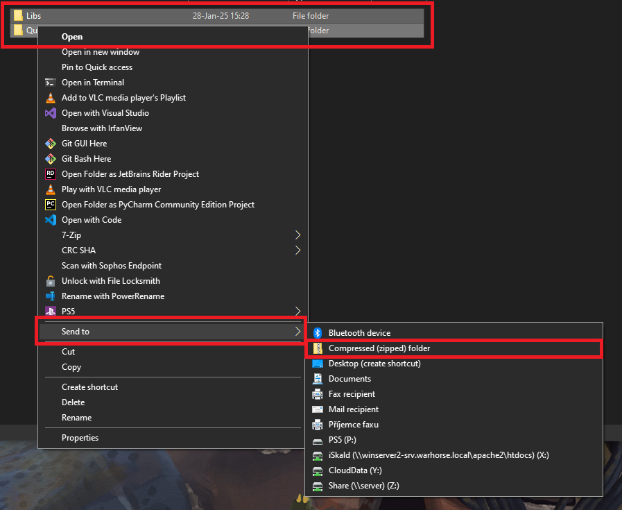

# Publishing a mod
When your mod works in the development build, there are a couple extra step that you need to take.

## Packing loose files

The published version of the game does not load loose files - it only loads files from PAKs. There are only two exceptions to this - mod.manifest file and mod.cfg file. You will need to pack all files in `data/` folder in one or more PAKs. The same needs to be done for localization/ folder (if your mod requires localization).
PAKs are technically just a ZIP archive without any compression, they can be created by most zipping tools - Total Commander and Windows Explorer on Windows 10 are verified to work. **ZIP archives created by 7zip don't work** (7zip creates the archives in a slightly different format, which the game cannot load). The published game splits game data into several different PAKs, however that is not necessary - you can put all of your files into a single PAK, or split them however you want.

<details>
    <summary> How to create a mod .pak with Windows Explorer (only works on Windows 10) </summary>

1. We have our modded data inside `<modid>/data`
2. Select all the data inside this folder \> right-click \> send to \> compressed (zipped) folder
   1. {width=70%}
3. This will create a .zip file, and rename it to `<whatever>.pak` , I prefer `<mod>Data.pak`
   1. 
   2. 
4. Paks created this way should be placed in `<modid>/data` folder

</details>

## Folder structure and uploading

After packing the mod, the folder should look like this.

```
mod_folder
├ mod.manifest
├ mod.cfg
├ data
│ ├ data1.pak
│ ├ data2.pak
│ └ ...
└ localization
  ├ english_xml.pak
  ├ whs_xml.pak
  └ ...
```

This folder can then be uploaded with SteamWorkshopUploader (select the mod_folder as the folder to upload), or on any other mod distribution site.

## Using Paks in Development version

Development version of the game, by default, uses both loose files and files from paks (with loose files having priority). You can change this beahavior using the sys_pakPriority cvar. This cvar has to be set before the engine launches, so we have to insert it into user.cfg in the workspace's root (create an empty one if none is found).

* `sys_pakPriority 0` - `files > paks`\- this it the default, game loads both paks and files, files outside of paks have priority
* `sys_pakPriority 1` - `paks > files`, game still loads both, but files inside paks have priority over files outside
* `sys_pakPriority 2` - only paks, loose files are ignored (this is the default and only possible behavior for the published version of the game)