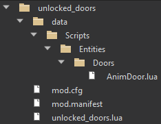
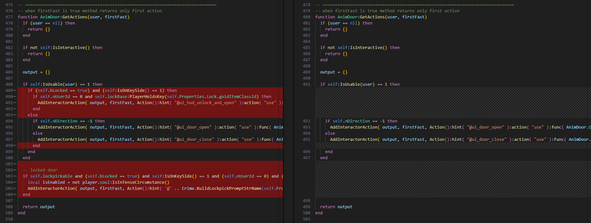
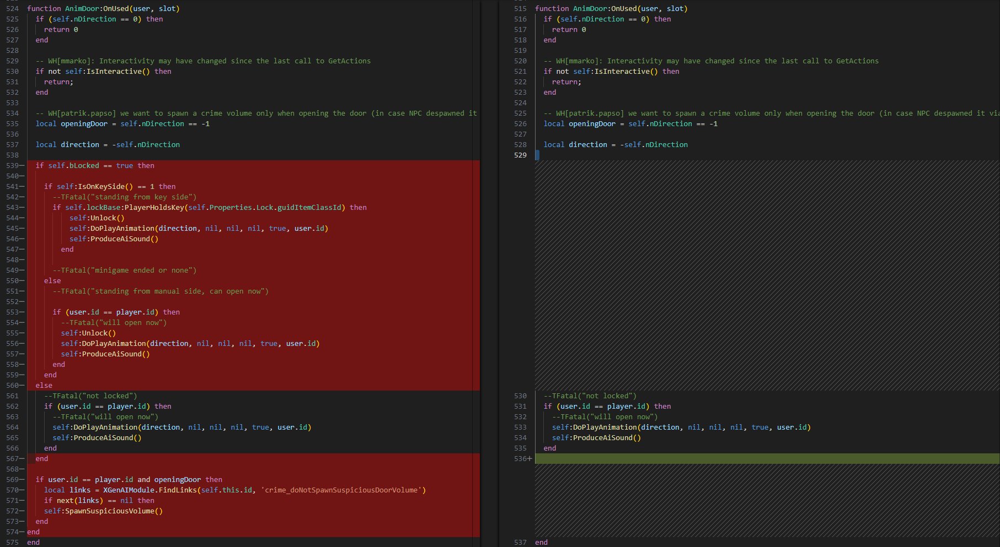
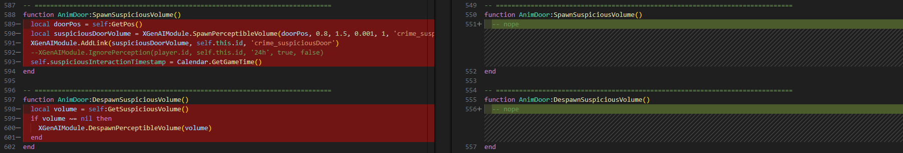

# Modifying LUA entities and scripts
Entities and their basic functionality in KCD2 are scripted in [LUA](https://www.lua.org/start.html "null") together with XGEN AI and Skald(so not everything is modifiable just via LUA).

### Mod's init script

As written in the [KM-A-3](../../../KM-A-36 Technical Overview/KM-A-3 Structure of a Mod/README.md) - the mod can contain a root .lua file that will get executed when the game loads. This file has to be called `<modid>.lua` (e.g. `no_compass.lua`). This LUA script can be used to initialize mod's structures and global functions, it's optional.

### Modifying game entities

If you wish to directly modify the game's entity scripts, you have to override the given file with your own script. You can find these entity scripts in folder `Data/Scripts/`. Your mod folder structure has to reflect this structure - if we wish to override entity `Data/Scripts/Entities/Doors/AnimDoor.lua` (in the game files), our mod will be as such:



---

## Example mod

As an example, let's create a mod that will remove the door's unlock/lock functionality and all the doors in the world will stay unlocked forever (for the player that is, doors will still lock).


1. Find the entity script we want to modify, in our case, it will be `Data/Scripts/Entities/Doors/AnimDoor.lua`, this script defines doors across the world.
2. Create a copy of this file and place it into your mod's folder, remember to reflect the folder structure.
3. Modify this file to your liking, in our case we want to do two main things:
   A: Remove logic that controls if the player opens/unlocks the door, make it so it's always "open".
   B: Don't spawn a crime volume when the player opens a door - this controls NPC's reactions to an opened door.

#### 

### 3A removing unlock/lock logic

We have to modify the function `AnimDoor:GetActions(...)`, this controls what interactive prompts a user (generic usage, in our case it's always the Player) gets when they aim at the entity. The file diff between the base AnimDoor and our modified one looks like this:

{width=70%}

We removed the logic that controls the prompt for "Unlock/Lockpick door" based on the variable `self.bLocked`, instead, we always offer the user prompt "Open/Close".


The logic for using the door is extracted to the function `AnimDoor:OnUsed(...)`:

```lua
AddInteractorAction( output, firstFast, Action():hint( "@ui_door_open" ):action( "use" ):func( AnimDoor.OnUsed ):interaction( inr_doorOpen ) )
```

so we have to modify that function as well:

{width=70%}

Here we once again completely removed checks for the variable `self.bLocked` and instead just open the door regardless of the locked state. The locked state of the door is checked/modified only on this entity level, so the game will let you "force" open the door even though the entity says it's locked (since we don't modify the variable `self.bLocked`, the NPCs will still "lock" it regardless).


### 3B don't spawn crime volumes

The NPCs use this perceptible volume to react to player's shenanigans - let's remove them as well, so the doors truly seem unlocked. We removed the call of these functions from `AnimDoor:OnUsed(...)`, but to be sure we should remove the logic itself as well. This part is rather simple and all we have to do is clean up functions `AnimDoor:SpawnSuspiciousVolume()` and `AnimDoor:DespawnSuspiciousVolume()`:

{width=70%}