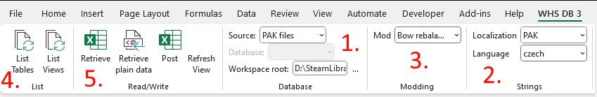

# Excel Addin
Excel Addin (Tools/modding/excelAddin) is a plugin for excel that allows efficient modification of most game data tables. It is installed with
**Tools/modding/ExcelDbAddin.DbAndXsdSupport.vsto**, and adds a tab to excel:

1. The addin can use either extracted XML files, or PAKs (this concerns the base game data files). You need to set your workspace root to the modding tools root (.../SteamLibrary/steamapps/common/KCD2Mod)
2. The addin can save localized string directly to localization PAKs
3. If you select a mod here, changes will be saved as patched tables into your mod's directory
 (This section will only appear if you have at least one mod in your mods/ folder)
4. Lists tables or views this tool can edit. Views are mostly used for tables that contain several different types of data (e.g. items table contains weapons, armor, tools, etc... each of these has it's own dedicated view)
5. Retrieve loads table/view, post saves it