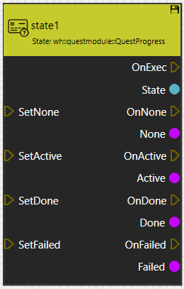
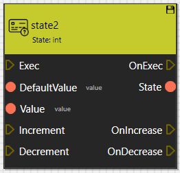
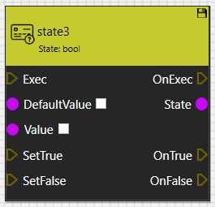
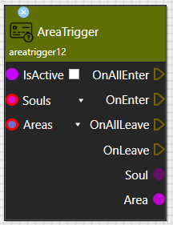
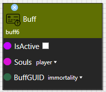
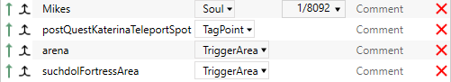
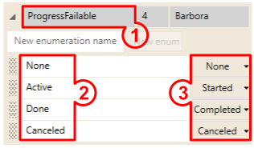
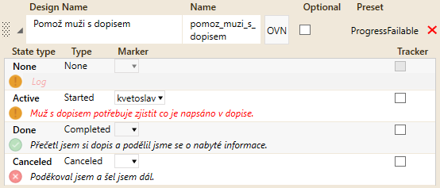

# General
* Quest system (also referred as "concept graph") is a collection of nodes connected to a graph. With these nodes it is possible to script quests, create dialogues and react to player's actions.
* It is a visual scripting language similar to Unreal Engine Blueprints for example
* It has some important properties that set it apart from other simillar scripting languages:
    * All triggers are executed synchronously, immediatelly as they happen. This ensures the game can't save in the middle of exucuting some critical script section - if you need to run some massive script changes, it might create visible FPS drops, therefore it must be done while some fader is active
    * Changes to game world (creating items, changing NPC schedules, streaming in parts of the level, etc...) are done through Effects, which are always temporary - they don't have On and Off triggers, instead they are connected to some boolean variable, which always drives their On/Off state - this simplifies patching the game, as these changes are left often behind when something changes
* Concept graph is saved in a hierarchical structure of XML files
    * Base game uses **data\\Quests\\Final\\barbora.xml** as root file
    * You can change any of the XML in **data\\Quests\\Final\\barbora\\...** folders, however there is no merging procedure - if multiple mods change the same file, only one will be used
    * You can create a whole new graph - the root needs to be in **data\\Quests\\«modid».xml** . It will be loaded alongside the main concept graph

***

**Contents**
* [Node Types](#node-types)
  * [Definition](#definition)
  * [State](#state)
  * [Effect](#effect)
* [Ports and Edges](#ports-and-edges)
  * [Trigger](#trigger)
  * [Data](#data)
* [Assets](#assets)
* [Objectives](#objectives)
* [Markers](#markers)
***

# Node Types
There are 3 main types of nodes:
 - ## Definition
    - Encapsulate other nodes. 
    - Has some other funcionalities
 - ## State
    - persistent nodes -> their inner state is save&load
    - can be recognized by "save icon" in the top right corner
    - controls effect nodes
    - you can define your own state nodes

 - ## Effect
    - When node is active, some effect affects the game world/entity (or tracks some events/data)
    - **must** be controlled by state node
    - if effect node has both - output data and trigger ports, then data ports are **valid** and **ready to read** **ONLY** when the output trigger is fired

***

# Ports and Edges
There are two types of ports and edges:
## Trigger
 
    - These are "signals" -> If you send this signal, you trigger the node to do its work.
 ## Data
 
    - (colour depends on type)
    - Data port can be input (node needs data to do work) or output (node provides some data)

***

# Assets
Some nodes for working correctly requires entites from level. But it is impossible to directly link particular entities. You need to create an "asset" of correct type with name of your choice. It is an "empty envelope" which is resolved during runtime when the concept node is enabled. In fact, some assets can be linked directly from Skald via database (souls for example). But for most entities you need to link this asset name with entity in the level editor. Tutorial will be described in another article.  

***

# Objectives
Smallest piece of Quest. Tasks that player needs to complete. It is visible in journal. In concept graph it is represented with **state node** and one special node that is responsible for visualizing objective in HUD.
Objectives must be created in *Quest* definition node.
State node for objective can be your own custom type but must be defined in *Quest* definition node as well.
For particular states you can set HUD behavior:

Objective:

*** 

# Markers
There are 2 types of markers:
  - point/entity
  - area