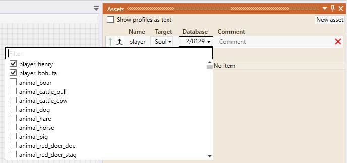
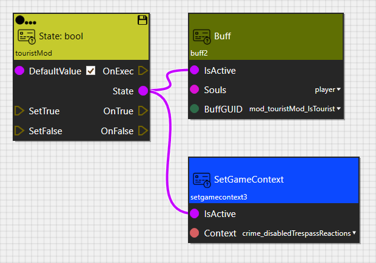
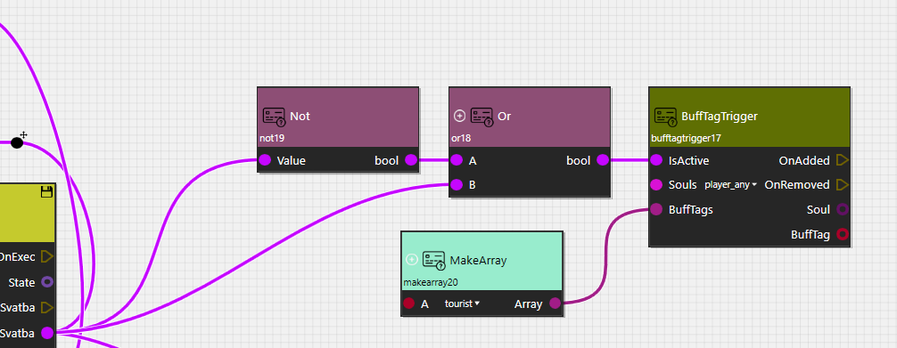

# Example: Tourist mode
Environment in KCD2 is beautiful. So Let's create a mode that hides all streamed gates and allows to player to discover places that are closed in openworld gameplay. And disable trespass crime reactions for peaceful travelling.

---

1. Create new buff ai tag in the *buff_ai_tag* table as described in [KM-A-17](../../../KM-A-83 Walkthroughs/KM-A-17 Adding a new Item/README.md). We name the tag **tourist**. Will be used in later steps.
2. Create new buff in the *buff* table as described in [KM-A-17](../../../KM-A-83 Walkthroughs/KM-A-17 Adding a new Item/README.md). We name it **mod_touristMod_isTourist**. Assign to this buff previously created ai tag. This buff will be useful in concept graph of KCD2. It is a sort of indication that mod is loaded and one of the many ways how we can react to mode events in base game concept graph . And the ai tag is required, so we are able to trigger signal in the base game concept graph.
3. Create new mod as described in [KM-A-18](../../../KM-A-83 Walkthroughs/KM-A-18 Skald/README.md) so mode has its own concept graph opened.
4. For player identification create new **soul** asset in *Asset* tab and check player's souls
   
5. Create a state of type **bool**. This state will control (enable/disable) required effects.
6. In fact, there is no need to disable effects in this mode. So right mouse button click on state -\> show hidden ports -\> switch defaultValue to **TRUE**. So when the mode concept graph is loaded the state is **TRUE** and the effects are active.
7. Add *SetGameContext* node with context **crime_disabledTrespassReactions**. Connect its *IsActive* port to *State* port of bool state. As the name says - this context disables trespass crime reactions when it is active.
8. Add *Buff* node. Set *BuffGUID* parameter to previously created buff: **mod_touristMod_isTourist**. If you don't see the buff in the list - reload tables/rerun Skald. Set *Souls* parameter to previously created asset with player souls.
9. It should look like this:

10. Now we need to change the concept graph of the base game a bit. Open base game concept graph. How to do it is also described here  [KM-A-18](../../../KM-A-83 Walkthroughs/KM-A-18 Skald/README.md)
11. In the concept graph of base game there are some places you need to add this:

12. This script works as this: Always keeps BuffTagTrigger node active. This node observes whether buff with ai tag "tourist" is added on player's soul. If it so, node sends signal. Signal is then used to unstream profile that contains level layers with closed doors, gates, etc. There is more than one place in concept graph that controls such profiles, so you must use this construct in all places to unstream all gate/door objects.