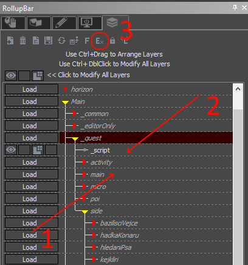
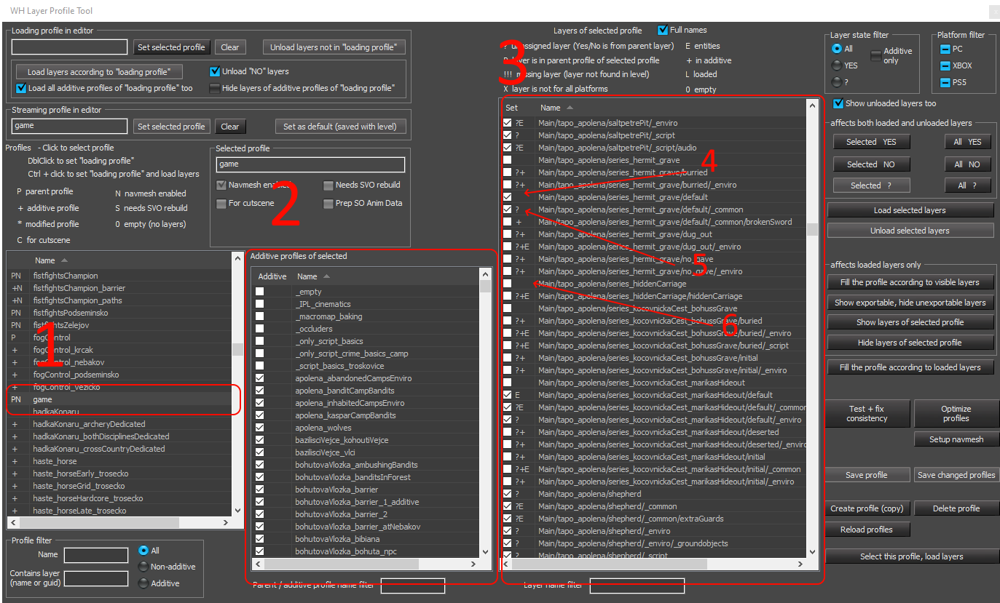

# Level data
Changing the game levels is not fully supported for KCD mods unfortunatelly, because there are many export steps that gather data from level and save it in differently formatted files, which the game cannot merge (navmesh, streaming layer list, paths and streams, HLODs, global illumination, soul lists, ledges, POIs, navigation paths, brushes, entity list, terrain shape and textures ...).

Some exported data can be merged - Scheduler links, cat waypoints, dog points, smart object animations (all located in level.pak/tables). You can create patch files for these tables just as you would for any other table in data/libs/tables.

You are still able to edit the level, export it in full and include the entire set of paks in a mod. Such a mod most likely won't be compatible with future versions of the game, and won't be compatible with other mods that change level.

## Exporting

Level can be exported from editor GUI, however that won't run all necessary build steps. If you are exporting kutnohorsko level, you will need \~64GB of RAM. Our export runs in several steps:

### 1\. HLod tree export

```
Bin\Win64ReleaseSteamLTO_DLL\Editor.exe -layerExportProfile game -exportHLodTree Data\Levels\trosecko\trosecko.cry -unattended -ignoreAssert -TraceNoServer
```

This creates hlodtree.xml in the level folder. It is necessary for Hierarchical lods to work properly (for brushes this includes also lod 0).

### 2\. Level export

```
Bin\Win64ReleaseSteamLTO_DLL\Editor.exe -useHDDForILAO -useILAOFolder AOData_builder -unattended -noSourceControl -noRender -mandatoryPaks -TraceNoServer -ignoreAssert +s_AudioSystemImplementationName nic ++sys_parallel_processing 0 ++wh_concept_strictPortValidation 0 ++wh_ai_PathMNMValidationFailIsError 1 ++r_BreakOnError 0 ++wh_sys_PakExportEmbedZlibHeader 1 ++wh_sys_PakExportAlignmentUsingZlibHeader 1 -layerExportProfile game -export Data\Levels\kutnohorsko\kutnohorsko.cry
```

Before running this command, delete the old level.pak, otherwise the editor will try to open it and then won't be able to override it.
The export runs for about 1.5 hours on trosecko or 2.5 hours on kutnohorsko, at the end it will create most of the paks in the correct level folder.

### 3\. Final RC packing

This creates recast.pak, and adds some files into level.pak

```
Tools\rc\rc.exe /ZlibHeaderMaintainAlignment=1 /threads=8 /crashOnAssert /p=PC /zip_encrypt=0 /branch=main /verbose=0 /EmbedZlibHeader=1 /jobtarget= /job=Tools/rc/RcJob_WH_level.xml /LevelPath=Data/Levels/trosecko
```

## Layers and Export profiles

All of the entities and brushes are split into layers. Each layer is a single .lyr file, and they are used mostly to organize the entities - at export, contents of all layers are put into several files (one for entities, one for brushes, ...), with the exception of streaming layers.
Streaming layers are any layers that are part of a streaming profile. Streaming profiles are not present in game, until activated by a Concept node "EnableProfile".

The main profile is called "game" (thats what `-layerExportProfile game` specifies in the export parameters above), and it will be exported to game with all of it's child (also called "additive" profiles). There are many more parent profiles alongside game, those are used during development to easily load all layers relevant to a quest, for example.

Each layer can be present in the game profile, or in any number of it's additive profiles. Contents of all of layers in game profile will be compressed into one file (e.g. objects_mission0.xml for entities) and will always be present in game. Layers in additive profiles will be exported individually, and are only present in game as long as at least one of their profiles is enabled.



1. A layer that is currently unloaded (in editor)
2. A layer that is currently loaded in editor
3. Button that opens Layer Profile Tool

{width=70%}

1. Currently selected layer profile
2. Additive (child) profiles of selected profile
3. All layers in game and their presence in current profile
4. A layer that is explicitly set to be exported as a part of currently selected profile
5. A layer that is implicitly exported (because it's parent layer is exported, and this has not been overriden)
6. A layer that is explicitly NOT exported (probably exported in some other, additive, profile)