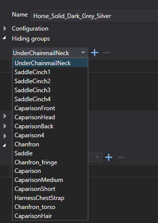

# Hiding groups

To use hiding groups, you have to:

* **Paint hiding groups on mesh**
* **Assign hiding groups to components**

When a component is equipped in the game, its hiding groups will be activated on the whole character. This means that all polygons painted as the active hiding group will be hidden on that character (even on a different component).

An exception is FirstPersonView, which is applied automatically on the player in first-person view.

*Technical data*

Hiding groups are specified in vertex color alpha channel as a bit field. Therefore maximum 8 hiding groups are supported per equipment part (group 0-7).

Example alpha colors:

* `11111111 = 255`: Vertex will be always visible
* `11111110 = 254`: Vertex will be hidden if hiding group 0 active
* `11111011 = 251`: Vertex will be hidden if hiding group 2 is active
* `10010110 = 150`: Vertex will be hidden if hiding group 0, 3, 5 or 6 is active
* `00000000 = 0`: Vertex will be hidden if any hiding group is active

  

Use Smid to assign hiding groups to components.

Select a component and in Component Details window and expand the Hiding groups panel. \> Choose a hiding group from the combo box and click + to assign it to the component. Each component can have multiple hiding groups assigned.

List of all existing hiding groups can be found in *Data/Libs/Tables/Character/ClothingHidingGroup.xml*

Example of available hiding groups for horses

