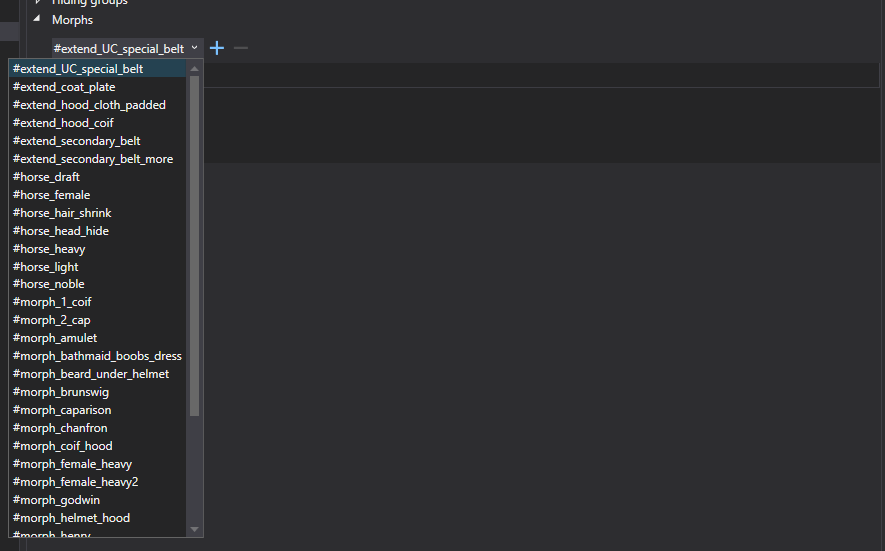
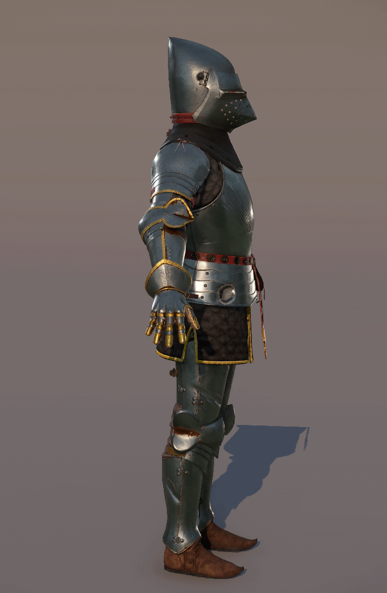

# Morphs
Morphs can be used to deform a character component mesh to better fit when another component is in the way.

Each component can apply one or more morphs. When a component is equipped, its morphs will be applied to all equipped meshes on the character. It is valid if a mesh doesn't contain the requested morph. Currently, only LOD 0 supports morphs.

Unfortunately, there is a limitation, if you have multiple geometries in cry export node, you need to merge them together because there can't be multiple morphs in the scene with the same name.

## **Assigning morphs to components**

Use Smid to assign morphs to components.

{width=70%}

Select a Component and in Component Details window \> expand the Morphs panel. Choose a morph from the combobox and click + to assign it to the component.

## **How it works**

If you have a morph in Waffenrock to appear bigger with cuirass underneath, you add specific morph to Cuirass in Smid (triggered when cuirass is equipped) and create actual blendshape in Maya in Waffenrock.

List of all existing morphs can be found in *Data/Libs/Tables/Character/ClothingMorph.xml*

## **Example:**

Morphs are used to change the original shape of the horse model.

{width=70%}

Morph is triggered by the unique head to fit the unique body.

