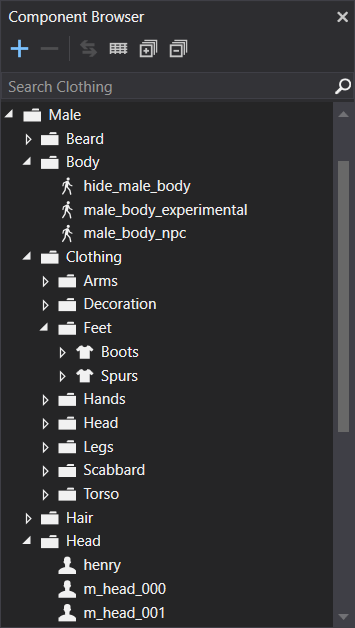
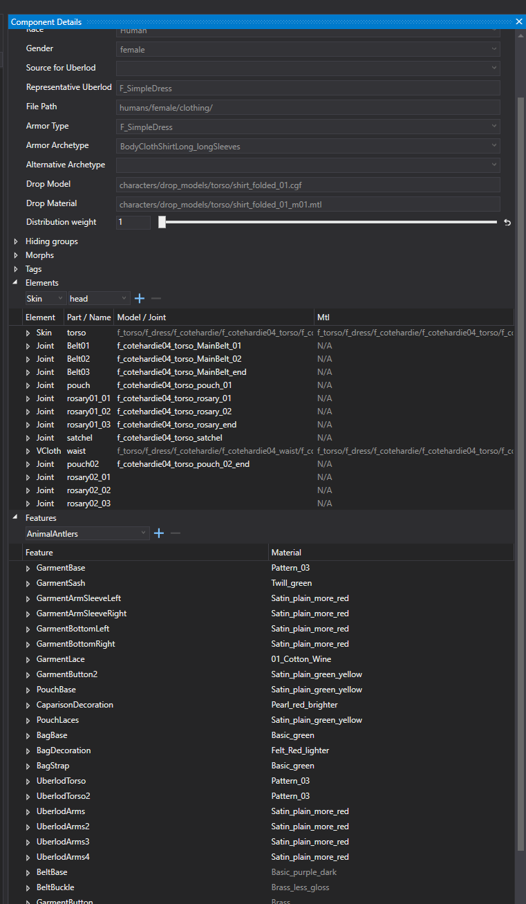
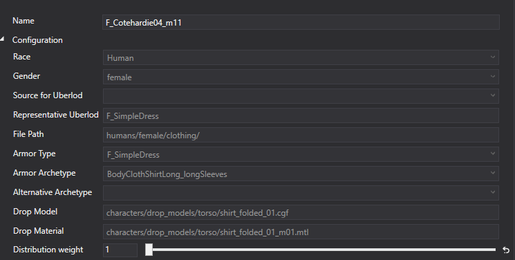
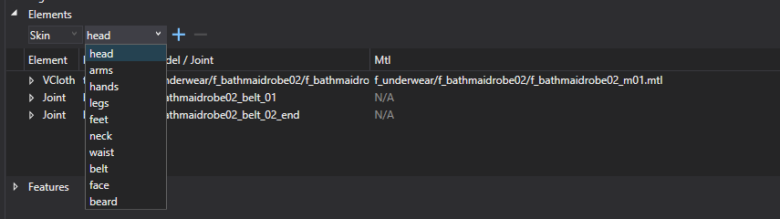
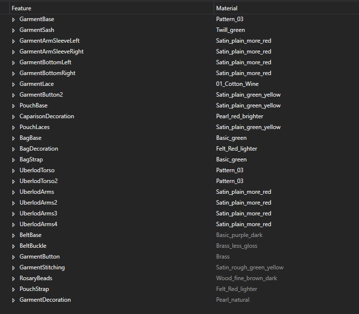

# Character Components
Characters are made out of components.

We have five types of components:

* **Body**
* **Head (only for humans, animals have head included in the body)**
* **Hair**
* **Beard (on animals this can be used for tail)**
* **Clothing**

# **Creating components**

New components are created in Smid's Component Browser. The type is represented by different icons and is assigned automatically based on which folder they are created in.

# **Modifying components**

This is usually the way you see details of a selected component. There are five groups which can be modified.

{width=70%}

### **Configuration**

This is usually all setup in advance, and there will be no need for use to make any edits. It's basic information for the race / gender / armor types and archetypes which are used in the game.

### **Hiding groups**

In some situations we needed a way to hide polygons independently from features. To solve this issue, we came up with the idea of hiding groups. We are using hiding groups to hide certain elements or avoid clipping through the layer system.

### **Morphs**

Similar to hiding groups. These static morphs are used to help us avoid visible clipping with layered assets. They can also be used for unique characters with non-standardized shapes or to modify existing shapes (f.e. - different horse head shapes).

Each component can apply one or more morphs. When a component is equipped, its morphs will be applied to all equipped meshes on the character.

### **Tags**

Tags are used for specific rules distributions  in the world.

### **Elements**

Elements are definition of what model and materials will be used in the Component. Smid is supporting normal skinned model (skin), model with VCloth simulation (VCloth) or we can use it to define physical simulation of Pendulum joints.

Each of the element part has to be set with proper Equipment Part (head / arms / legs, etc )

{width=70%}

### **Features**

Probably the most used part of the components are probably the character features. With these we are able to very quickly and effectively create different variants of all supported assets. They are using the ID textures or colors (which can be also stored in the vertex color of the model) and loading the selected material from Material Atlas in Smid.

