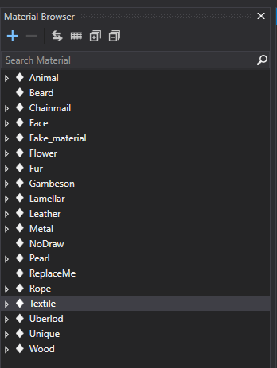
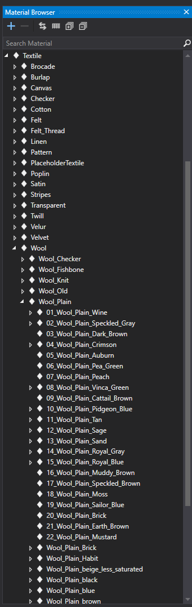
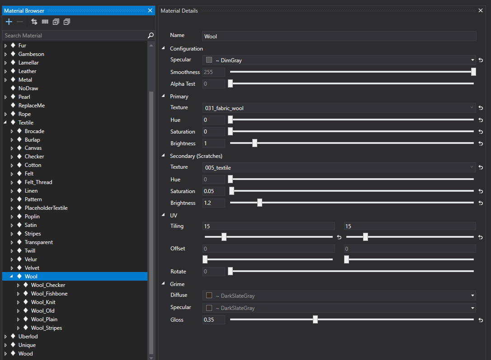

# Material Atlas
Material atlas is a library of various materials created to be used for texturing the clothing assets.

The main idea is to use these and assign them to correct **features** through use of **ID maps**.

Materials in Smid are logically organized by the type of surfaces.

There are several core material we are using now: **metals, fabrics, gambesons, chainmails, leather, fur, wood, etc.**

These folders are then sorted into more specific variants and types.

## Collapsed core structure of materials:

## 

## Example of expanded materials with all its existing variants:

## **Changing the material details:**

If you will be in need of adding new material or want to inherit new version of already existing material, please be aware that you are making these changes globally and **IT WILL AFFECT ALL CLOTHES IN THE GAME**, which are sharing the same material.

You can change Hue, Saturation and Brightness of each material. In some cases you can also change the specular value and smoothness of the material. This is handy if you need more or less shiny version.

{width=70%}

The **UV Tiling** should always be the same as the original root material, otherwise it's possible there will be inconsistency with other variants. 

You can specify different **Grime** value for the dirt, so it works more nicely with the newly changed color.

Secondary material is used for **Scratches** (the item is losing its durability). Generally it's more older and worn version of the original material.

{width=70%}