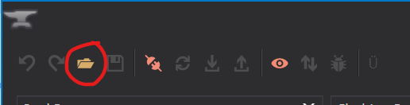
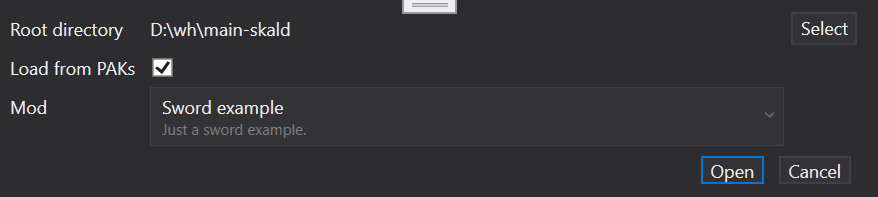
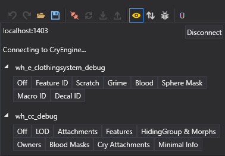

# Smid
Smid is our essential tool for setting up Components, Materials, Body parts, Armors, Weapons and Presets. With this tool we can easily change visuals of existing assets or quickly create more variants.

### Open workspace

**Root directory** - game root, should contain Data, Localization and Tools folders

**Load from PAKs** - checked (unless you have unpacked PAK files)

**Mod** - select your mod

{width=70%}

You can easily check  various debugs with the debug view in Smid. This will help us to visualize all the ID colors, texture masks for Scratches, Grime and Blood, but also which attachments, features, morph or even hiding groups are used in the scene.

*Debug views*

*Explanatory video of Smid functionality*

{width=70%}