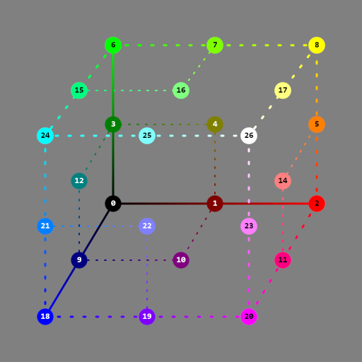
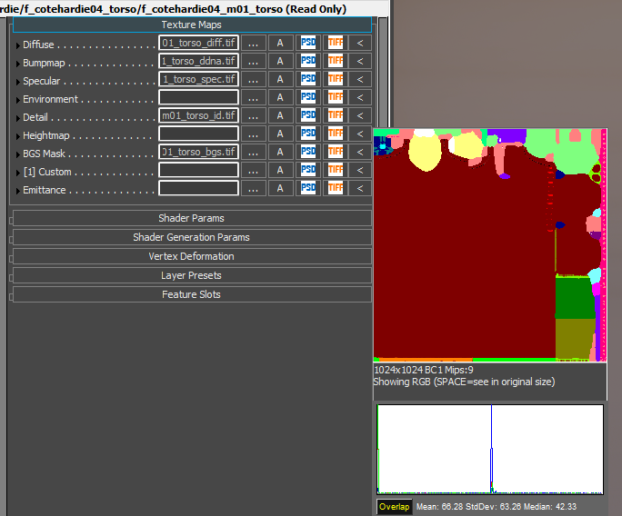
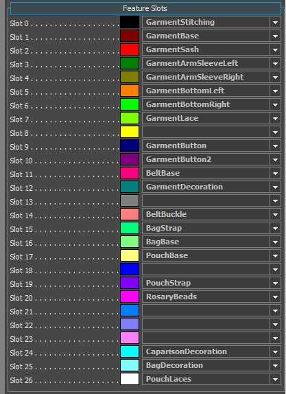
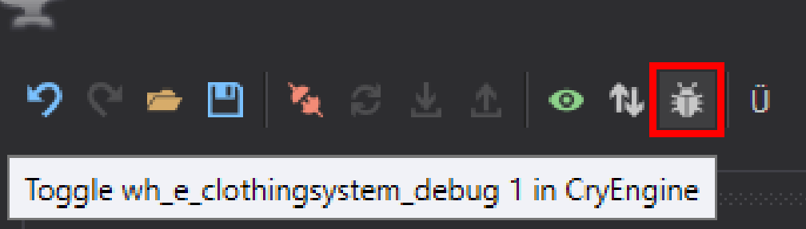
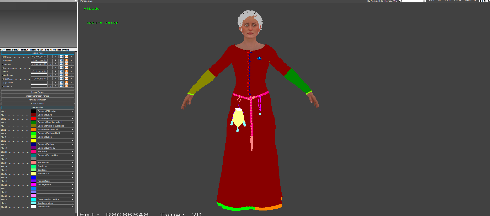

# Clothing Features
# **Feature ID**

Features are identified by ID. You can assign feature IDs either in vertex color or in texture. A single model can use both methods at the same time (vertex color has priority over texture).

*Feature ID cube*

You have to put this texture in the "**Detail**" slot in CryEngines material editor and then properly connect the features with the color.

For features which are "touching" in the texture, make sure to use adjacent IDs from the color cube. If you don't follow this rule, graphical glitches might appear at the boundary of features.

*Example of filled features in material*

{width=417px}

## Debug ID colors in editor

You can preview the color with the debug view. This can be done in Smid or with console command: **wh_e_clothingsystem_debug 1**

{width=70%}

{width=70%}