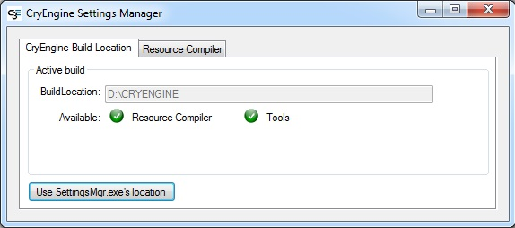
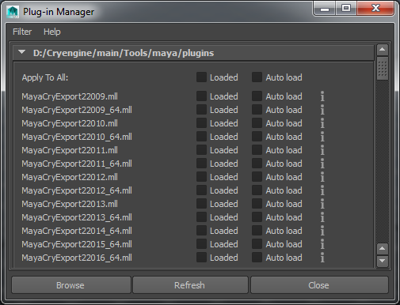
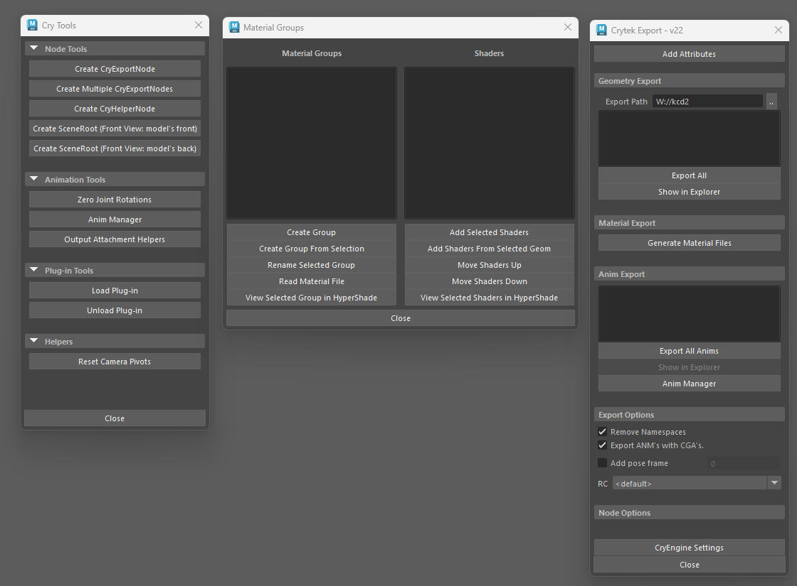

# Maya setup
*Installation of the CryEngine tools plugin*

Please navigate to the following folder, where you'll find the installation instructions in the Readme file.
Maya plugin files are located here: **KCD2Mod\Tools\modding\Maya\plugin**

### **Manual Installation**

Move the ./plugin/MayaCryExport folder and ./plugin/MayaCryExport.mod file to

\\\<user\>\\Documents\\maya\\\<version\>\\modules

You might have to create the "modules" folder if it does not exist.

This plugin only supports Maya 2022, 2024, and 2025 in win64.

1\. Run the `<root>\Tools\SettingsMgr.exe` and setup the path to your build. See the **Settings Manager** article on how to do this:

2\. In Maya make sure that the 'MayaCryExport2%MAYAVERSION%.mll' plugin is loaded in Plugin Manager.
Go to **Windows -\> Settings/Preferences -\> Plug-in Manager.**

Use the **browse** button and load the plugin directly from your `<root>\Tools\maya\plugins\` folder.

3\. Once loaded, Maya may have to be restarted for the Exporter to work.

Tools, Material and Export dialog

{width=70%}

### 