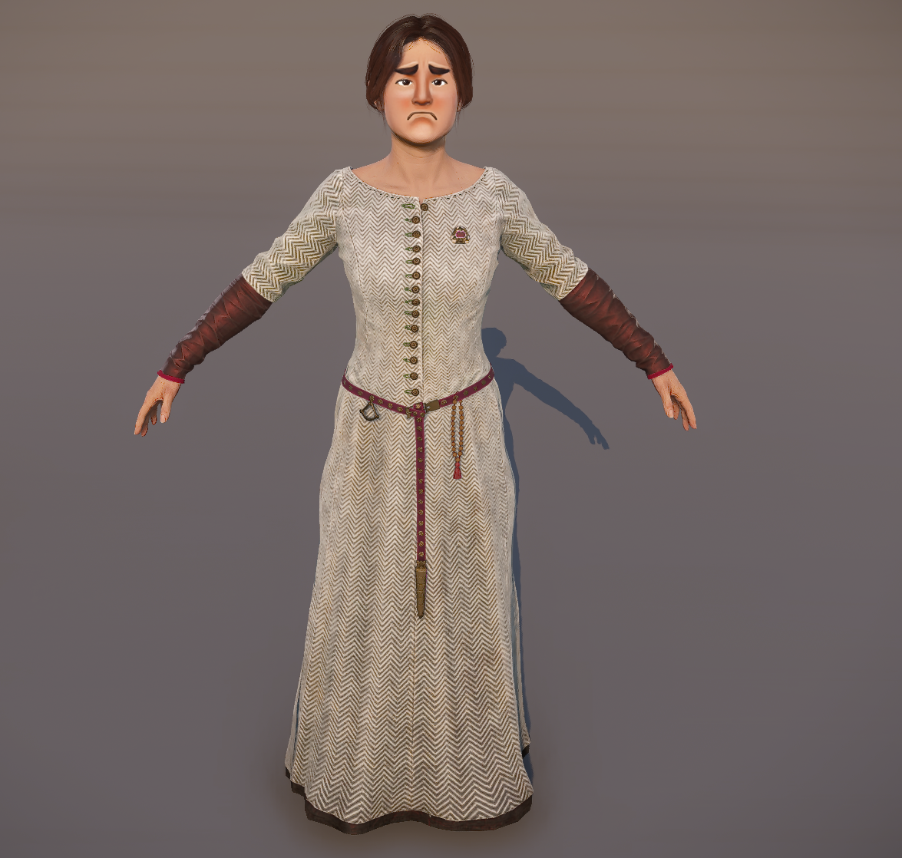
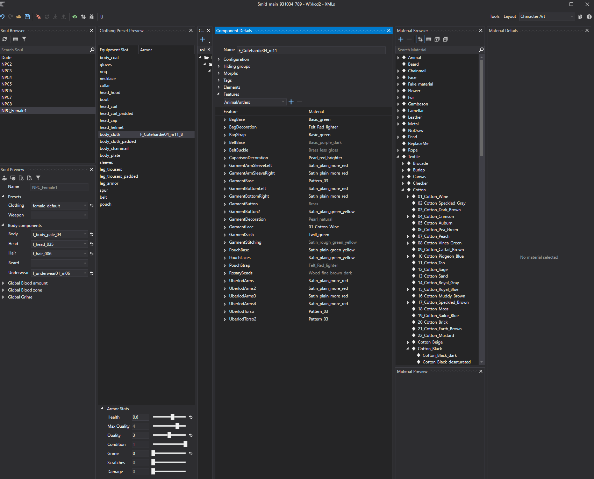
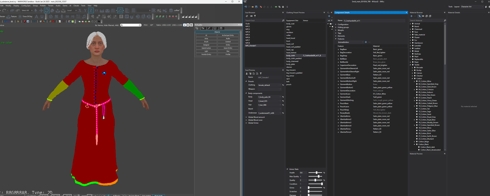
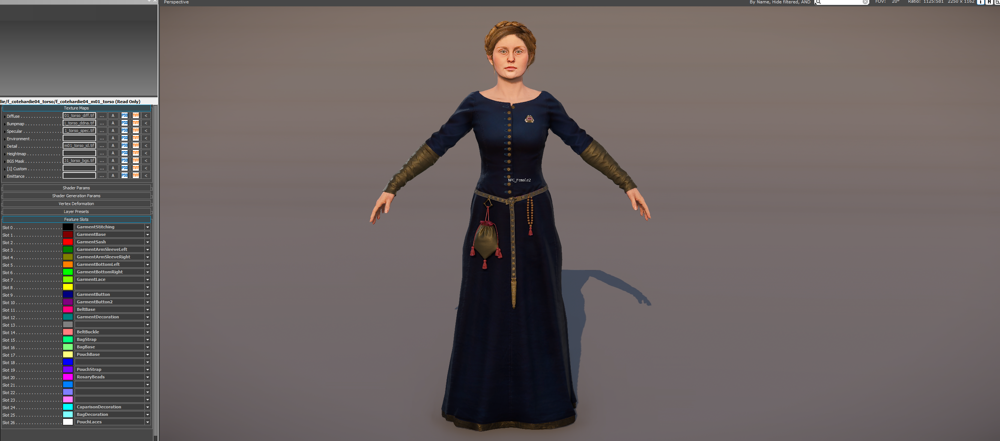
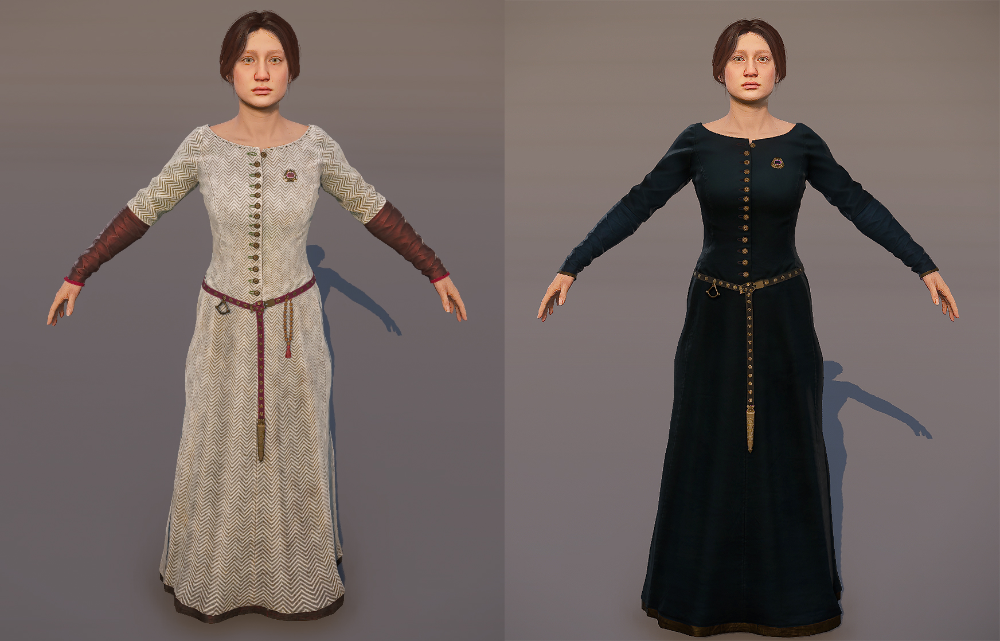

# Dress recolor
Alright, let's imagine you found a really nice dress in the game, but it's quite not what you like. Is there a way how could you change it perhaps?

{width=70%}

To make things work the way we want, we’ve got our trusty tool, **[Smid](../../KM-A-22 Clothing - technical overview/KM-A-14 Smid/README.md)**, to help us out.

Let's load this dress, it's called Cotehardie04_m11 and see what can be done about it.

Component detail window is the most importat part.

Here you can see which features are used and what materials are loaded.

{width=70%}

For easier visualisation, you can use the feature debug to see which ID colors are used and filled in the material of the asset.

{width=70%}

{width=70%}

To change the original materials,  simply assign your selected material to required features. You can select from already existing ones or simply [create your own](../../KM-A-22 Clothing - technical overview/KM-A-14 Smid/KM-A-26 Material Atlas/README.md) to your liking.

You can do this with the sync button enabled or drag'n'drop the material into the feature box.

*Changing with existing materials*

{width=70%}

*Changing with new color of material*

{width=70%}

You can even hide certain elements of the dress. Lets say I'm not really fond of the rosary here. So lets get rid of it.

It's easy, just use the NoDraw material for the features which are used in the rosary element.

{width=70%}

Once you are finished, simply save your changes in Smid.

This will create patched xml data which will override the existing asset and use your new color palette.

Tadaa, your fancy dress is ready now!

{width=70%}

