# Custom horses
Let's say we have our trusty Pebbles.. but she seems a bit boring, don't you think? Perhaps we could do something about it :)


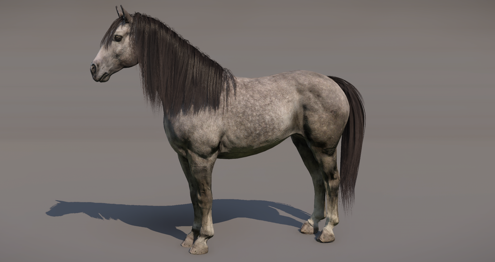{width=70%}


### Creating the body


Our horses benefit from several features of the clothing system. The body is divided into distinct sections, allowing for improved visual control and enabling us to more effectively create various color variations.


*Body features*

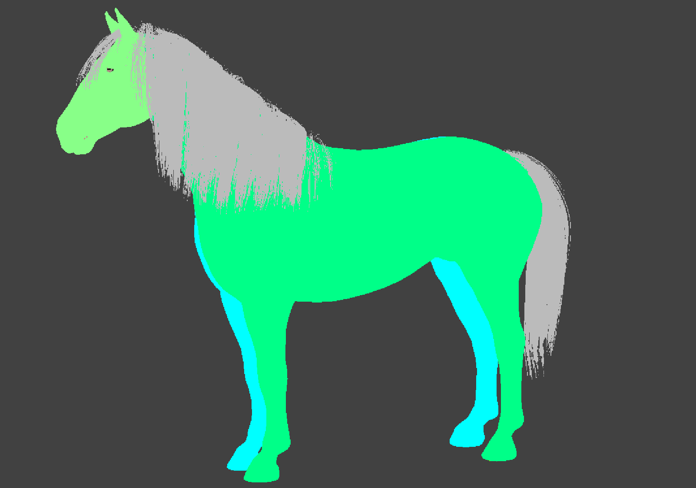{width=70%}


To achieve this, we’ve decided to use the 'Scratches' technology, utilizing this channel as a mask for different markings. How does it work? We apply a black-and-white texture as a  gradient mask, which overlays a secondary material onto the original. You can control the amount of material override using the intensity slider, allowing you to achieve your desired look more precisely.


{width=70%}


So let's start!!

Firstly, we need to create our mask texture. Maybe something like this?


*Scratch texture*

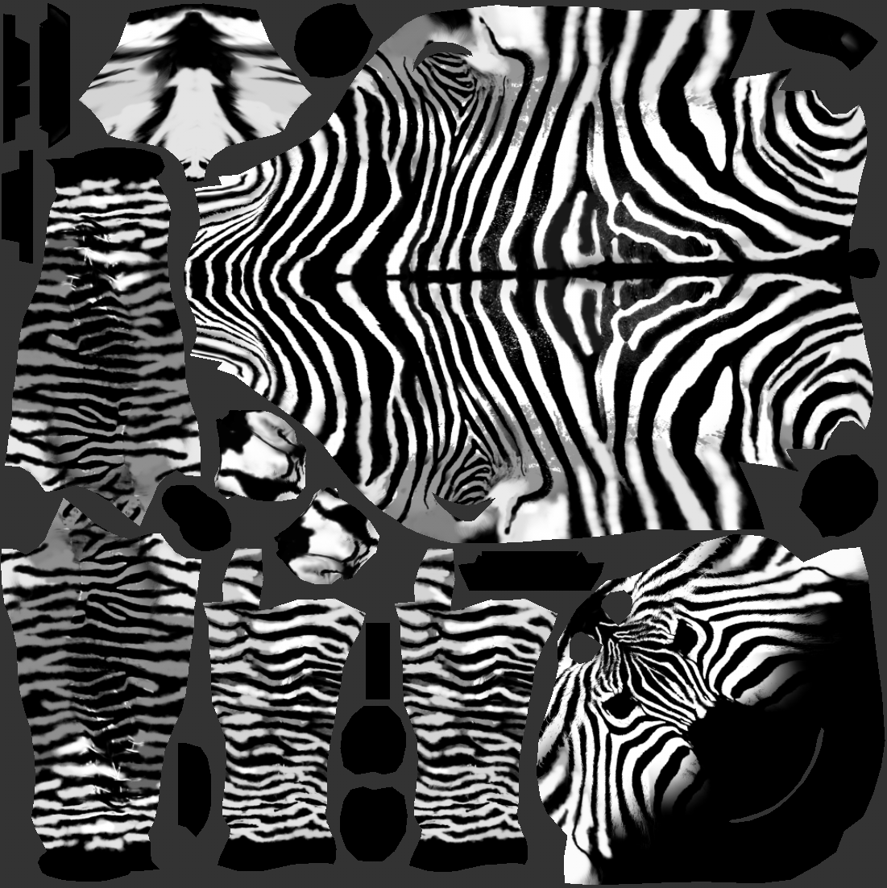{width=70%}


So what does it do? It's easy! The black represents the original material of the horse, so there will be no visible change. The white value is telling which part of the horse will receive another color / material.

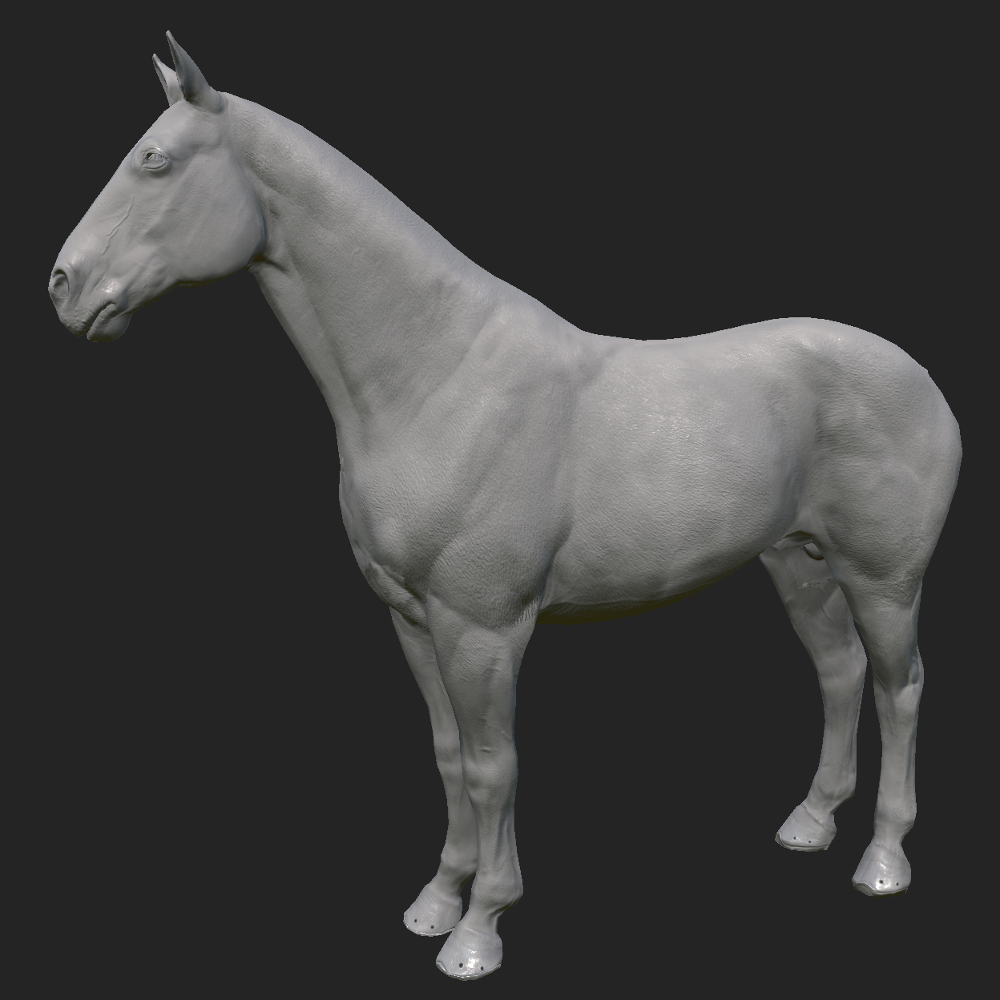{width=70%}


Now, let's create a new material and call it **horse_body_zebra**.

I took already existing material that we are using for solid colored  horses (horse_body_solid) and duplicated it. Now we need to change the BGS texture to our newly created. We plug the new BGS texture (Blood, Grime, Scratches) into the BGS mask. It looks a bit funky, but the scratch value is stored in the blue channel.

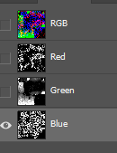

*Material view*

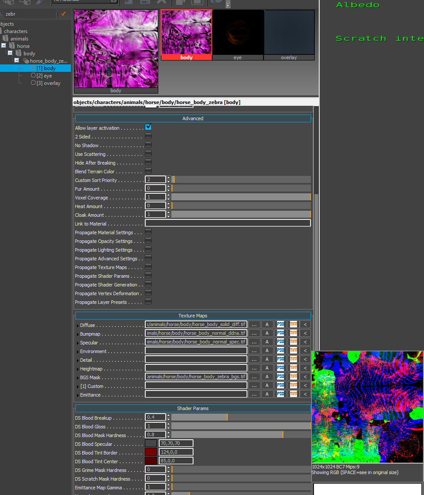{width=70%}


Now, let's head to Smid and find the body component for Pebbles \> **Unique_Sedivka**.

We need to replace the original material with the new one. Open the Elements window and simply select the newly created '**horse_body_zebra**' material to apply to it.


*Smid view*

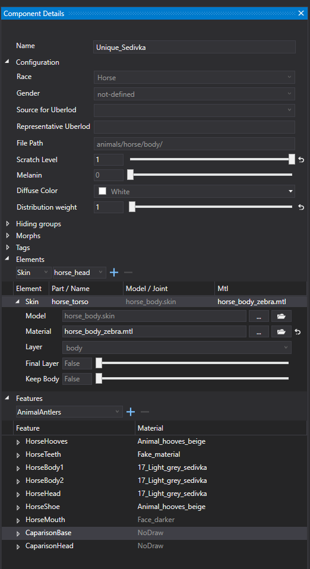


You can use the debug view and preview the scratches mask in the editor


*Scratches preview*

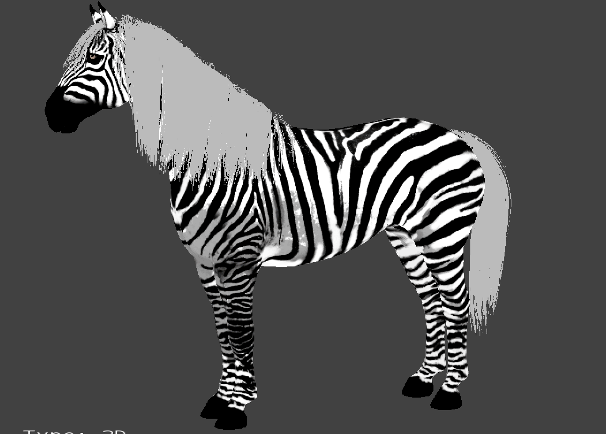{width=70%}


Great! But nothing really happens, right? Why is that? Simple – Pebbles is using the grey light fur material, which doesn’t work well with this type of pattern. To fix this, let’s try something more suitable. We can look for an existing material with higher contrast that might work better.


We are using the black base of the body material and white fur which is used as value for the scratches. You can play with the slider too, but I think the full value is what we want.


{width=70%}


Nice! It works! But I think we can make it even better and closer to our vision. Let’s go ahead and create a unique morph to adjust just her body type a bit :)


For that, we need to create a new morph which can be activated in her body component.

in the *main/Data/Libs/Tables/Character/* open the **ClothingMorph**.xml and add this new line and save.

You can add this at the end, but I’ve gone ahead and added it under the other body types we’ve already established.


```
<Morph Name="#horse_zebra" />
```


*ClothingMorph*

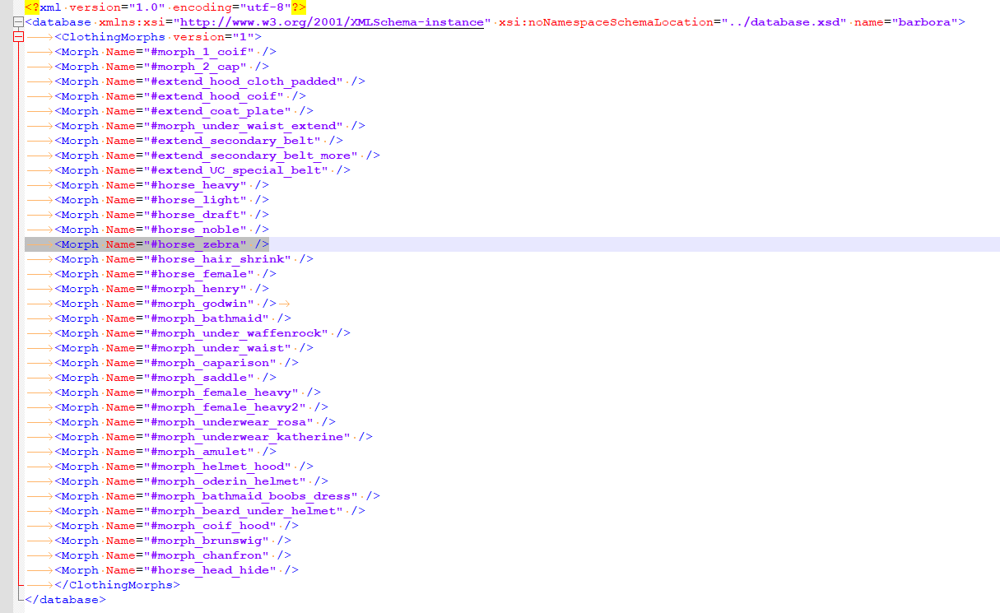{width=70%}


Now lets go ahead for actual cretion of the bodytype itself!


Open the Maya scene with the horse body and duplicate the model. Call the new duplicate **horse_zebra** and put at the end of the horse blendshapes group under the rest of the other body types morphs.

**The naming needs to match the name of the created morph in ClothingMorphs.xml so it triggers once it’s added in Smid.**


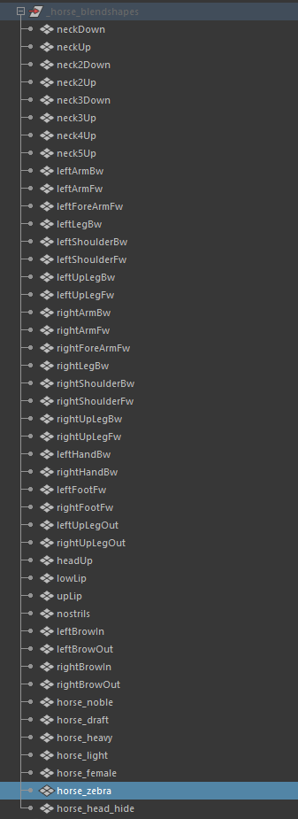


*Body change*

{width=70%}


Now, let’s move on to changing the body itself. Make sure you're working on the blendshape model. I mostly use soft selection and make simple edits to the low-poly model. Just follow your reference and aim to make it look as great as possible! We should avoid making any significant proportional changes since the skeleton will remain the same, ensuring it still looks natural. Also, be sure not to scale the character.


Once you're done, you can export your model into the engine, and the morph will be added to the rest of the blendshapes on the model. You can also preview the change using the intensity slider.

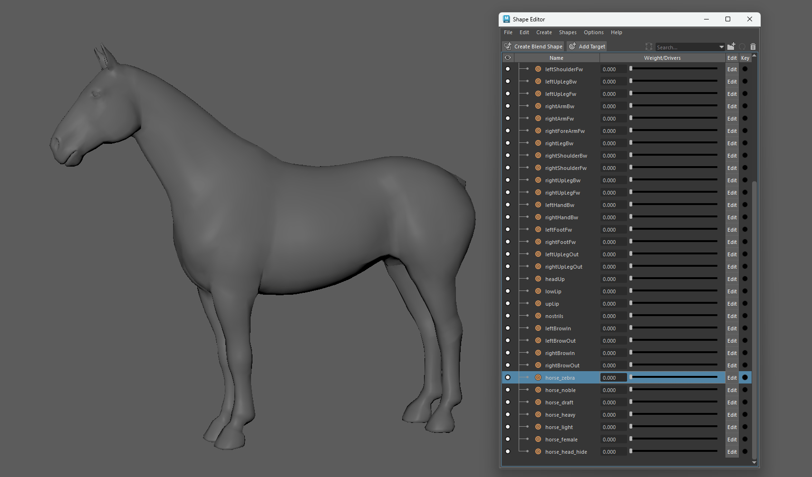{width=70%}


Alright! We're finally getting there!

Now, simply go back to Smid and find the body component for Pebbles. Head to the **Morphs** window and add the '**horse_zebra**' morph for her and don't forget to save Smid. This will ensure that the zebra morph is triggered only on her body and not on any other horses.


*Smid*

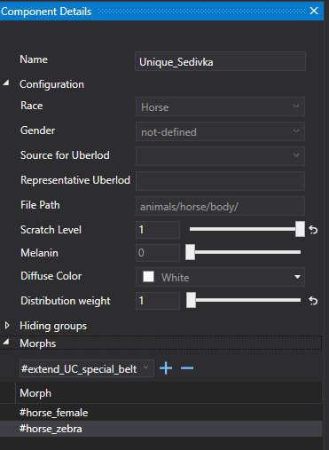


And here she is ! Aaaaaalmost there! I'm still not really happy about the mane and tail, but we can change that too !


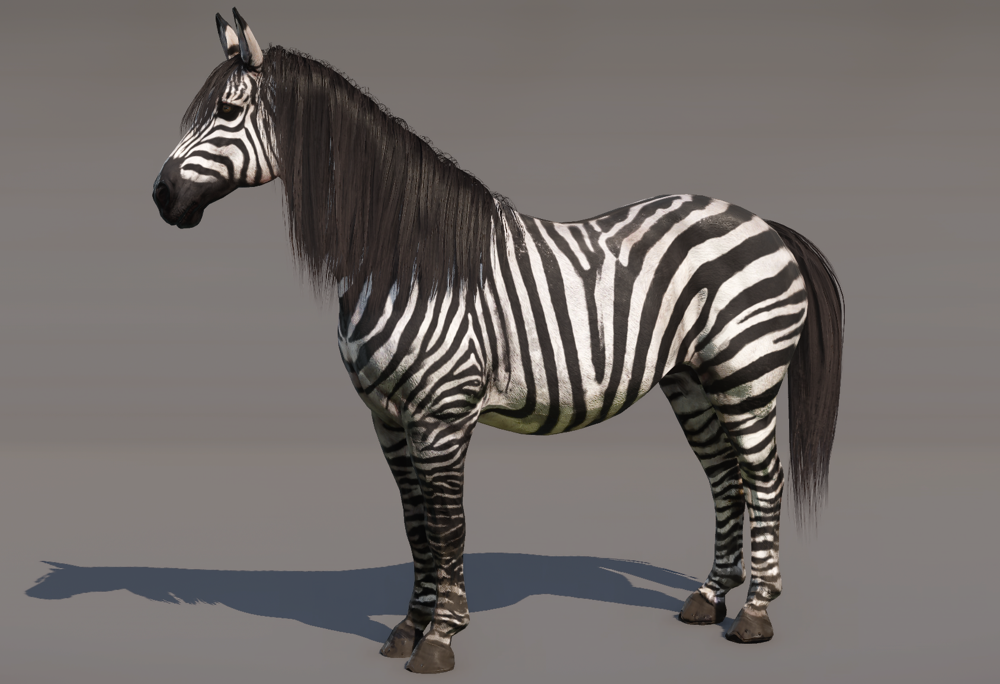{width=70%}


Let’s create a [storm rule](../../../../KM-A-37 Modding - Game Data/KM-A-19 Modifying game data/KM-A-16 RPG - Character stats and skills/KM-A-32 STORM/README.md) for her look.

we know that in \***main/Data/Libs/Storm/appearance/common/appearance_horse.xml** \*are stored rules which body / hair and tail part will be loaded for this specific horse. It should look something similar to this:


```
		<rule name="body_tsem_sedivka">
			<selectors>
				<hasName name="tsem_sedivka" />
			</selectors>
			<operations>
				<setBody name="Unique_Sedivka" />
				<setHair name="horse_hair_000_deep_black" />
			</operations>
		</rule>
```


Firstly, we need to create patched storm rule for this mod. Simple create a new xml file name **custom_horse** which will contains these changes:


```
<?xml version="1.0"?>
<storm>
	<rules>

		<rule name="body_tsem_sedivka">
			<selectors>
				<hasName name="tsem_sedivka" />
			</selectors>
			<operations>
				<setBody name="Unique_Sedivka" />
				<setHair name="horse_hair_000_flipped_deepl_black" />
				<setBeard name="braided_tail_01" />
			</operations>
		</rule>

	</rules>
</storm>
```


Secondly, we need to create a storm override file which will have information of the specific storm changes. Create a xml file named **storm_custom_horse** and insert these lines:


```
<?xml version="1.0"?>
<storm>
  <tasks>
    <task name="appearance" class="appearance">
      <source path="custom_horse.xml" />
    </task>
  </tasks>
</storm>
```


Tadaaa here is Pebbles, in all her exotic glory!

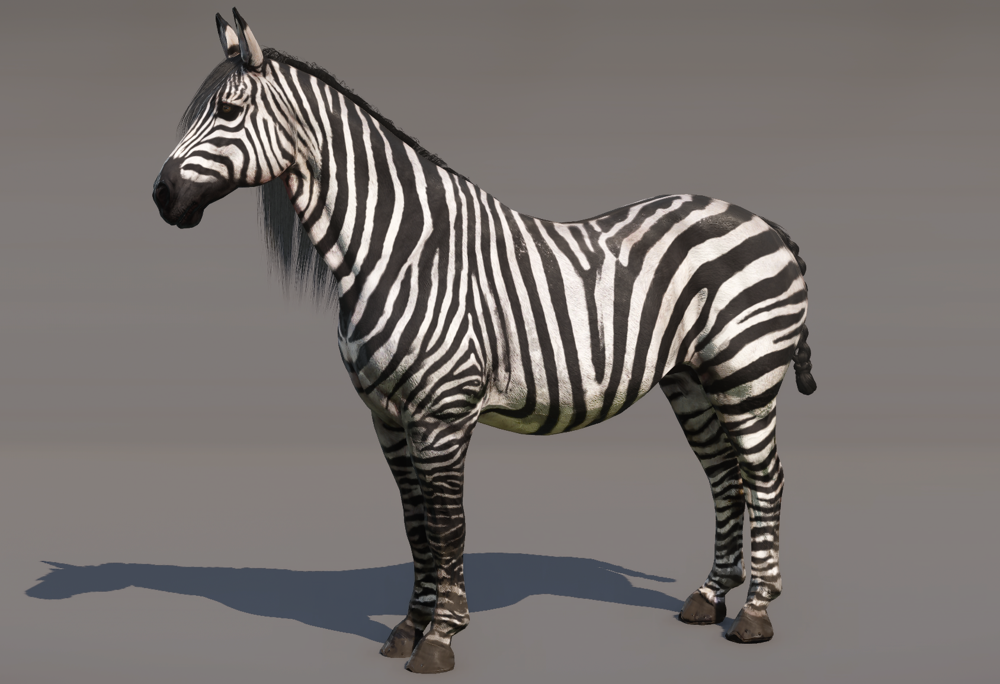{width=70%}

{width=70%}


The first part is done! Congrats!


### Adjusting saddles


Now, for patching. Since we’ve changed her original shape, it's likely that most of the saddles won’t fit properly, and there will be noticeable clipping—especially if we made any significant proportional changes to areas like the belly, head, or butt.


*Badly fitted saddle*

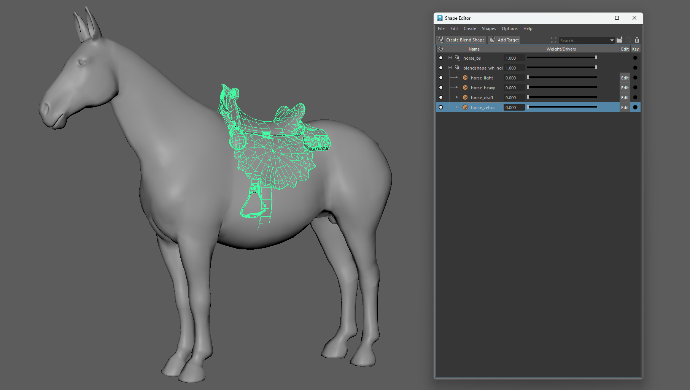{width=70%}


To fix this, we can use the same method we used to create her body, by utilizing morphs.

So, what does that mean? It's simple. We need to create a 'zebra' version of each saddle that doesn’t fit her body properly.

Simply duplicate the saddle model, name the same way as the activated morph (horse_zebra) and adjust the saddle shape to fit her body better.


By exporting to the engine, the morph will be added to the rest of already existing blendshapes and activated.


Added marph to fit the custom body

{width=70%}


This will need to be done for each of the horse clothing which won't fit the newly created shape. It's a bit tedious, but worth the work :)


And here she is, all in her beauty with a properly fitted saddle :)

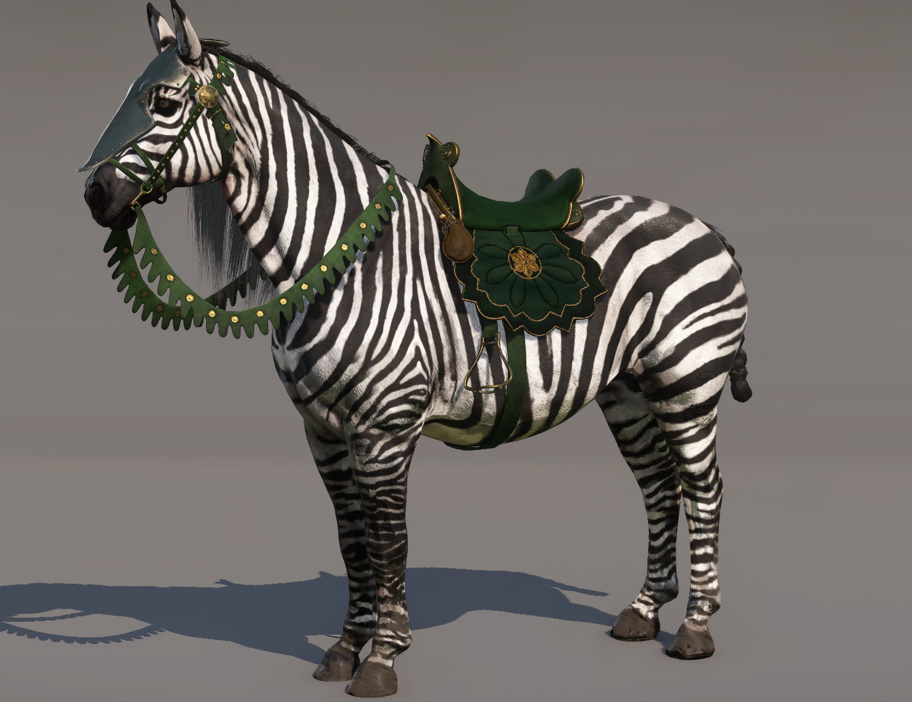{width=70%}