# Custom helmet
So, you're looking to design a stylish helmet as well? No problem!

Creating helmets within our clothing system is relatively straightforward. As one of the topmost layers, there are fewer constraints to consider, allowing for more creative freedom. Let’s dive in and start bringing your vision to life.

Assuming you have a clear reference and concept in mind, go ahead and open your preferred software to begin crafting your high-poly model. Make sure to use the male body as your reference, ensuring the helmet fits comfortably around the head. The goal is to avoid any clipping, so be mindful that the ears and nose are fully enclosed within the helmet without any awkward sticking out.

*High poly model*

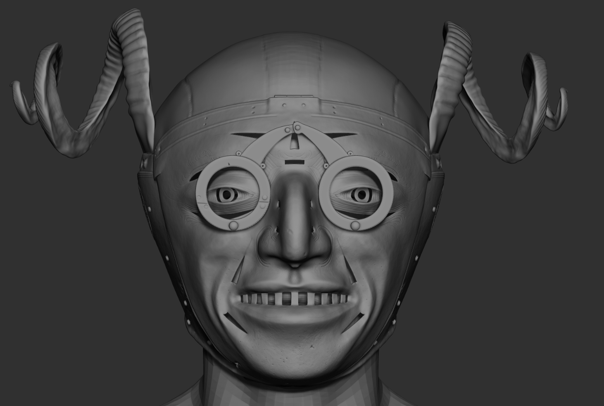{width=70%}

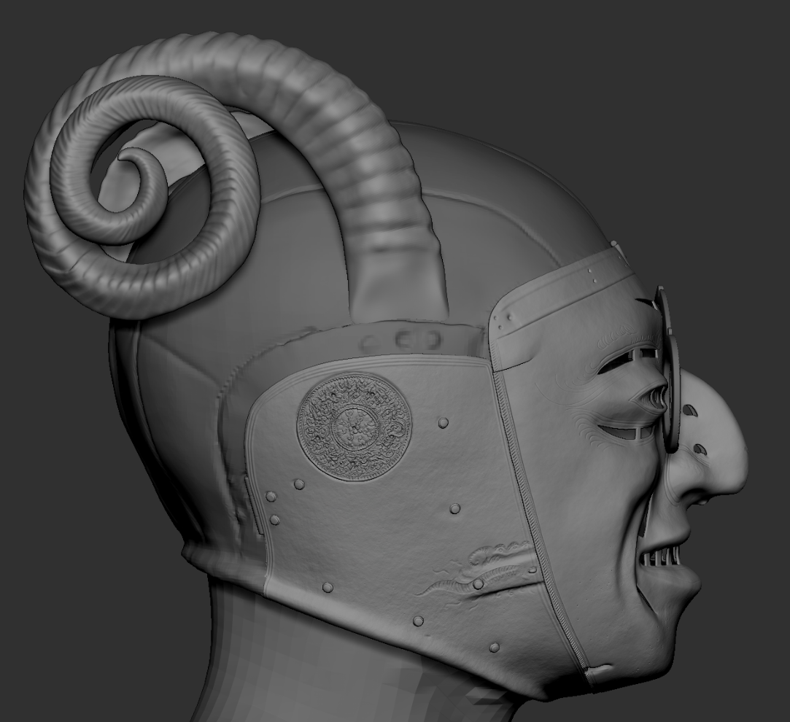{width=70%}

### Low poly model

Once you're satisfied with your high-poly model, it’s time to create the low-poly version. The goal is to maintain a reasonable polycount to ensure smooth performance in the game, while still preserving key details. It's recommended to keep the polycount relatively low, aiming for around 4,000 to 6,000 polygons for optimal balance.

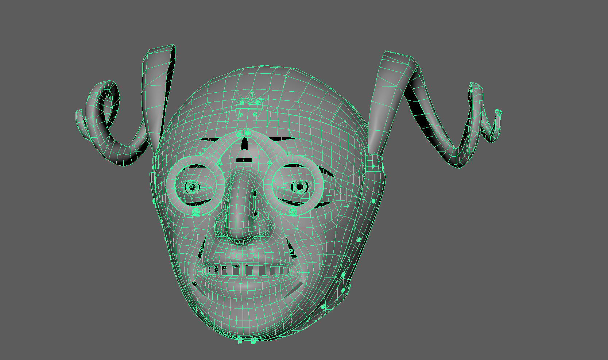{width=70%}

As the clothing system doesn’t permit a helmet to be worn without a padded layer on the neck, we should add a protective layer that covers both the neck and chest beneath the helmet. For this situation, we've created macro models that are shared across all helmet models. However, a simple covering model will suffice for our purposes.

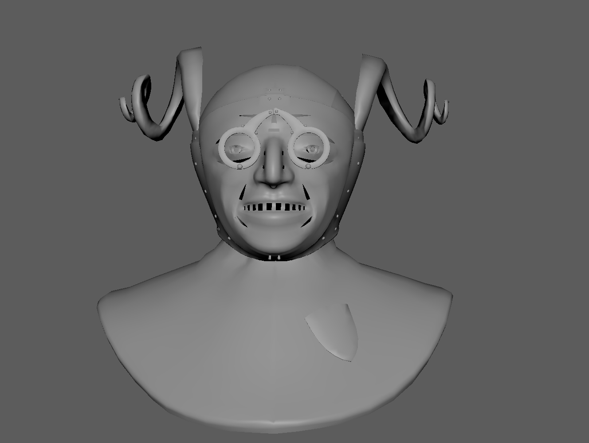{width=70%}

Create a **cryExport** node using the Crytek tools. We’ll be working with a .SKIN file, as this model will be skinned to a male skeleton.

*CryTools*

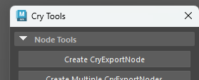

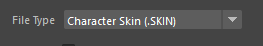

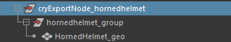

Bind the model to the skeleton and ensure that the entire weight of the helmet is painted to the head joint. This will help prevent any skinning issues or stretching.

*Helmet skinning*

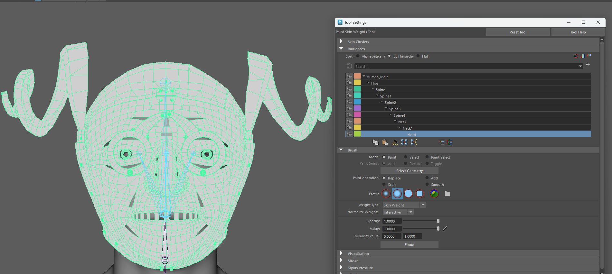{width=70%}

To properly load the material into the engine, we need to assign the original Maya material to the Crytek material groups. Simply select your model, create a new Material Group, and use the "**Add Shader from Selected Geom**" button.

*Material groups*

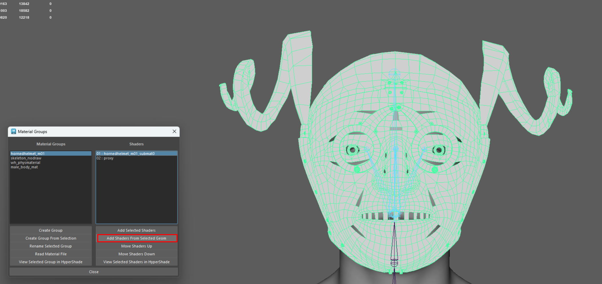{width=70%}

Now just save your scene and export the model into your correct engine folder.

*Export options*

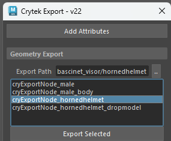

### Texturing process

Once you’re finished, it’s time to bake the textures, transferring all the detailed information from the high-poly model to the low-poly version. We recommend baking essential maps such as Ambient Occlusion (AO), Curvature, Thickness, Normal maps, Position, and ID maps. These will aid in the texturing process and help you achieve the best possible result.

Since our texturing approach differs from the traditional method—thanks to the use of our Material Atlas—we’ll need to handle the textures a bit differently. Think of the texture as a base layer, overlaid on top of the tileable materials from the Material Atlas, which serves more as the foundational material definition. This approach enables us to achieve greater detail while optimizing performance. Our goal is to create various visual elements that help break down the tileable textures, adding imperfections, defining unique characteristics, and giving the overall piece a distinct look.

Since this helmet is primarily made of metal, we’ll only need the Normal map, along with Glossiness, Specular, and ID maps. These will be used in Smid to define the various features of the helmet.

*Material \> Specular \> Gloss \> ID channels*

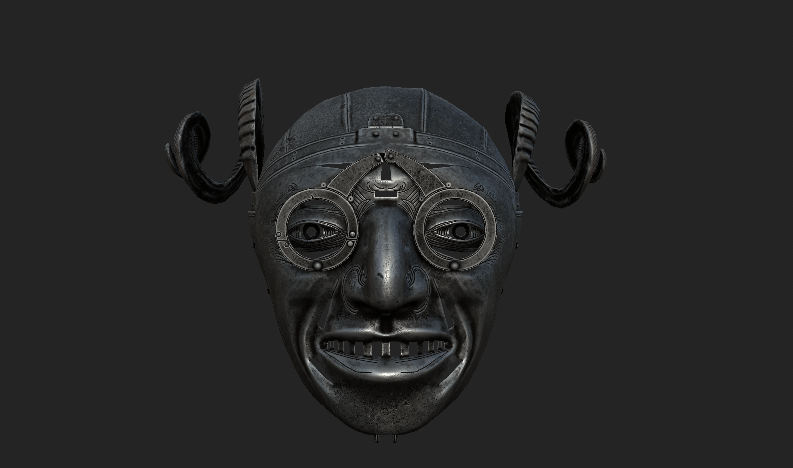{width=70%}

### Engine implementation

Create a new material named **HornedHelmet_m01** and set up your custom textures. Be sure to enable the **Clothing System** option, as this will allow us to configure the feature slots from the ID map.

*Material view*

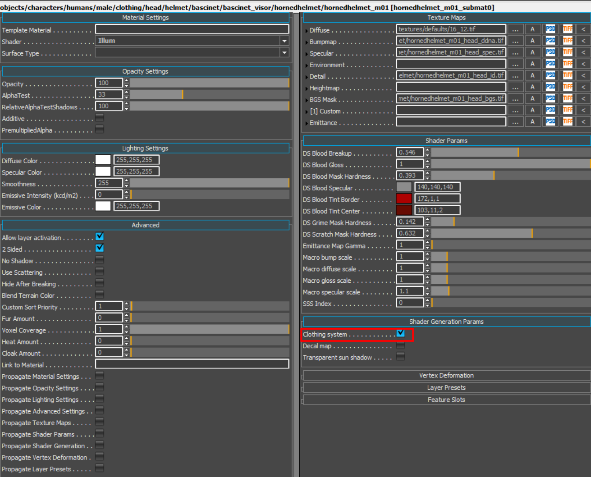{width=70%}

We’ll be using several helmet features to complete the asset, specifically **HelmetBase**, **HelmetRivet**, **HelmetVisor**, and **HelmetTrim**. Assign the corresponding colors from your ID map to each feature, then we can move on to the Smid implementation.

LargeCoif features will be used for the padded element under the helmet.

*Features*

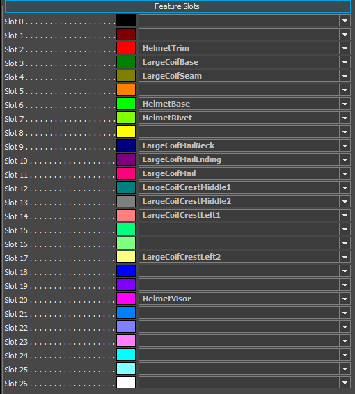

*ID debug in editor*

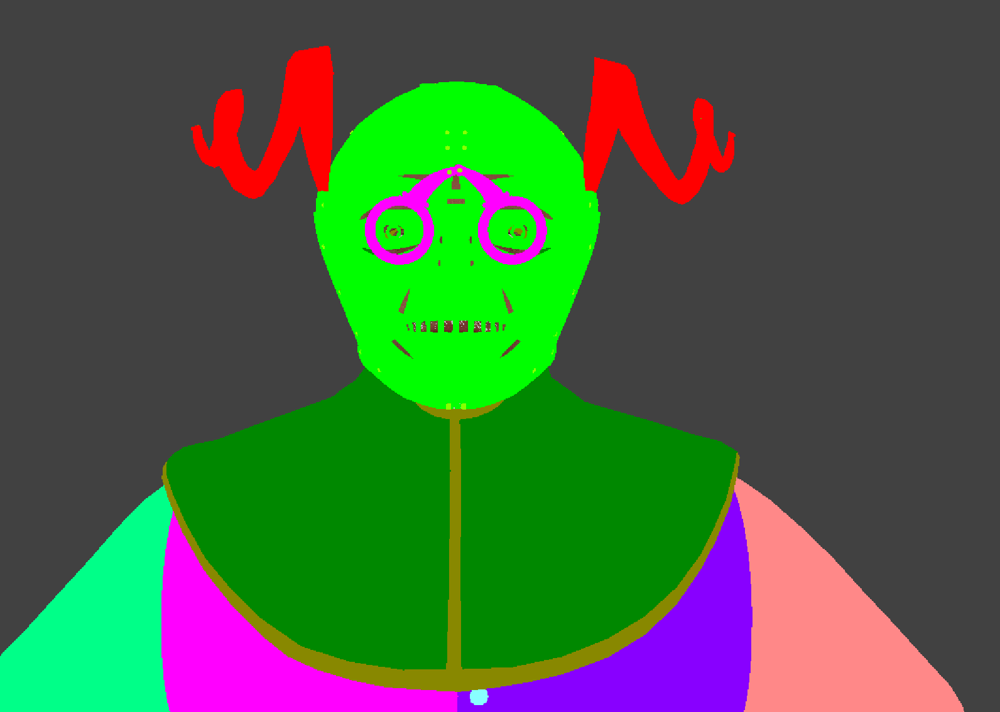{width=70%}

### Smid implementation

Lets create a new Component in the Bascinet root, call it **HornedHelmet_01** and setup all the elements and material in Component Details.

Make sure to check the **Armor Type** and **Archetype** as well. These settings help the system determine which slot the helmet should be equipped in. For this helmet, we'll use the **BascinetVisor** for the Armor Type and **HeadPlateHelmFull** for the Archetype, along with the alternative archetype.

You can also refer to other pre-existing helmets to see how they are set up, ensuring that everything is configured correctly.

*Component Browser*

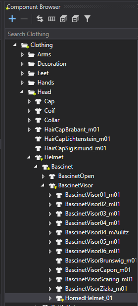

*Component Details*

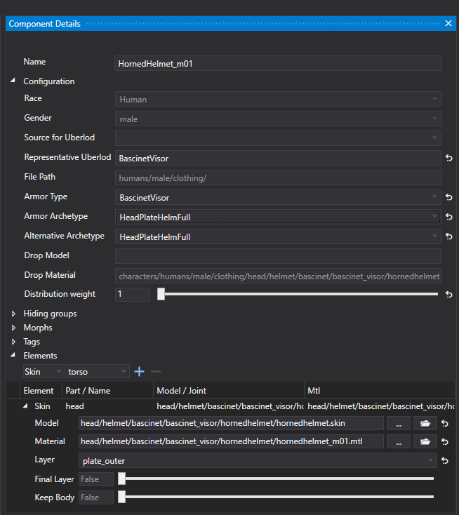

### **Item Creation**

To equip and view the model, we need to connect the component with the item.

Open the **Item Browser** tab from the menu and search for **BascinetVisor**—we'll use it as a reference to duplicate. Rename the newly created duplicate to match the name of your helmet component: **HornedHelmet_m01_C3** (where the "C" represents the quality grade).

Now, simply drag and drop the correct component, save, and you're done!

*Item browser*

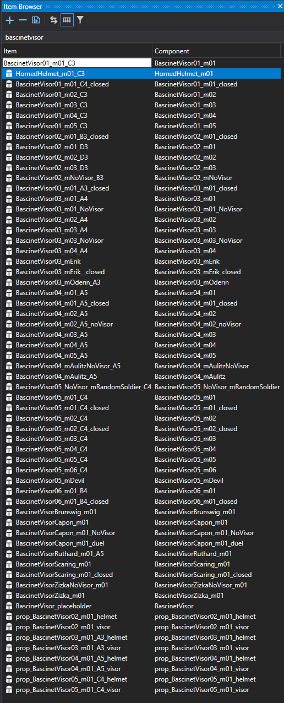

{width=70%}

To ensure everything is set up correctly, open the **Item Details** and double-check that the component is properly connected. You can also update the UI name to make it easier to find your new helmet in the game.

*Item details*

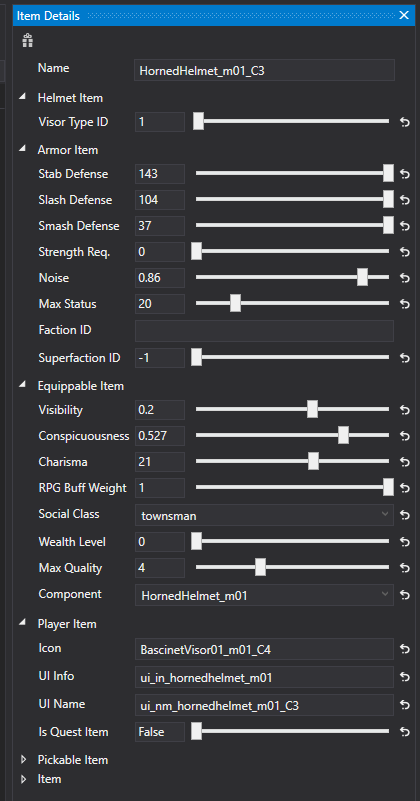

### Feature setup

Now, let’s complete it visually! Add the necessary features to your component through the Feature Browser window by either clicking the + button or simply dragging and dropping them in. Be sure to specify all the helmet features and assign the appropriate materials.

There's no need to worry about the **LargeCoif** part, as it’s inherited from the padded layer itself and will dynamically change based on the clothing the player is wearing.

*Component Details*

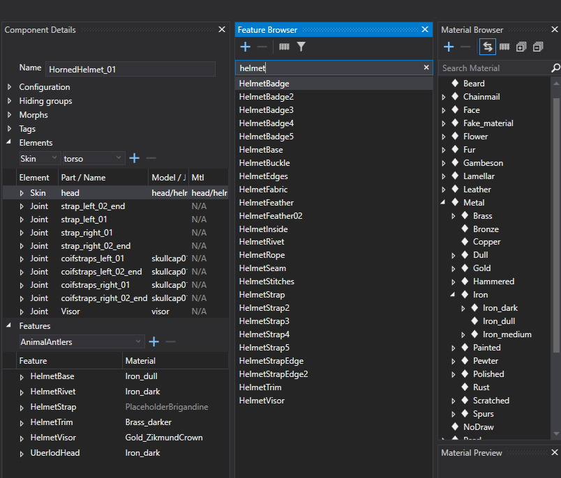{width=70%}

And that’s it! Now it’s up to you and your vision. Simply choose the material that fits best and complete your helmet. :)

*Features assigned to materials*

{width=70%}