# 3D Max tools
Here is the description of the tools that you are going to find after setting up your WH workspace in 3DStudio max

## **3d Max tools:**

**Ours tools:**
once you installed our tool, you should see that new tab here
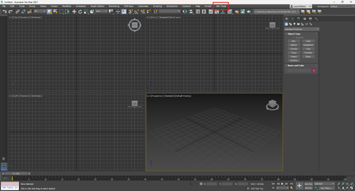

Which will give you access to our export and model menu.

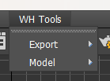

in the exported menu we use this one

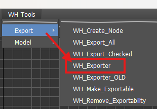

and in the model menu you will find our material tool
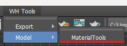

## **Tools menu:**

**The exporter:**

1\. Export checked: use the check boxes to select which node/assets you want to export
2\. Export all: export all the nodes in the list
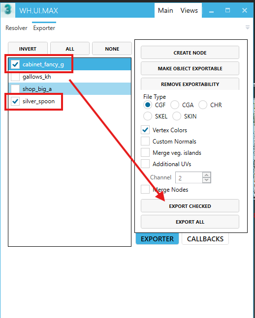
\- Cabinet_fancy_g, gallow_kh, ... – multiple files/assets could be exported from one 3ds Max scene
\- Create Node – creates Export node
\- File Type – possibility to change the file type per exported asset, we use CGF for static environment assets
\- Vertex Colors, Custom Normals, ... – include extra properties during export, could be set separately per node

**WH_Export node:**

To export geometry via WH Exporter, the **Export node needs to be created and mesh linked to the node**. There are several ways how to do it:

* Via *the Create Node button in the WH Exporter window*
  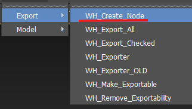
* Via menu *WH Tools -\> Export -\< WH_Create_Node*
* Via *Create/Helpers/WARHORSE* command panel
  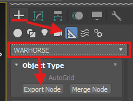

The Name of the Export node represents the name of the exported file (for example, cabinet_fancy_g).
The Pivot of the node represents the pivot of the exported model in the engine.
The File is exported to the same folder where \*.max file is placed.

!!! The Node is used only as an information container, and it's not exported.!!!

Typically there should be only one mesh linked to the Export node, i.e. all the model geometry should be attached with its XForm reset

**Merge node:**

Merge node allows us to link multiple meshes to the export node.
This could be used to our advantage – we can keep meshes instanced, we don't need to care about XForm etc.
All the meshes are linked to the Merge node, and the Merge node is linked to the Export node. Proxy meshes are also linked to the Merge node, the same as LOD meshes.
To make sure proxies are distinguished from visual meshes, they should have the string *"proxy"* somewhere in their name.

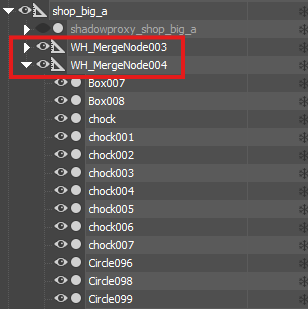{width=308px}

**Exporting**

During export, the CryENGINE Exporter log window pops up. Please check the log for possible errors.
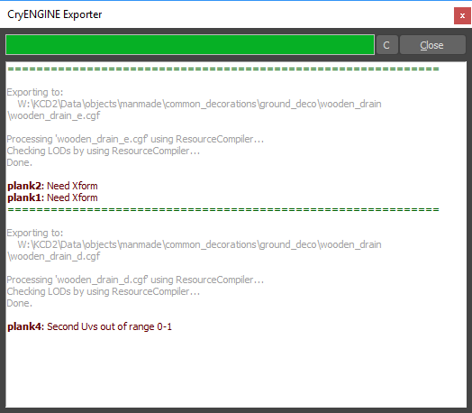

**Material Tools:**

This will allow you to import your cry engine material in the max file and assigne them to your model, it will make the connection between the model and his shader.

**There are two ways to get the material:**

**\-Active material Slot:** it will automatically assign the mtl to the active slot selected in the material editor. Better to use this one, especially if your models have a lot of different parts.
**\-Selected Object:** this one will assign it directly to the selected object

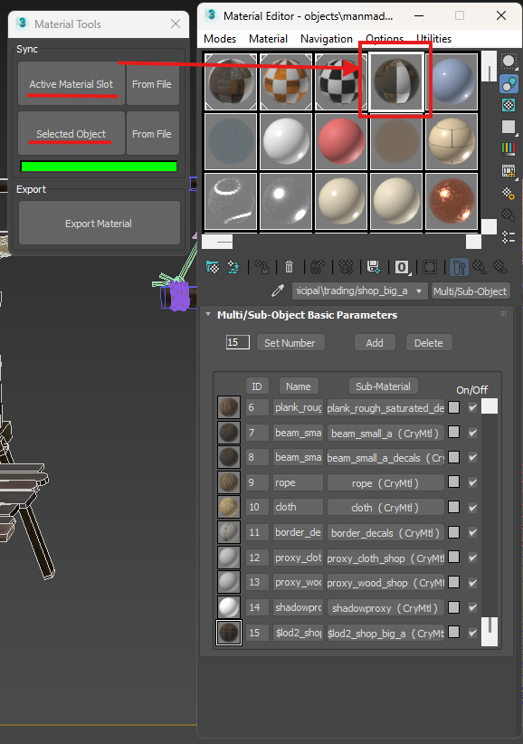

The rest is quite simple
"From File “ will open your file explorer and then just go to the folder where your mtl is, select the one you need and open it to have it in your Material Editor.

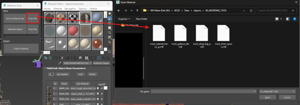

**NB:**
In case you have to cancel the opening etc do not panic is you see these, just close those pop up windows (max script included), the material tool and re-open it again.

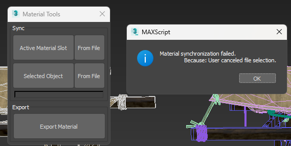

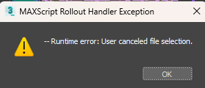