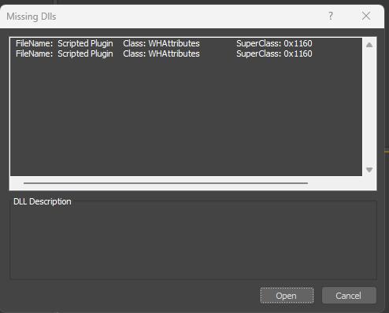
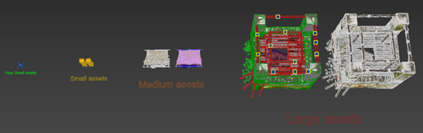
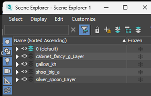
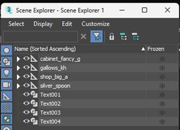
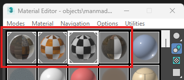
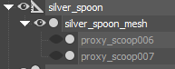
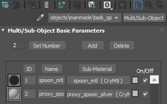
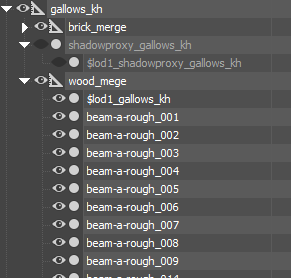
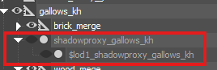

# 3D Max template file
**!!! on opening the file, you might have this warning, just hit open !!!**

**Here is what you are going to find in the scene:**
\-several object going from very small to the larger one
\- their respective material assigned to each one
\-also a complete node structure for each one of then
\-as well with their LOD and shadow proxies.

Let’s go over the whole file

In the scene Explorer you would find each asset ready to be exported

 
&nbsp;&nbsp;&nbsp;&nbsp;&nbsp;&nbsp;&nbsp;&nbsp;&nbsp;&nbsp;&nbsp;&nbsp;&nbsp;&nbsp;&nbsp;&nbsp;&nbsp;&nbsp;&nbsp;either by layer                                                 or by hierarchy

And their respective materials

**From the smallest:**

\*\*silver_spoon
\*\*

where you can see that the mesh is directly linked to the export node. Because it is a small model, only **physical proxy** are included and \*\*linked to the mesh itself as there is no need for LOD’s and shadow proxys.

Why no need for shadow proxy and LOD‘s\*\* here it‘s because the material is really simple

\*\*
To the biggest and complex one:\*\*

**gallow_kh**

Where the model is **compossed from a lot of element** which are **grouped in the merge nodes** (brick_merge and wood_merge) as well with the shadow proxys and the **LOD1 also included in a merge node**

\*\*!!! we can see here that the shadow proxies work a bit differently!!!
\*\*

the **LOD 0 (main model) shadow proxy is linked directly to the export node** gallow_kh and the **LOD1 shadow proxy is linked to the first shadow proxy**.

**!!! the naming convention in the hierachy for the shadow proxy here is really important, same with the LOD’s!!!**