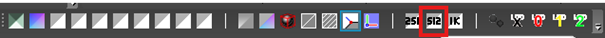
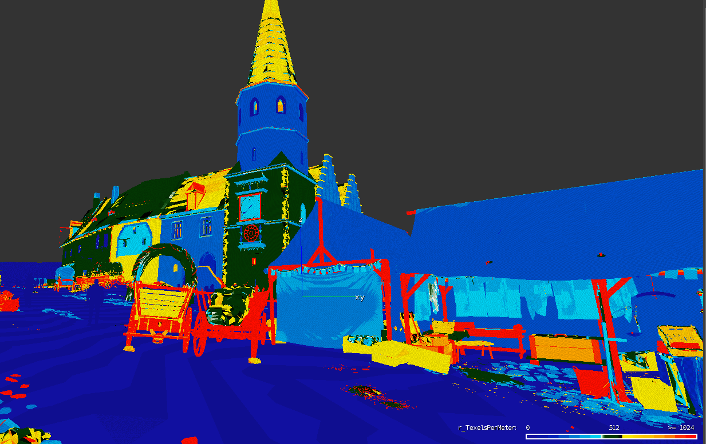

# Asset creation
## **General**

*This here is about assets in the sense of models created for level, not about all the different pieces of data.*

Asset creation for games is no easy task. Of course you need to be able to use many intricate applications and have a feel for what's nice, but that's not the only thing. Because in the case of realtime rendering resources are limited, you have to be able to balance many aspects of the asset for it to be usable and nice to look at. Furthermore, an asset is not an island, and that makes judging what you can and cannot afford even harder. Basically, you are always trying to create as nice an asset as you can in the limits of technical constraints. And the knowledge of where you can push further and when you can hold back without compromising quality is a hallmark of a good game artist.

Every asset needs a couple of things:

1. model – geometry of the asset
2. material – defines what shaders and textures are used
3. mapping – defines what pixels of textures are used on what pixels of a rendered asset. In some cases it may define something completely different (e.g. uberlods use it to define final size)
4. textures – defines many different things like color, normal direction, high-frequency height differences or even where will rust appear first when a weapon gets older.
5. Physics proxy - reduces physical simulation cost of an asset by approximating its geometry
6. surface type – defines what a physics reaction will look like, sound like and some other things
7. shadow proxy — reduces shadowcasting cost of an asset
8. LODs — reduces rendering costs of an asset from distance

## **Model**

**Tri-count**

To see why tricount is a better measurement than polycount, click [here](http://wiki.polycount.com/wiki/Polygon_Count).

During modelling you need to pay attention to tricount. Less is better for GPU and memory, but visual quality shouldn't suffer much. You should always try to save triangles on flat surfaces, so you can use them on silhouettes. On flat surfaces the normal map can be enough and if you combine it with OBM/POM, there shouldn't be any difference to the detail model.

Hero assets in general can have more triangles than regular ones.

Vegetation assets that will be placed in groups or used in fillers should use less.

Think about prevailing view distance of the model in the game. Roof that the player won't ever be able to get close to doesn't need a lot of details, but a torch he will hold in hand does.

Round things will always need more triangles where the silhouette is round, but that doesn't have to apply for the whole thing. For example, a log needs to have a lot of geo on both ends, but the middle can be quite low poly.

It is hard to give some general "good triangle amount" for every model, but the technical limit in CryEngine is 64 000 indices (split vertices). A suggestion to start with would be:

* 0.1m3 = 1000 tris
* 1m3 = 5000 tris
* 10m3  = 20000 tris
* 100m3 = a couple of 64 000 tris models.

But as stated above, that doesn't mean that a big cube needs to be tessellated heavily, nor that an intricate family sword that the players usually have in the hand needs to be a low poly blob.

**Reusing**

Games in general are about repeating. Even art benefits from reusing assets and parts of assets, so it's a good idea to think about it from the beginning. In terms of model, it saves time spent on modeling and mapping. In terms of memory, you might enable an option to reuse textures. Sometimes, to create a model, you need to make just a few unique parts and then build with them like with Lego blocks. Even adding triangles to enable the possibility of repeating texture elements is usually a good thing.  Always try to think about ways how to make this. Don't worry too much about losing uniqueness. It can be then added by local deformations, decals, second UV textures or vertex color.

**Pivot**

There are some reasons to think about pivot placement as well.

First, since the resulting file needs to be as small as possible, some compression will happen. As a result, vertices you carefully position in max might end up somewhere else in the editor. This imprecision is bigger the further the vertex is from the pivot, and at 100 meters it might make a couple of cms easily.

The second thing is the ease of use, in the editor you can align a model to any surface by holding Ctrl+Shift+click. Think about how the model will usually be positioned and place the pivot so it can be aligned easily. This is less of an issue for unique assets like castles, because these are placed once and are big, so the precision is needed more.

**Dimensions**

Some things in the game need to be made using standardized dimensions, for example, height of a chair, width and height of the door frame, height of a building floor, etc. You can see dimensions in the [Standardized dimension](KM-A-52) section.

**Mapping**

Good mapping can save a lot of memory and a lot of work as well. It is where most of the reusing can happen and where final texture resolutions are decided.

**Percentage of UV space used**

Leave as little unused UV space as possible.

Automatic packing algorithms are great but are working well only with rectangle like islands. Also, they might mess up a direction of your islands (e.g. you might want to map wood according to the grain in texture). And lastly, it maps things uniquely, and that is not what you want.

**Straightening islands** that won't get distorted by it much is a good idea because it will likely save quite some space.

**Reusing UV space**

Every island that shares space with another is a free resolution in a way.

Flat things might be mapped the same from both sides.

Sectors of round things might share the space. Both halves of a barrel, for example, can use the same UV space. Even quarters might work well.

Tiling saves loads of space. The detail can be added by decals, second UV textures (obsolete) or vertex color.

## **Textures**

**Texel ratio**

The most important thing for perceived resolution is the texel ratio. Our target texel ratio is 512px for diffuse maps on PC, which means that on a 1m2 you'll have 5122 pixels. Ideally, this should be the case for every surface in the game, but as with everything, there are exceptions and technical limitations that prevent it.

A hero asset might need more texel ratio as they will be close to the camera quite often. On the other hand, we don't need as much on the bottom of a table desk because that won't be visible almost ever.

Flattening the geometry during mapping will likely result in some distortion, and that will cause different texel ratios on different triangles.

Texel ratio of 512 is only important for LOD0. Textures you won't see from closeup can be and should be of lower density.

Maps other than diffuse have these texel ratios:

* Normal+Gloss – 512 (256 in case it's possible)
* Specular – 128
* Heightmap – 128
* DetailAtlas – 64
* Detail – 2048 (is achieved by tiling)

Texel ratio can be viewed in the editor using r_TexelsPerMeter = 512 or clicking the right button on the View-modes panel.

This overrides shaders with texel ratio debug shader. You can tell by the color how far off the specified value a model is by color.

* Red is at least twice as much as the value (\>1024 in our case)
* White/green/black is on the spot.

Dark blue is 0. This is the tricky part, because while the rightmost end of the legend shows twice the texel ratio, the leftmost shows 0, not half the texel ratio. This means that half is actually in the middle of the left side in the legend.

{width=70%}
For more information you can look on the [Texel ratio](KM-A-54) page

**Resolution**

Resolution depends on the texel ratio and mapping. For example, if I create a 1x1x1 box in max and leave the default mapping where all the sides are mapped on top of each other filling the 0,0 to 1,1 UV space, then for a diffuse texture I will use 512x512 pixels.

**Detail maps**

Detail maps are extremely important because the texel ratio of 512 isn't sharp enough from close up. We have a technology called detail mapping that allows us to use multiple detail maps on a single model, so almost everything can make use of them. All detail textures have resolution of 512x512. It is important to set proper tiling based on a diffuse map. Target texel ratio for detail maps is 2048.

Example of tiling settings:

* Diffuse 512x512 – Detail tiling 2, 2
* Diffuse 1024x1024 – Detail tiling 4, 4
* Diffuse 512x1024 – Detail tiling 2, 4

Be aware that a detail map can be mapped from the first uv channel or the second. Second mapping channel is a default if there is one. You can switch to first using a flag in shader generation params called Use first UVs for DetailMap.
For more information about setting up in CryEngine go on the [Detail maps](KM-A-53) page

**Reusing**

Whenever you can, you should use a texture that already exists in the level. Not only will it save time, it also saves the memory and streaming bandwidth. When the same texture is used on two models being rendered together, it is loaded only once into the memory.

**Detail frequency**

Detail frequency in an image means how frequently a significant change of values occurs in an image. For example, a picture of a white noise has a very high frequency of details, while a simple gradient has a very low frequency of detail. Usually a picture will have multiple different frequencies in smaller or larger amounts. A rich and eye-pleasing texture usually has all the frequencies well represented, so it is a good thing to keep in mind.

Rich low-frequency details might result in a texture that will show any tiling a lot. This is why a detail map, which tiles a lot, should have only the details of higher frequencies present.

**Basic types of textures**

When saving textures in Photoshop, Ultimate Texture Saver does the most work for you. However, in case you don't have it, you need to prepare texture before saving by yourself, i.e. to fill appropriate channels with appropriate content, use the proper filename suffix and select the proper RC profile. For basic file types, see the following:

**Diffuse map**: albedo in R, G, B channels, alpha in the Alpha channel, filename suffix "_diff", RC preset "AlbedoXXX"

**Normal map**: normals in R, G, B channels, filename suffix "_ddn", RC preset "Normals"

**Normal map combined with glossiness**: normals in R, G, B channels, glossiness in the Alpha channel, filename suffix "_ddna", RC preset "NormalsWithSmoothness"

**Specular map**: specular in R, G, B channels, filename suffix "_spec", RC preset "Reflectance"

**Height map**: black in R, G, B channels, height map in the Alpha channel, filename suffix "_displ", RC preset "Displacement"

**Detail mask**: values same in R, G, B and A channels, filename suffix "_dtmask", RC preset "Detailmask"

**DDS and working with textures in the editor**

As soon as the Crytiff is saved, RC compiler (running on the background when the editor is started) converts it into the DDS file based on the settings from the dialog above (resolution reduction, RC preset, etc.). It's **NOT recommended** to save DDS directly from Photoshop/Painter, you'd lose some options.

In editor's Material editor, it's recommended to fill in "tif" instead of "dds". However, what you see in the viewport are compiled DDSs.

**Materials**

Material defines the shader and textures used while rendering an asset. You should always use as simple shader as possible.

Complex models use multimaterial – i.e. several material IDs under the one joint name.

Whenever possible and your materials meant to be visible from close up should make use of detail atlas..

More reference regarding the materials could be found in the Cry Engine Documentation.

Basic Assets Setup and Export out of Max
<https://www.cryengine.com/docs/static/engines/cryengine-3/categories/1114113/pages/15728901>
Material Editor and Shaders
<https://www.cryengine.com/docs/static/engines/cryengine-3/categories/1114113/pages/1048701>
Physically Based Shading
<https://www.cryengine.com/docs/static/engines/cryengine-3/categories/1114113/pages/21267786>