# LOD's (Level Of Details)
## ***LOD's***

*(Level of Detail) is an essential part of game art. Well-done LODs will ensure a smoothly running game with unnoticeable switching.*

**There are a couple of things you want to achieve when making LODs:**

1. lower the number of drawcalls (this helps CPU)
2. keep the appearance (this helps us to look like professionals ;) ...and prevents self-shadowing.
3. simplify shaders - get rid of unnecessary effects like parallax, detail map, alpha blend and alpha test and so on (this helps GPU and Memory)
4. lower the number of triangles (this helps GPU but is usually not a bottleneck)

Usually drawcalls are a big issue, so lowering it is more important than anything else. The second most important thing is for the LOD model to look as close to the original as possible. Since models are being switched while the player is approaching them, it is important for this switch to be unnoticeable.

**While LODs are great and all, it is also unwise to have too many of them on an asset. Because:**

* switching LOD's requires resources (streaming)
* during the switch both models are being rendered

How many LODs an object should have depends on the object. For small objets with low material ID count and reasonable geometry, none are needed. Actually, it is better not to have them! During the switch, the engine has to render two objects and then blend between them. Also, determining whether to switch or not takes some small amount of time. In case the model is of medium size and can disappear at some distance, one LOD is just fine. And then two LODs (LOD 1 and LOD 2) are reserved for big objects like buildings, structures and so on. But this is just a basic guideline. In case you're not able to make good looking LOD while lowering drawcalls or triangles significantly, it might not be worth doing it, and vice versa, if you can save a lot by having more LODs, go for it.

In any case LOD1 has to have all the shapes of LOD0 present

## **LOD pipeline guideline.**

The following are guidelines for the LoD creation and things to keep in mind while creating LoDs and Shadowproxy.

**LoDs for houses and other big structures – how to create them**

Big structures like houses, barns, etc. have the following LODs:

* LoD0 – original geometry
* LoD 1 – decimated geometry at least 50 % of LOD 0
* LoD 2 – decimated geometry at least 50 % of LOD 1

**LOD ratio values**

We use proper LOD Ratio values. Switch Config spec to Medium and set LodRatio as follows:

* 255 for big city houses
* 200 for big objects (big tents, smaller city houses, village houses, barns)
* 150 for other stuff (furniture, small sheds)

**LoD 0**

Before start working on LoDs itself, think about the original model alias LoD 0. Usually there is a lot of room how to save precious memory by optimizing the geometry.
The most problematic are usually things like plank/ beam and other model parts that are not visible at all because of a wall, under the ground, etc, which are rapidly increasing poly budget. Go through your model to see where it could be optimized as best as possible without compromising the visual target.

Note: the biggest thing to keep in mind is the silhouette. So whenever the silhouette is not important or visible (high above, in the dark), these are the parts you can look for saving triangle.

**LoD 1 – reduced triangle LoD**

First, LoD of houses, barns and other big structures with tens of thousands of triangles is decimated original mesh, possibly with some not necessary matIDs removed completely when it’s not visible from far away or hidden.

**Naming convention of LOD meshes**

In 3ds Max: $lod1_XXX, $lod2_XXX\*\*,\*\* etc, meshes are linked to the LOD0 mesh. In case of using the Merge node, link the LODs directly to the Merge node

## ***LoD guidelines*** – how to Create LoD 1

Here is a simple rule for LoD creation.
LoD 1 is optimized LoD 0 using the method of simple poly reducing either by hand (sometimes it’s mandatory and cleaner).
Or by using the available tool in 3Dmax like ProOptimizer (this one often gives the best result) and Optimize

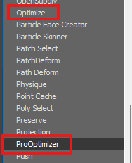

Keep and eyes on where even lower value will look good enough or the IDs which can be deleted completely (really small decals, for example, nails, etc.).
Contrarily, there is specific geometry, where you must keep higher resolution/tri count – for example, with a thatched roof or planks and careful ***big decals must stay as they are so usually just copied and attached to the LOD1***.

**When to strip**

* the object doesn't have a lot of materials
* getting rid of some materials won't be noticeable from a distance
* no expensive shaders are used or can be simplified (for example, you can always switch off parallax, but turning off second UVs can be quite noticeable)

***Tips***

* If you have more IDs in one wall, see if you can remove some, and if not, then you must be careful to avoid decimating too much and remove too many vertices used in the vertex painting.
* Keep your vertex painting modifier if it’s really necessary and decimate your model according to the idea of keeping a good visual.
* Be careful while decimating to keep and eye on the smoothing groups, and if you notice some wrong smoothing, use max tool to fix it, by the poly smoothing group

  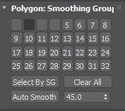

Or some modifier like those
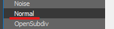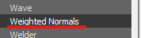

***Interior of LoD***

For house LoDs, we keep only the exterior.
So when you're satisfied with how the LoD looks from the outside, the next step is to ***delete whole interior geometry***.
Walls, stairs, inside beams etc. Because we don't want to see through the house, we need to create simple interior ***fill geometry*** with **black vertex color** to simulate darkness in the interior.

Note: This geometry will be later reused for LoD 2 too.

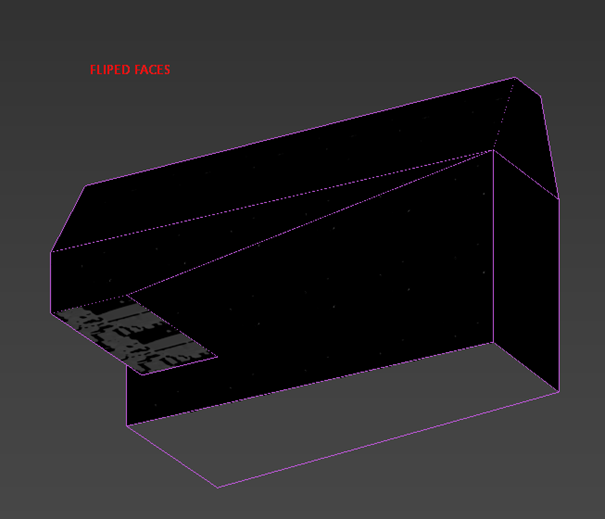

***Tips***

* The faces of interior fill mesh should be **at least 30 cm from the outside wall**  or more and must cover all holes (windows, doorways). Finally, **flip** the faces.
* **Create UV coordinates** for this fake dark interior (box mapping), set it's ID to some of the house IDs which use vertex color, **!!! not on id that use any alpha!!!,** and set vertex colors of the mesh to black (0,0,0). **Attach this mesh to the final LoD 1**.
* Create the interior fill mesh, align it with corresponding LOD1 (the same pivot and orientation). This will automatically place your interior mesh in the desired position and attach it to the newly generated LOD2.

## **LoD 2**

Use the same process as before but start from a copy of the LOD1.

**General remarks**

* Check LOD mesh for holes in geometry. Typically roof; when looking from the bottom, you can often see through. If it's a complex object, for example, base-floor+interior+roof, you should check how the parts work together.
* Think ahead. If you create a compound object (for example, pile of logs), you can create LODs of single logs and build LOD while making LOD0 pile.
* Work with smooth groups. If the original mesh has a rounded corner with one smooth-group and you will reduce it to a sharp corner, you need to separate smooth-groups as well.
* Try to make LOD mesh as similar to previous LOD as possible. Sometimes the LOD mesh is slightly bigger, which can cause self-shadowing artefacts during switching (see the tower here)

  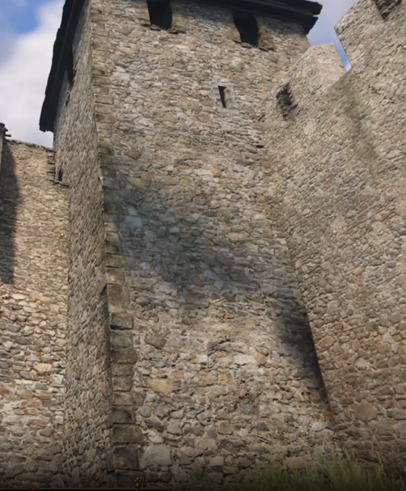
* In 3ds Max, put LODs into the proper layer to keep the scene organized.
* In 3ds Max, move LODs under the original mesh (or Merge node) and set them different wireframe color (colors are now set automatically during max file opening).
* In the editor, test LODs with LodRatio set to 255!
* Check LODs under different lighting/light orientation.
* Don't be too aggressive when deleting bottom faces – sometimes the object can be seen from the bottom even from the big distance (for example, when lots of houses are placed in the steep slope thus visible from the bottom)
* Unless the objects are very specific, you must always assume someone will use it in the way or in the place you didn't intend/presume to. For example, the cart can be used upside down, so even the bottom part must look ok in LODs.
* If the LODs are not working for any reason, check for proper hierarchy in 3ds Max
* Check what is visible from a distance and what is not, for example, the rope inside in LOD0

  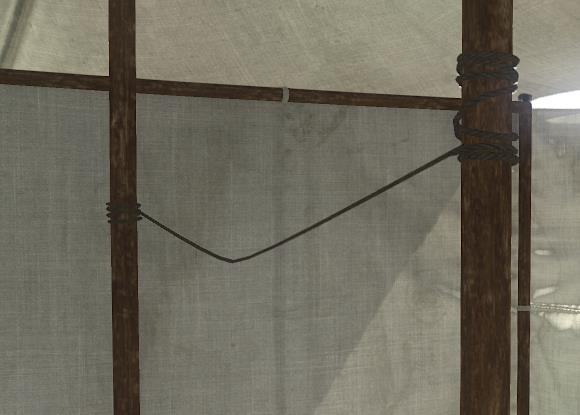
* Is completely unnecessary in the LOD1 distance:

  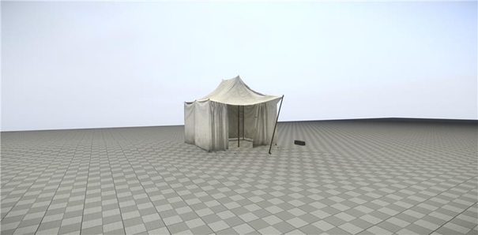{width=605px}

## **LODs for props**

This is a little more challenging to make the right decision which way uses for creating LODS, but we have a few rules for help.

* Remember one number: **1m3** (cubic meter). If your asset has a similar size or bigger, you will need to create last "LOD".
* Very small asset doesn’t have any LOD (dishes, food,…).

***Examples what to do***
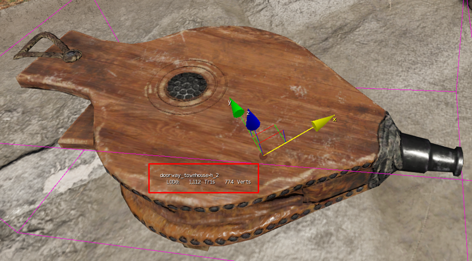{width=70%}

1 Drawcall, 1,1k tris. and small object. You can leave this brush.

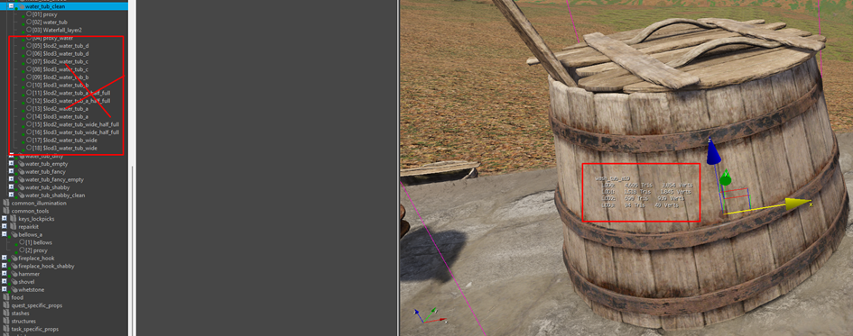{width=70%}
1 Drawcall, 4,6k tris and bigger object. You should create one poly-reduced LOD.

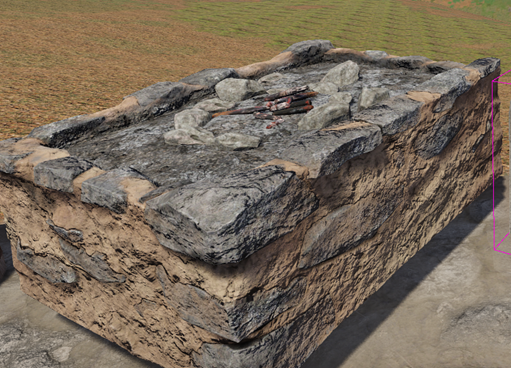

7 Drawcalls, 5,7k tris., interior object. Asset should have one poly-reduced LOD with 1-2 drawcalls (by keeping the really important material ID).

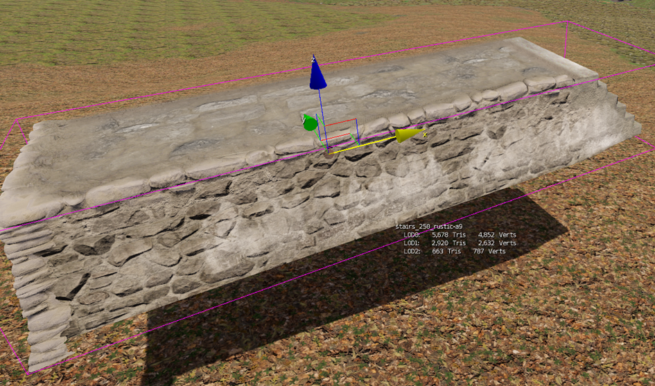{width=70%}

8 Drawcalls, 5,7k tris., large exterior object with many details. Asset should have a poly reduced LOD 1 and LOD 2 as well as reduced material id on LOD2.

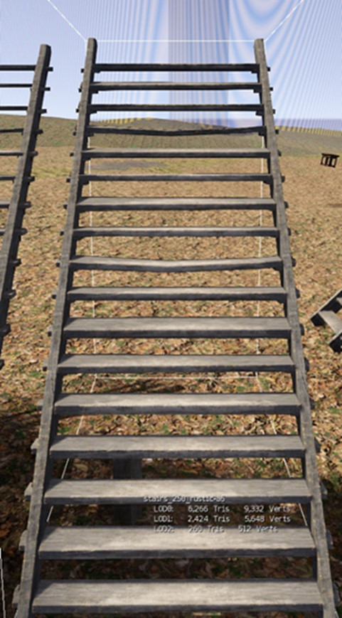

3 Drawcalls, 6,3k tris., large universal object. Asset should have one poly-reduced LOD (with only one ID).