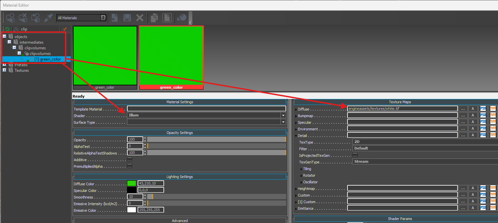
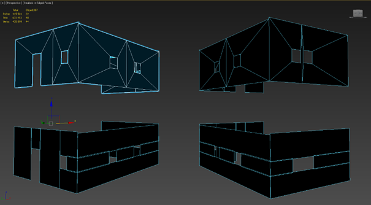
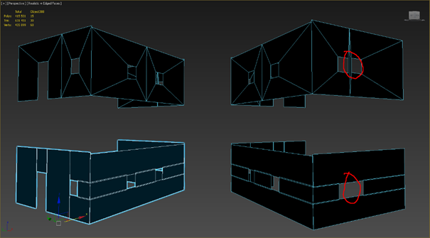
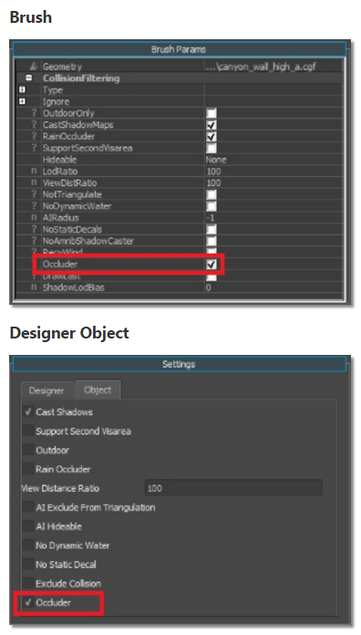
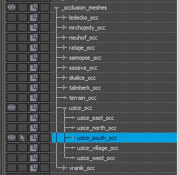
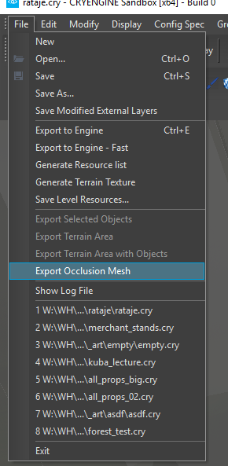

# Occlusion Proxy
# **Occlusion proxy, what is it**

Occlusion proxy helps the engine determine what exactly is needed to be rendered in a frame. It is used in one of the two coverage buffer occlusion techniques. First and the more important one is reprojecting data from previous frames, but the drawback of it is that if something wasn't yet visible back, then it is not taken into account. With fast camera sweeps during player's turning, this can be even third of the whole screen, and that's where static occlusion mesh comes to save the day.

It is being rendered on the current frame before everything else on CPU (that's why it is extremely important to keep it as light as possible), and the information is added to the information from reprojection.

The occlusion mesh is independent on render-mesh but is usually being created in 3ds Max to fit specific cgf. It is then placed into the level in a specific layer (s) and then exported and saved in the level's root as *occluder.ocm* file. This contains all the occluders in the level.

**!!!Important!!! You can only place occlusion meshes to where geometry won't change during the gameplay. Do not place them where layers are streamed out or in.**

**Terrain occlusion proxy**

There is also occlusion proxy for terrain. It's created from the real terrain mesh by simplifying it in 3ds Max (ProOptimizer...), split into segments and exported into the level into designated layer. Simplified mesh can protrude through real terrain, this is why whole occluder terrain mesh is translated several meters down. Also, make sure important terrain holes remain present after simplification (mine entrances etc.)

## **How to do it**

1. Create and export occluder as ordinary cgf in the 3ds max.
2. Place it into the level and align it to the render cgf.
3. Set Occluder flag
4. Move it to the proper layer.
5. Export occluder.ocm.

**!!! A correct Material is necessary for the export!!!**
To have the **exporter process your Occ mesh**, they **need** to have a **proper CryEngine material assigned** to them, two options:
1\. The rapid "dirty" fix: Apply the same mtl from the structure you're creating and select a material ID without any alpha/ transparency, etc.
2\. The "cleaner" way: you can use the same material as the clip volume, or you can also create your own as long as it's a Cry Mtl same as the other used in the game.

{width=70%}
*in case you want to make your own, be sure to use the illum shader and have the diffuse slot fill with a basic 4x4 white texture, the diffuse color has no importance here aside maybe make it easier to work in max by using a saturated color to spot any clipping through walls, etc.*

## 

## **Creation**

1\. While creating the occlusion mesh, it is of paramount importance to keep it as light as possible. Keep the triangle count as close to a single digit as possible. Really!

You don't have to bother with proper triangulation and connection between the triangles. Usually everything can be more optimized if you build it out of planes. This saved almost 40 % of triangles without compromising occluding in any way on the example below.

Small features of the mesh can be disregarded completely.  Note how the small column between the windows on an image below was omitted. Only big shapes are cost-efficient on occlusion proxies.

It is also unnecessary to create mesh for interior/interior walls (including floors and ceilings), **but interior/exterior walls need to have the mesh from both sides** – **only the side facing the camera is occluding**.

**Tips**
\-an easy way to process is to build the outside part, then duplicate it and flip the face toward the inside to have 2-sided Occluder then

It is necessary to **align occluder's pivot to the pivot of the visual mesh it belongs** to, this will make placing in the level easier.

Regarding naming, please add _occ suffix to the name of the proxy.

2\. Load the occluder mesh cgf into the level and place it where you want it to be

3\. Set occluder flag in object properties

4\. Our occlusion meshes must be all under the *_occlusion_meshes* layer separated into corresponding region layers.

5\. When you're done adding all the meshes you need, you can hit *File→Export Occlusion Mesh* and save it into the level's root as *occluder.ocm*. Make sure you have all the occluder layers loaded, otherwise objects in those layers won't get into the occluder.ocm. Also make sure you have the latest Data (i.e. latest all other occluder cgfs).

**Debug**

You can debug the content of the buffer with *e_coverageBufferDebug = 1*. You can also specify what part of coverage buffer you want to see:

* *e_coverageBufferReproj = 2* - only reprojection
* *e_coverageBufferReproj = 4* - only static occlusion mesh
* *e_coverageBufferReproj = 6* - both

Please note, to see changes after regenerating *occluder.ocm*, you need to restart the Editor because the file is not reloaded on the fly.