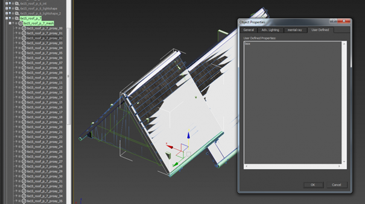
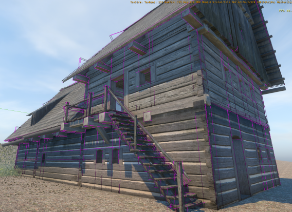
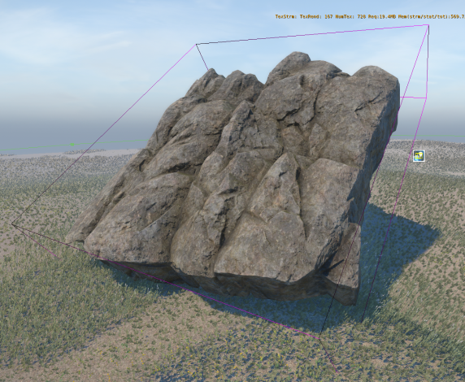
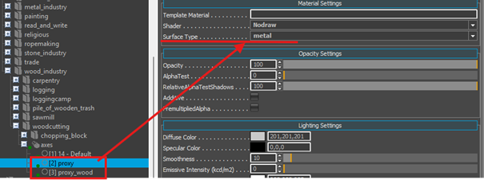
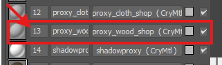
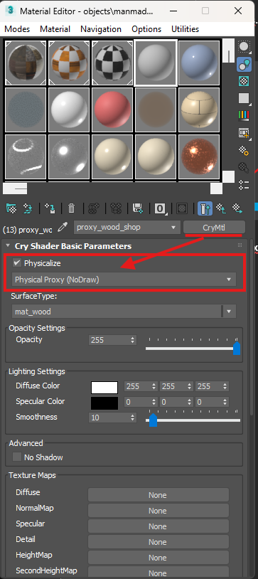
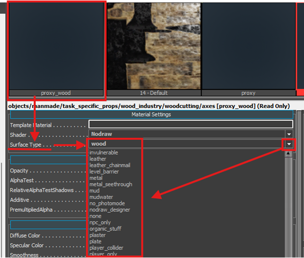
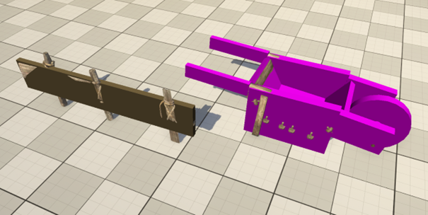
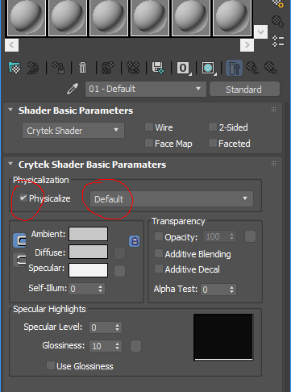

# Physical Proxy - Collisions
## **Purpose of physics proxies**

Physics proxies are a crucial part of an asset because they:

* block movement – objects with physics proxies (player/NPC, house, sword...) cannot pass through each other
* produce hit reactions – when one object hits another, it can, for example, trigger a sound effect or place a decal.
* allow enabling of the physics simulation – when you drop an object with physics proxy from your inventory, it will realistically fall down and won't get stuck in the air

**When should an asset have a physics proxy?**

Not all assets need physics proxies, because:

* every proxy eats up limited resources (memory when streamed in, CPU time every time the physics is tested)
* it adds complexity to the physics of the level (the more complex collisions in the level, the bigger the harder time player/NPCs have to navigate through it)

In general, small assets like small stones, twigs, bowls and cups don't need physics proxies. However, if these are supposed to be pickable, then they need it.

## **How to create a proxy**

Proxies are created in 3ds Max, linked to the mesh which they represent. Proxies can be a mesh or preferably some primitives. The simplicity of proxy for collision calculation from simplest to most difficult is: sphere, capsule, cylinder, box, trimesh

**Using primitives is usually better.** However, try to stay as close to objects' true shape as possible. Some calculations are dependent on shape; for example, a thrown rock hitting cube with spherical proxy will bounce off strangely.

**In the case of primitives, the type of primitive has to be stated in Object Properties.**

This shows the linking of proxies in the scene and primitive definition in the Object Properties dialog in 3ds Max.

**Collision and Merge node**

If you use the Merge node, proxy meshes are linked directly to the Merge node. In order for the exporter to recognize proxy primitives, they have to have a "proxy" string somewhere in them.

**Collision box**

Also, for some calculation (e.g. line of sight) in the engine, the bounding box of a collision is used. Therefore, it's important to check that in the Editor and make sure it doesn't deviate much from the actual proxy. To do that, write **p_draw_helpers s_t(1)** into the console and hit Enter. Something like this will show up (those violet wire boxes around each proxy):

&nbsp;&nbsp;&nbsp;&nbsp;&nbsp;&nbsp;&nbsp;&nbsp;&nbsp;&nbsp;&nbsp;&nbsp;&nbsp;&nbsp;&nbsp;&nbsp;&nbsp;&nbsp;&nbsp;&nbsp;&nbsp;&nbsp;&nbsp;&nbsp;&nbsp;&nbsp;&nbsp;&nbsp;&nbsp;&nbsp;&nbsp;&nbsp;&nbsp;&nbsp;&nbsp;&nbsp;&nbsp;&nbsp;&nbsp;&nbsp;&nbsp;&nbsp;&nbsp;&nbsp;&nbsp;&nbsp;&nbsp;&nbsp;&nbsp;&nbsp;this is good

&nbsp;&nbsp;&nbsp;&nbsp;&nbsp;&nbsp;&nbsp;&nbsp;&nbsp;&nbsp;&nbsp;&nbsp;&nbsp;&nbsp;&nbsp;&nbsp;&nbsp;&nbsp;&nbsp;&nbsp;&nbsp;&nbsp;&nbsp;&nbsp;&nbsp;&nbsp;&nbsp;&nbsp;&nbsp;&nbsp;&nbsp;&nbsp;&nbsp;&nbsp;&nbsp;&nbsp;&nbsp;&nbsp;&nbsp;&nbsp;&nbsp;&nbsp;&nbsp;&nbsp;&nbsp;&nbsp;&nbsp;&nbsp;&nbsp;&nbsp;&nbsp;this is bad
The second bounding box doesn't respect the geometry much. It would be much better to split the collision proxy into more pieces.

## **Proxy material**

All proxies have the same material as the object they're proxying for. Also, if we want the proxies to represent different surface types, more submaterials have to be assigned to them in the material. Let's say I make an axe... the handle will have proxy with material ID 1, and the metal part will have material ID 2. To these IDs I then assign different physicalized submaterials. In this case IDs 3,4 ... 32 can be used for standard non-physical materials.

**!!! Important for your proxy to work!!**
In Max material editor be sure that in your mtl Id settings

**"Physicalize “ is checked and set on: "Physical proxy (No Draw)“**
{width=363px}

## **Engine side - surface type**

Surface type for different proxies is then set in the editor's Material.

It affects:

* sound triggered during hit reaction
* particle effect spawned during hit reaction
* decal placed on the asset during hit reaction
* pierceability of the asset (when shot at)
* transparency (whether NPCs will see through the object, e.g. through bushes or glass)
* walkability (whether navmesh is generated on the asset)
* whether the horse ignores that collision
* whether only horse collides
* whether only player collides
* whether it's a special stair collision
* etc.

  

  In case you can't find a proper surface type, you can add one yourself to W:\\WH\\Game\\Libs\\MaterialEffects\\SurfaceTypes.xml; however, this should be done and upon the agreement of your team leader.

  Naming of them should be self-explanatory. However, there might be some confusion. See a brief overview of some of the surface types:
  * fabric – for apparel assets made of fabric, only (it bleeds when you shoot it :) )
  * fabric items – for non-wearable assets made of fabric, i.e. laundry on the line, curtains etc.
  * sack – for assets made of fabric which are not meant to be shot through, for example, sack
  * wood – general wood assets
  * wood_unwalk – wood assets we know player or NPC will never be able to walk on; this will not generate navmesh and therefore save memory and reduce the complexity of path finding
  * player_only – such a collision blocks only player's movement
  * horse_only – such a collision blocks only horse's movement
  * slope, stairs_wood, stairs_stone – special surface types for stairs

  You can display collisions in the scene by using cVar **p_draw_helpers 1**.

  Notice how different surface types are shown in different colors (wood – brown, thatch – yellow, etc.). Every physical proxy should have defined some surface type, and you can spot the missing surface type by bright purple color.
  
  &nbsp;&nbsp;&nbsp;&nbsp;&nbsp;&nbsp;&nbsp;&nbsp;&nbsp;&nbsp;&nbsp;&nbsp;*Barrow on the right has a missing (has default) surface type*

**Visual mesh as a physical proxy**

* **On very rare occasions**, you can use visual mesh itself as a physical proxy instead of making extra mesh/primitive:
  * for terrain assets where proxy should follow visual mesh precisely
  * for testing purpose

  To do that, set material ID property in 3ds Max as following:
  

**Editor object as a proxy**

* There is a way how to create a physical proxy right in the editor by using editor object - Designer. Create Designer (to by found in Objects rollout) to your liking and assign proxy material to it (for example, *Materials/default/collision_proxy_material*). This method could be used, for example, to prevent a player from getting stuck in some complicated area by blocking it with Designer objects.