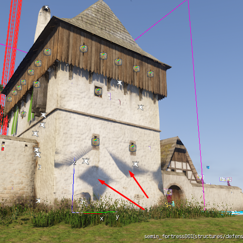
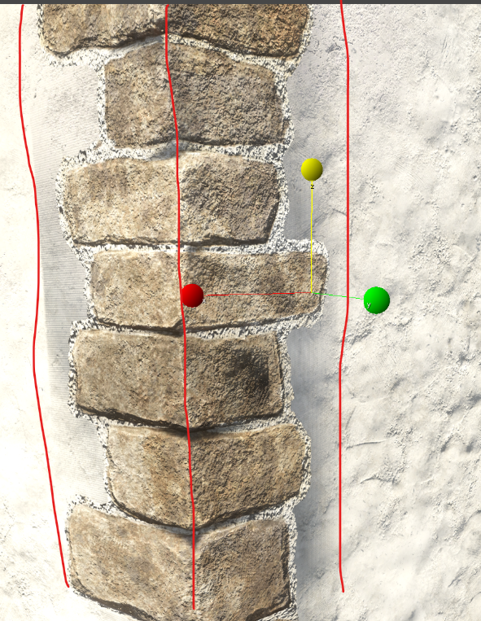
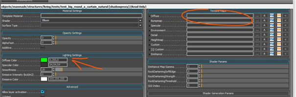
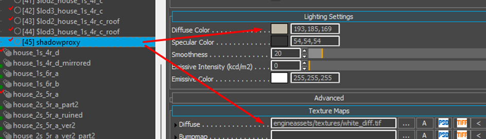

# Shadow Proxy
# **Shadow-proxy:**

Since we need to save as many draw calls as possible, we will create a shadow proxy for most of the objects we have in the game. It helps because shadow-map rendering doesn't care about any surface property of a material, only geometry, so we can actually merge what would be many drawcalls into one. Shadow proxy is an optimized geometry of the model without alpha-blended parts (decals mostly) with a dedicated single material ID and a shadow proxy sub-material set in CryENGINE material.

The process is explained here, so please take a look at the [CryENGINE documentation](https://www.cryengine.com/docs/static/engines/cryengine-3/categories/1114113/pages/21268752)

## 

## Warhorse Shadowproxy pipeline guideline:

**!!! We use shadow proxy only for the LOD 0 and LOD 1 !!!**

The generation of shadow proxy is quite the same as the LOD except that **we get rid of all the decals and alpha** id material to keep only the **"hard"** mesh.

For the **LOD 0** be careful to keep **enough resolutions** in the **decimation/ optimization.** This is because the player is going to navigate in the middle of those shadow proxy (as it is LOD 0) and **pay more attention** to the roof and the wall as some artifact might be visible

For the roof I recommend staying at least around 60-65% of reduction, **sometimes it is necessary to do some manual fix** on the shadow proxy, we can use a **Push** modifier or just **move the vertices by hand**.

Here the corner has to be excluded from the shadow proxy and uncheck "no shadow" in the material ID.

## **Material tweaks:**

**After you export it, you have to do some tweaks in the editor:**

you **MUST** fill in texture textures/defaults/white_diff.tif and **setup Diffuse color** to the overall asset color

So we must have filled diffuse slot for texture in shadow-proxy, so we use a basic
256x256 white texture.

{width=70%}

All the other mat id have to have the "**No Shadow"** checked **with as exception of the thatched roof id, hay, stone corner, straw etc.**
This exception can be applied as well to the **roof-edge borders** that are using also alpha cutout to have a correct shadow cast on the floor. **But be careful** for that last part as if it is a **roof from a tall building**, there is no need to do so as it is so far from the ground that it wouldn't have any real visual impact.