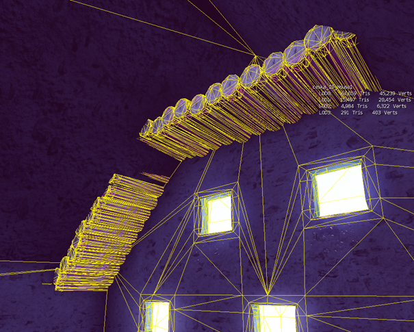
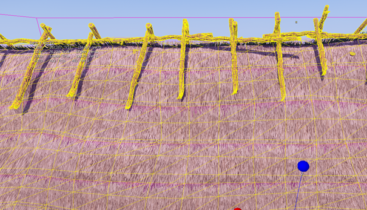
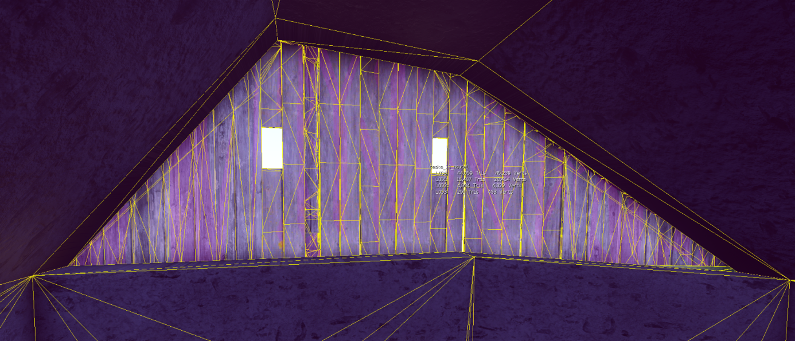
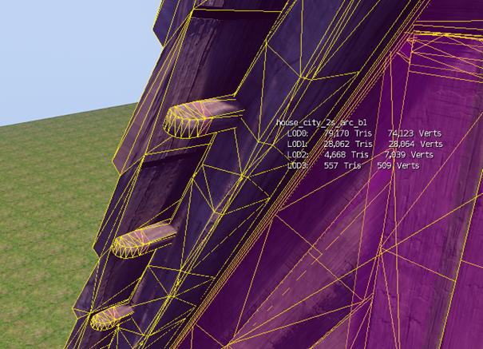
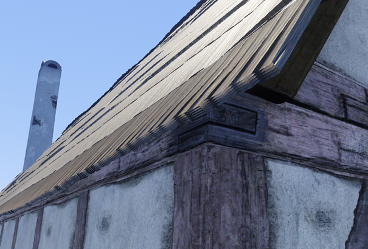
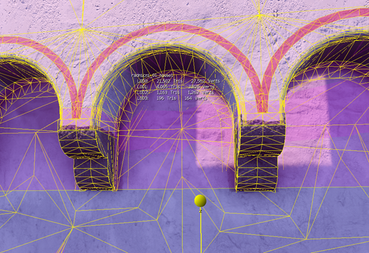
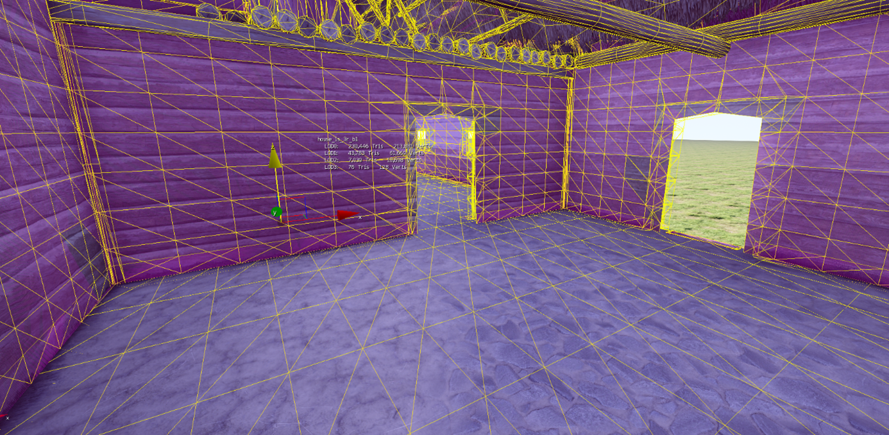
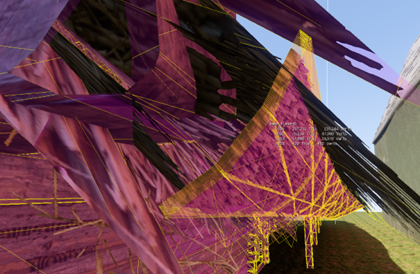

# General mesh optimization guidelines
## **Some useful rules to keep in mind**

When your meshes are way too polygons heavy and there’s a problem to fit them into memory, especially on consoles. There’s a need to optimize them more or rather fix them so they don't waste polygons as much as they do now.

**Delete what is not visible**

* This is very true for inaccessible houses

  
  *So many polygons are wasted inside inaccessible houses. You can use Slice modifier to easily cut away excessive part*

**The further from the player, the lower the level of detail**

* You can model distant planks according to the LOD1 or LOD2 tri count

  
  So many polygons, even with LOD2 tri count planks would be perfectly ok here

* Plank used under a dark roof can also be "LODed“
* Do not use planks where not necessary – for example, roof gable in inaccessible houses can use tiling texture instead of actual planks

  {width=70%}

  &nbsp;&nbsp;&nbsp;&nbsp;&nbsp;&nbsp;&nbsp;&nbsp;&nbsp;*The gable of the inaccessible house is made of planks and has all the polygons inside*

* Create the most simple ends where not visible

  

  *Small beams under the high roof that use polygon-heavy ends, this is not necessary*

* Only one layer on the roof edge high above

  

  *This roof edge is 11 m above the ground, one or two layers are perfectly ok*

* Optimize distant arcs

  

  This here is way too much as it’s high above the ground so far from the camera

* Optimize flat walls
* Be careful to avoid tessellated walls for no reason, without vertex paint extra vertices are not used

  {width=70%}
* Same for barely visible high roofs, avoid tessellation too much (this could be valid for houses which are standing next to each other; you need to check in the level first)
* Delete at least every second layer of thatched roofs (and even more for roofs high above the player). Don't delete upmost layer, otherwise the roof edge will be see-through

  

**Separate model into multiple cgfs**

* Complicated interiors could be separated into their own CGF (for example, basement under the house) and set up with very low ViewDistRatio.

**Shadowproxy**

* When the optimization is done, if needed, remember to rebuild Shadowproxy and LODs