# Details mapping - Detail atlas
# Detail Mapping

**How is it used**:

In our shader we used quite several details maps to add an additional layer of frequency in the texture, really fine detail like the grain of a stone or the fiber of a plank for a really small price in terms of performance. As those detail maps are 512X512 tillable texture and allowed us to add those finer details to big structures and really large walls, buildings, etc.

**Here we can see in our shader where the detail map is actually loaded.**

## 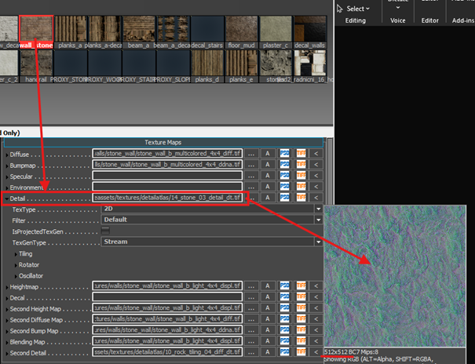

## **!!! to avoid shader/ data error, work only with the .tif file!!!**

**512X512 ok, but that is too low for a huge wall.**

Yes, it’s true, and we did enjoy the fact that those are tilling texture to make them tile to match the texture resolution.

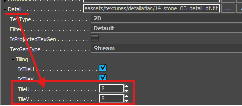
There’s some base value in the Asset Documentation page that we keep in mind, and sometimes it’s just a question of looking how it is and if it looks good or needs more / less tilling.

And for shaders that are using some blend mask between two materials, then we have two detail mappings
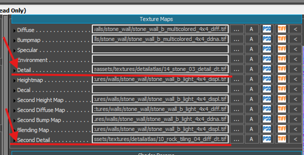

**Sounds amazing how do I get it!!**

in the shader Generation parameters find the detail mapping checkbox and enable it.

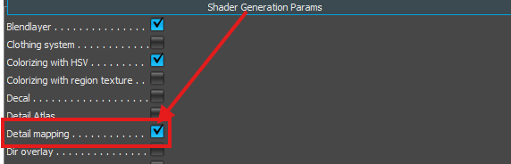

then go in the shader parameter to find the details map setting

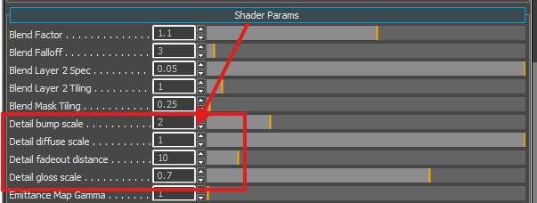
\- Detail bump scale: how much the details themselves are going to be visible
\- Detail diffuse scale: how much the diffuse color will be visible from the details
\- Detail fadeout distance: at which point the details are going to be faded in/out (here 10 meters)
\- Detail gloss scale: how much the glossiness of the details will be visible.

# 

# Detail Atlas

Detail atlas allows us to be able on one object with a single material (and single drawcall) to set up several different detail maps.
Like in a cabinet where the main wood materials use a wooden detail map and where the hinges would use a metallic detail map

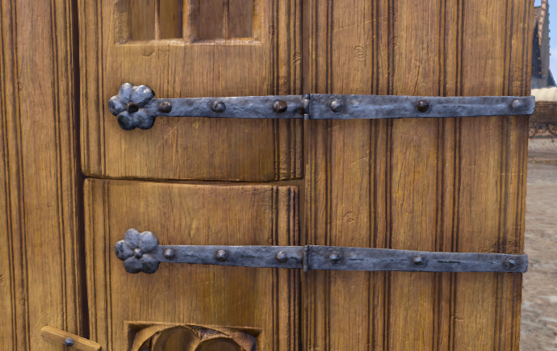

## To tell which part uses which detail map, you need to make a mask map with

suffix _dt, where particular shades of grey represent a particular detail map (for example, RGB 200, 200, 200 is metal_brushed).
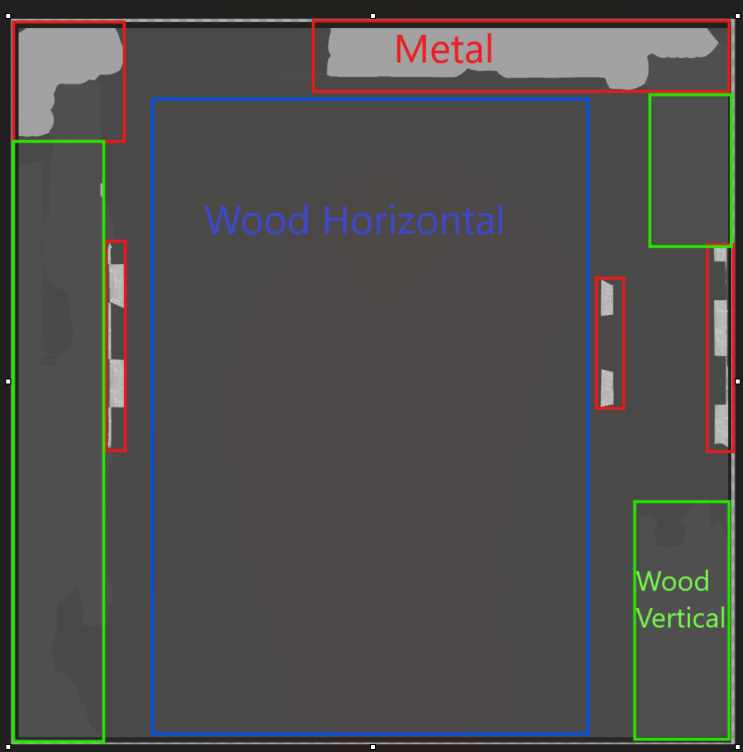

**You can find all the detail maps and their respective greyscale values in the [Library chart](KM-A-59).**

**Setting up the shader**
Same as the detail mapping, you need to activate it in the shader parameter:

## **!!! be careful here to activate the Detail Atlas!!!**

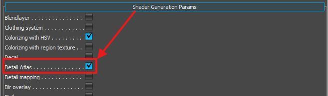

once this is done for the rest, it is the same as previously, **put your detail atlas in the detail slot**
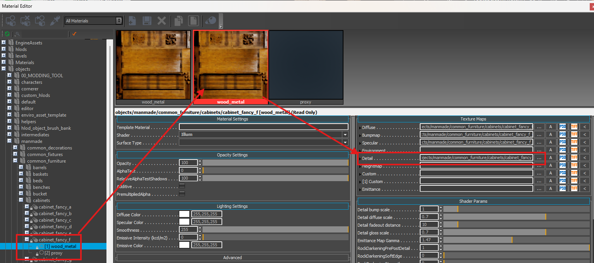{width=70%}

Once it's done, you have access to the same parameter as in the detail mapping. You can set up the tilling the same as before.
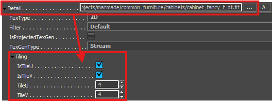
And you will also have access to the detail parameters.
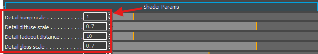