# Texel Ratio
## **What is it?**

The word texel is just a fancy term for a pixel belonging to a texture. Consequently, the texel ratio is a ratio between model size and texture size. It is a per-triangle value. That means a single object can have as many different texel ratio values as the number of triangles. The equation is sqrt(Triangle mapping area / Triangle area in meters \* Texture side size in pixels), and the result is in texels/meter. I know, I know, you want pictures.

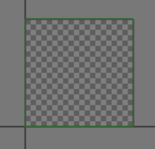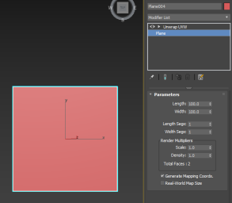
Here is a plane with a size of 100cm x 100cm. It is mapped on the whole [0,0] [1,1] uv range. Now what is it's texel ratio? Right, cannot tell, because we don't have a texture. Let us say the texture is 512x512 pixels, what now? Now the texel ratio of both triangles in this quad is 512/m.
 
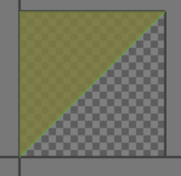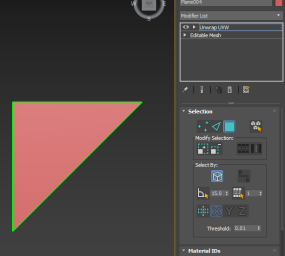
I have deleted one of the triangles. Did anything change? Nope, still 512/m.

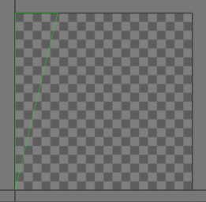
Here, I have changed the size of the triangle in both mapping and world. I moved just the vertex on the very right closer to those on the left. Does this change the ratio? Nope, the ratio is still 512/m. This is because mapping area gets divided by world area, so nothing changes as long as you change both the same amount.

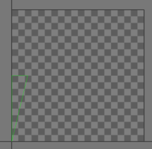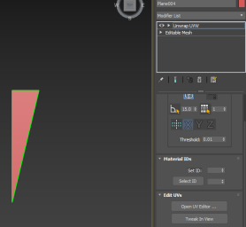
Now, I have kept the world positions the same but shrank the mapping to 50% of the original size. What do I get? Texel ratio of 256/m. Right? Yes, the resulting mapping area is now original/2. Because neither the world size nor the texture size changed, the whole thing is now equal to half of the original.

**Why is it important?**

The human brain is not very good at measuring exact values. You can feel cold during summer once the temperature drops below 20 degrees Celsius, while you're hot in 20 during winter. The temperature is the same in both cases, yet we feel it as quite different. That's because we are good at comparing values.

Well, how come we aren't able to compare the temperature during winter to the one in summer? This ability to compare values is at it's best while we perceive both simultaneously. We cannot really remember a value well (unless we measure it and remember it as a number, but then we cannot translate it back to the value).

So when a player plays our game, he is not very good at saying how big our textures are. He can compare it to other games he played, but unless he plays them simultaneously, the comparison won't be very good. But he can very well compare the textures that are in the game at the same time near each other. And if one has a lower texel ratio than the other, you can bet the player will perceive the low-res one as blurry and not the high-res one as really sharp. Therefore, we should try to keep the texel ratio consistent, otherwise we will be judged by the textures with the lowest resolution.

**How to check it?**

On the page [Assets creation](KM-A-45) is briefly described how to check the texel ratio in CryEngine level editor.

And here is a more detailed version if needed:

**Method**

1. Open the editor, load a level and find the object you want to check.
2. Right-click any empty space on the toolbar at the top.
3. Choose ViewModes from the menu if it isn't active yet
   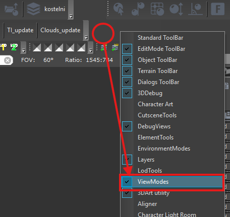
4. Press the button with your target texel ratio written on its icon.
   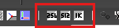
5. Inspect the object and compare the values seen on it with the scale shown at the bottom right of the viewport.

**Alternative method**

1. Open the console variables dialog by pressing the "..." button on the bottom right. (the key: **`` `~ ``**  over tab to display the console)
   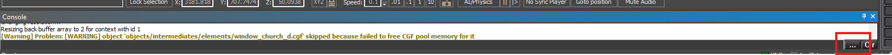{width=70%}
2. Find variable r_TexelsPerMeter (use the filter textbox at the bottom of the dialog)
3. Set its value to your desired target texel ratio
   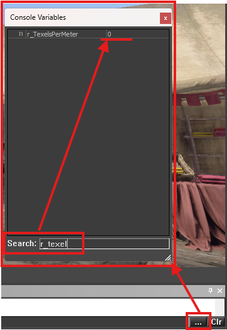

**Remarks**

The scale can be deceiving. The middle of the scale is the correct ratio, shown in green, white and black. On the right, there's at least twice the ratio in red. Now on the very left in dark blue, it is not half the target ratio, but rather infinitely small ratio. Half the target ratio is in the middle between the center and the left. Keep that in mind while checking!