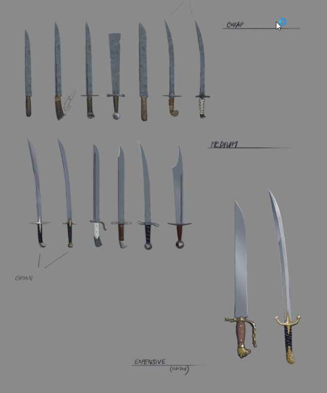
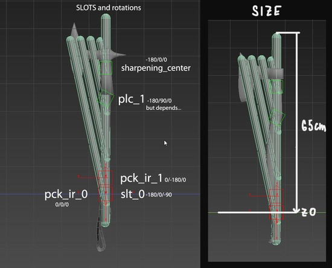
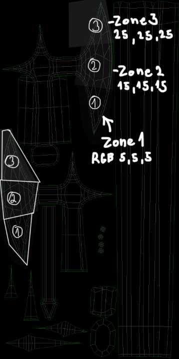
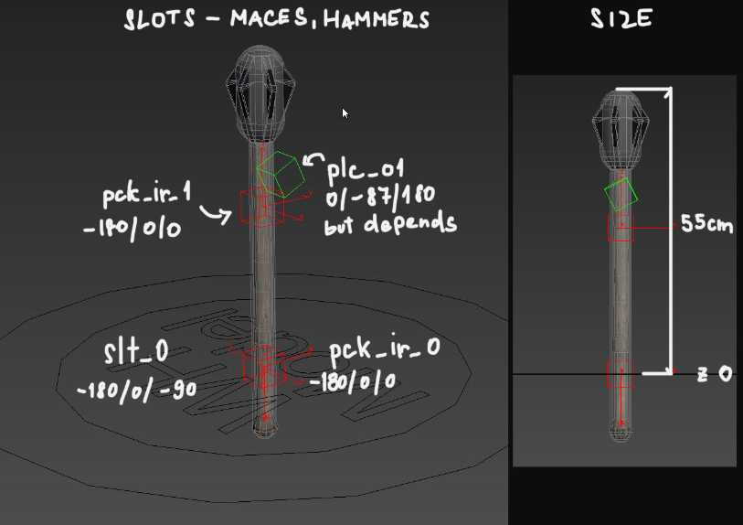
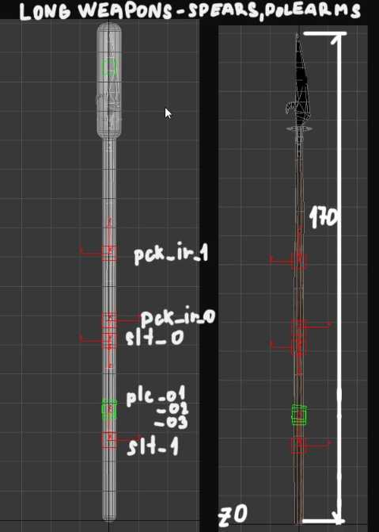
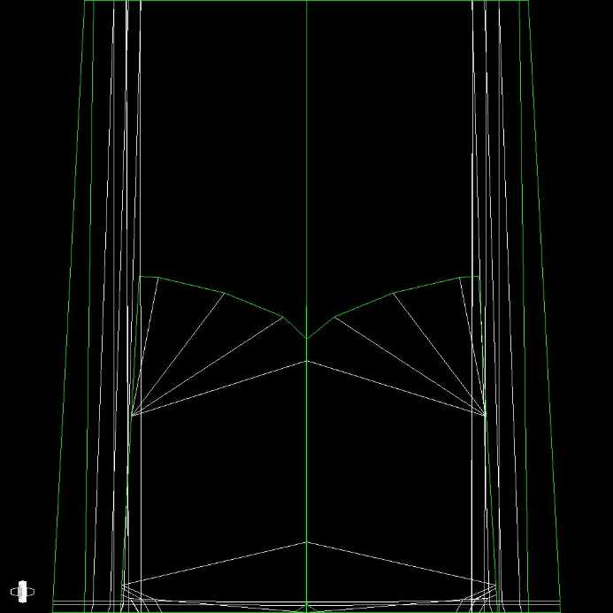
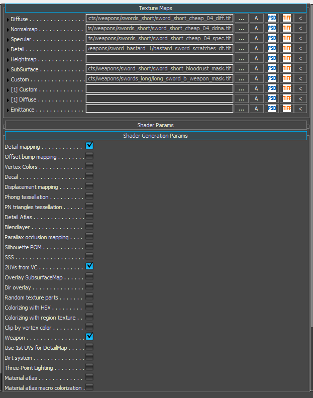
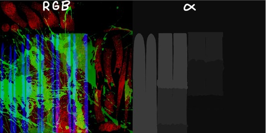
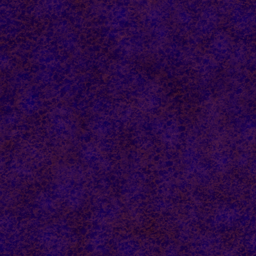
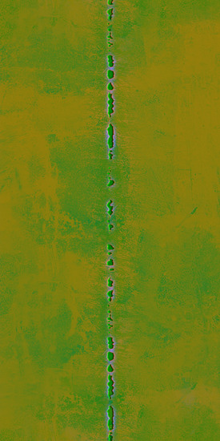

# Weapons
## General modeling remarks

* Don't be afraid of using quite a lot of polygons in LOD0, because we need a lot of fidelity while the player is wielding weapons. Some Sabres and Hunting swords in KC:D used custom normals to achieve the smoothest blade – (any modification of mesh will break smoothing).
* Weapons currently don't use LODs
* Some types of weapons are sorted by quality - **cheap, normal, expensive**. Most affected from the overall visual is the glossiness and specular of the blade, where cheap blades are smudgy with imperfect blade edge (in terms of mesh shape..chipped blade a bit), normal blades should look normal and expensive ones should be glossier with perfect shape.

#### 

## **Axes**

* cheap, normal, expensive

Size, slots etc.:

3 sharpening zones (**1** - *5,5,5*, **2** - *15,15,15,* **3** - *25,25,25*):

#### 

## Maces, hammers

* cheap, normal, expensive

Size, slots etc.:

{width=70%}

* no sharpening, only blood and rust mask needed

## Polearms

* no sharpening, only blood and rust mask needed

## Sword – long and short

* cheap, normal, expensive
* sharpening – 5 zones (1-5)

## **2nd UVs for blade damage**

For weapons which are supposed to be sharpened, we use blade damage texture (see below). To achieve that, we lay **second UVs** so that the edge of the blade is exactly in the middle of a UV space. Other parts of the weapon should be downscaled and moved somewhere to the corner. Artefact alert: keep UVs in 0..1 tile, **do not go over**.

## Materials and textures

**Resolution**
Lets try base resolution per weapon 2048px or 1024x2048 if needed… the most detailed parts and parts that are closest to the camera like cross-guard etc. could be slightly bigger in UVs to achieve better resolution for these crucial parts, on the other side, most of the weapons doesn't need such a big resolution for a blade which lacks detail anyway so the blade can be slightly (up to 30%) scaled down in UVs if needed.

If there are some super detailed engravings or details like that, decal with separate textures and UVs might be used to achieve high enough resolution

**Cryengine Weapons Shader**

A special Weapons shader is used for our weapons, enabling us to make the weapons gradually more bloody or rusty. The setup of this material is the main topic of this chapter. (operated within Cryengine)

### These checkboxes should be ticked in the material for it to function fully:

* Detail mapping - for edge damage
* 2UVs from VC - enables use of 2nd UV channel, which allows us to map the detailed damage on the edges.
* weapon - enables use of blood, rust and edge damage

### Textures we will be using

* Diffuse - unique per weapon
* Specular - unique per weapon
* Normal + gloss in alpha (ddna)  - unique per weapon
* Masks for rust, blood and edges and zones - unique per weapon
* Diffuse for blood and rust - shared by all weapons
* Edge damage - shared by all weapons

#### Diffuse

Nothing special here. We don't need any information in alpha. Just remember in the case of metal parts that you need to make it pretty dark (as the metals have very low diffuse reflectivity)

#### Specular

Nothing special here either. Just make it bright for metal parts (as the metals have very high specular reflectivity. Values around 180, 180, 180 sRGB are a good start).

#### Normal

As usual.

#### Masks

R – rust, G – blood, B – edges, Alpha –  5 sharpening zones. The example below shows mask texture for the sword.

**R channel** – RUST – similar to G but it controls the spread of rust. Keep the range 0-180 as well (some BW rusty grunge map should work well) .

**G channel**  – BLOOD  – specifies where the blood will appear while hacking and slashing some flesh. Values here work with Blood factor in material properties and it generally says where is the threshold for blood. So the brighter the value the sooner the blood appears. It takes some trials to make this channel right. And the values shouldn't be brighter than 180/255 because of the algorithm used ( use the levels to clip the values)

**B channel** – EDGES – shows where the edges of the weapons blade are and will mask the effects of sharpening

**Alpha** – ZONES – Basically paint the blade from the bottom up with RGB values: ZONE 1 - 5,5,5; ZONE 2 - 15,15,15; ZONE 3 - 25,25,25; ZONE 4 - 35,35,35; ZONE 5 - 50,50,50. Everything else should remain 0,0,0.

#### Diffuse map for blood and rust

Contains rust diffuse in R, rust specular in G and blood diffuse intensity in B (the color of the blood is picked by swatch) This map is the same for all the weapons:

#### Edge damage

Detail map mapped in 2nd UVs and is shared for all the weapons.

#### Shader Params explained

Detail bump scale – set to 0,7–2

Detail diffuse scale – set to 0,4–0,7

Detail gloss scale – set to 0,2–0,5

Fresnes Bias – as usual around 0,15 for non-metals and around 0.8 for metals

Fresnel Scale – as usual set to 1

Tiling for second UVs textures in U – 1

Tiling for second UVs textures in V – 1

Weapon Blood Color – sets the color of the blood - 200,0,0

Weapon Blood Factor – this determines how much blood is visible on the weapon. Use it to set the blood mask right and then leave it at 0

Weapon Blood Falloff – influences how sharp the edges of the blood will be, cca 15–60; depends on input mask

Weapon Blood Gloss – gloss of the blood. Around 190–220 should be right

Weapon Blood Scale – scales the blood diffuse, 4 is just right for sword-sized weapon

Weapon Blood Specular – specularity of the blood in range 0–1; 0,15 should be ok

Weapon Rust Blend – this is the opacity of the rust layer

Weapon Rust Factor –  this determines how much rust is visible on the weapon. Use it to get the rust mask right and then leave it at 0

Weapon Rust Falloff – influences how sharp the edges of the rust will be, around 5 looks ok (depends on input mask)

Weapon Rust Scale – scales the rust diffuse and spec

Zone0-5 Quality – used in sharpening minigame ( zone 0 –_ *0,0,0* _is not used )

Zone0-5 Scratches – used to damage the weapon during fights ( for swords zones 1–5, for axes zones 1–3)

## Pipeline from zero to hero

* Sculpt a detailed hi-poly model and decimate to cca 500K tris max
* Create a lowpoly model and 1st (bake) and second (blade edge damage) UVs and export as fbx
* Bake with SubstancePainter ( make sure lowpoly fbx is triangulated from 3dsmax to avoid shading artefacts in engine later)
* Use or create new smartmaterials in substance painter for effective reusing on other models
* Paint Weapon masks in substance Painter ( tool in progress 05/21)
* Export textures with our texture exporter to Crytiff ( diffuse, specular, normal+glossiness, weapon masks needed)
* Create slots and collision proxy according to latest requirements
* Export cgf to the game and set the shader parameters