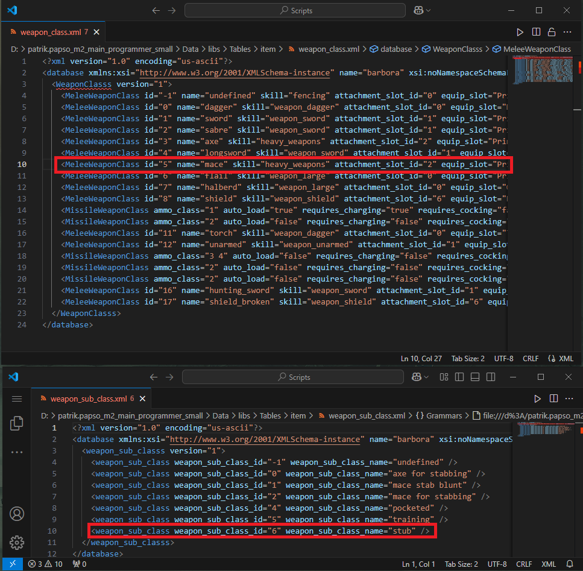
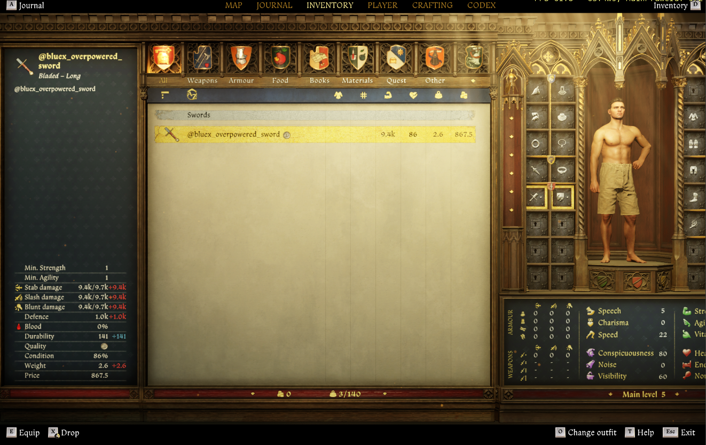

# Adding a new Item
KCD2 stores all the database entries in .XML files found in `Data/libs/Tables/...` or in `Tables.pak/Tables/...` - the summary and more information about them can be found at [KM-A-12](../../KM-A-36 Technical Overview/KM-A-3 Structure of a Mod/KM-A-12 Database tables/README.md).

There are a lot of database tables that control all sorts of things in the game - since we can't cover every aspect of the game, let's focus on a (probably) frequent and simple use case: adding a new item to the game.

### Creating a new item

All the items are in the tables at `Data/libs/Tables/Item/item.xml` and its subfiles, e.g. `item__unique.xml`, `item__alchemy.xml`. These subfiles are there just for easier browsing and editing. The whole item system is a bit too complicated for a tutorial of this scope, so we can use entries in these files as a template to create our own items. **You should always mod the base file, not the sub-files.**

Our mod will be called `sword_example`, so we will use this as the mod's `modid`.

1. Create a mod's patch table for items, it should be located in `Data/libs/Tables/Item/` and called `item__<modid>.xml`, in our case it's going to be `Data/libs/Tables/item/item__sword_example.xml`.
   1. The game will load this "patch" file and modify an existing entry or add a new one
2. We want to add a new sword that will be extremely overpowered and called after us. First of all we need to find a correct row to use as a template for our sword.
   1. All melee weapons are grouped up together and use `<MeleeWeapon ...` tag, then they further divide into different weapon classes.

Let's study a randomly chosen `<MeleeWeapon..` entry and see what item it creates (the name parameter obviously spoils it - it's a Warhammer):

```xml
<MeleeWeapon Attack="20" AttackModStab="0" AttackModSlash="0" AttackModSmash="1" Class="5" SubClass="6" Defense="8" MaxStatus="1" StrReq="3" AgiReq="5" IsBreakable="false" Visibility="1" Conspicuousness="1" Charisma="5" SocialClassId="0" WealthLevel="17" MaxQuality="1" IconId="mace_broken" UIInfo="ui_in_warhammer03_trollslayer_broken" UIName="ui_nm_warhammer03_trollslayer_broken" Model="manmade/weapons/war_hammers/warhammer03_damaged.cgf" Weight="1" Price="1" FadeCoef="133.333328" VisibilityCoef="0.83666" Id="93a87db1-c332-409a-9044-6e54b516c0ee" Name="warhammer03_trollslayer_broken" />
```

We can see the parameters `Class="5" SubClass="6"` , let's cross-reference these to tables `weapon_class.xml` and `weapon_sub_class.xml` to check what they mean:

{width=70%}

Thanks to that, we now know it's a mace (that uses heavy_weapons skill), equips into `PrimaryMainHand` and its subclass is `stub`.

3. After browsing `weapon_class.xml` we now know we want to find a `<MeleeWeapon...` with `class="4"`, because that's a longsword, e.g.:

```xml
<MeleeWeapon Attack="166" AttackModStab="1.05" AttackModSlash="1" AttackModSmash="0.2" Class="4" Defense="259" MaxStatus="141" StrReq="17" AgiReq="20" IsBreakable="true" BrokenItemClassId="584cf614-367b-413b-be8d-20bc5d275b74" Visibility="1" Conspicuousness="1" Charisma="5" SocialClassId="0" WealthLevel="0" MaxQuality="4" Clothing="Scabbard_LongSword04_m02" IconId="sermiry_longSwordGuild" UIInfo="ui_in_sermiry_guildSword" UIName="ui_nm_sermiry_guildSword" IsQuestItem="true" Model="manmade/weapons/swords_long/sermiri_long_sword_guild.cgf" Weight="2.6" Price="30985" FadeCoef="1" VisibilityCoef="16.75112" Id="036661e4-4556-4295-82f3-264e48cb2d49" Name="sermiry_longSwordGuild" />
```

This is a quest sword from the quest "sermiri", so we will have to modify a bit, we want to turn it into a normal item, increase damage, change the name, make it so it can't break etc. DON'T FORGET TO MODIFY THE GUID, since we don't want 2 items with the same GUID (the game would explode and we don't want that). Let's use an [online tool](https://www.guidgenerator.com/) to create a unique one.

4\. With all these changes, we end up with a file that looks like this:

```xml
<?xml version="1.0" encoding="us-ascii"?>
<database xmlns:xsi="http://www.w3.org/2001/XMLSchema-instance" name="barbora" xsi:noNamespaceSchemaLocation="item.xsd">
	<ItemClasses version="8">
    <MeleeWeapon Attack="1337" AttackModStab="10" AttackModSlash="10" AttackModSmash="10" Class="4" Defense="1000" MaxStatus="141" StrReq="1" AgiReq="1" IsBreakable="false" Visibility="1" Conspicuousness="1" Charisma="20" SocialClassId="0" WealthLevel="0" MaxQuality="4" Clothing="Scabbard_LongSword04_m02" IconId="sermiry_longSwordGuild" UIInfo="bluex_overpowered_sword" UIName="bluex_overpowered_sword" IsQuestItem="false" Model="manmade/weapons/swords_long/sermiri_long_sword_guild.cgf" Weight="2.6" Price="30985" FadeCoef="1" VisibilityCoef="16.75112" Id="f0307884-141d-485f-8667-b421391712de" Name="bluex_overpowered_sword" />
  </ItemClasses>
</database>
```


### Getting the item into the game

We managed to create the item itself, but right now the only way to get it is via a debugging tool (that you can't use in the real game)

1. The game uses inventory presets to populate NPCs/Stashes with items, these tables can be again found at `Data/libs/Tables/item/` and are called `InventoryPreset.xml` and subfiles are `InventoryPreset__...` . Same as with Item.xml - the subfiles are there for easier browsing and editing.

2. We will directly add this item to Henry's inventory, for that we have to find `InventoryPreset__player.xml` and check how it's structured

   

InventoryPreset__player.xml:

```xml
<?xml version="1.0" encoding="us-ascii"?>
<database xmlns:xsi="http://www.w3.org/2001/XMLSchema-instance" name="barbora" xsi:noNamespaceSchemaLocation="InventoryPreset.xsd">
	<InventoryPresets version="2">
		<InventoryPreset Name="inventory_player_bohuta">
			<InventoryPresetRef Name="inventory_tneb_bohuta" />
			<PresetItem Name="keyring" Amount="1" />
		</InventoryPreset>
		<InventoryPreset Name="inventory_player_henry">
			<PresetItem Name="keyring" Amount="1" />
		</InventoryPreset>
	</InventoryPresets>
</database>
```

Therefore, we want to patch `inventory_player_henry` and our modded `InventoryPreset__sword_example.xml` should look like this:

(Don't forget, that we want to patch directly InventoryPreset.xml and **not** the sub-table __player)
<span style="background-color:mistyrose;">(This will be changed in patch 1.3 - inventory presets will be easier to merge)</span>

```xml
<?xml version="1.0" encoding="us-ascii"?>
<database xmlns:xsi="http://www.w3.org/2001/XMLSchema-instance" name="barbora" xsi:noNamespaceSchemaLocation="InventoryPreset.xsd">
	<InventoryPresets version="2">
		<InventoryPreset Name="inventory_player_henry">
			<PresetItem Name="keyring" />
      <PresetItem Name="bluex_overpowered_sword" />
		</InventoryPreset>
	</InventoryPresets>
</database>
```


### Testing the mod

Now that we created a new item and added it to the player's inventory, let's check ingame if everything works! kcd.log looks good, both table patches are loading correctly:

```xml
<16:25:41> Patched database Item with file `item__sword_example.xml`.
<16:25:42> Patched database InventoryPreset with file `InventoryPreset__sword_example.xml`.
```

When we open Henry's inventory, we can see our overpowered sword sitting there:

{width=70%}