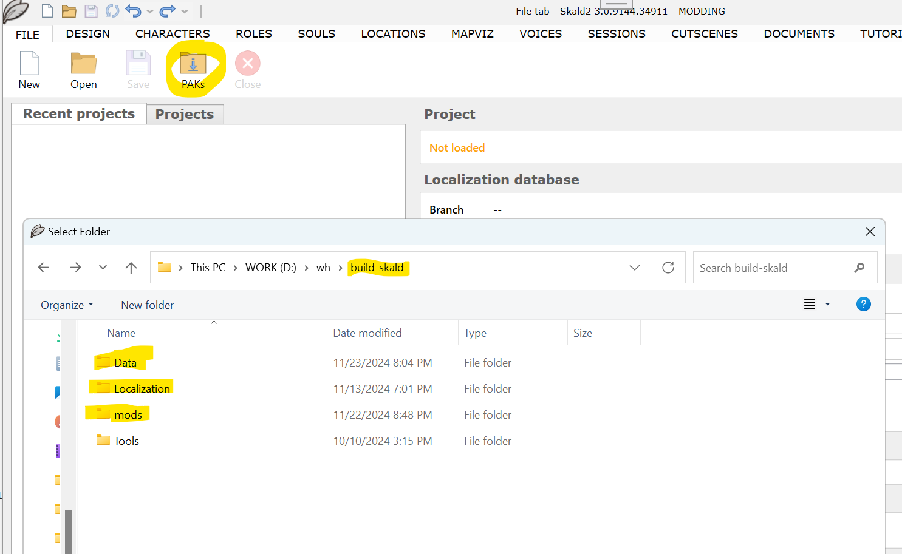
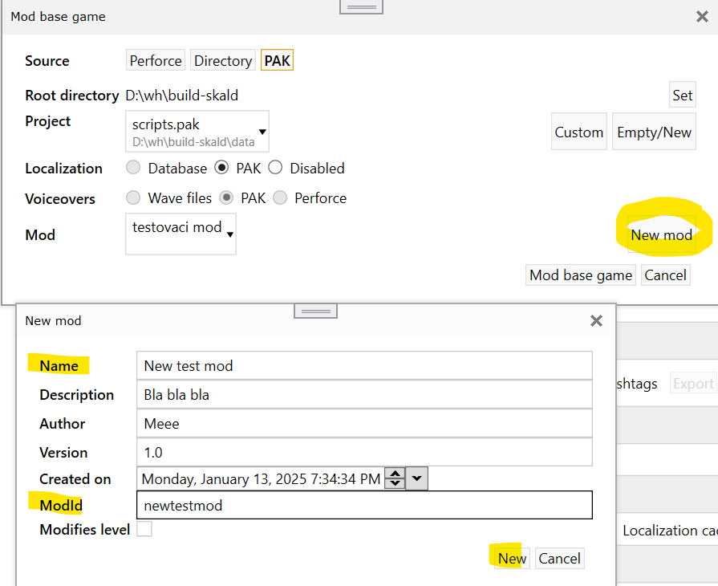
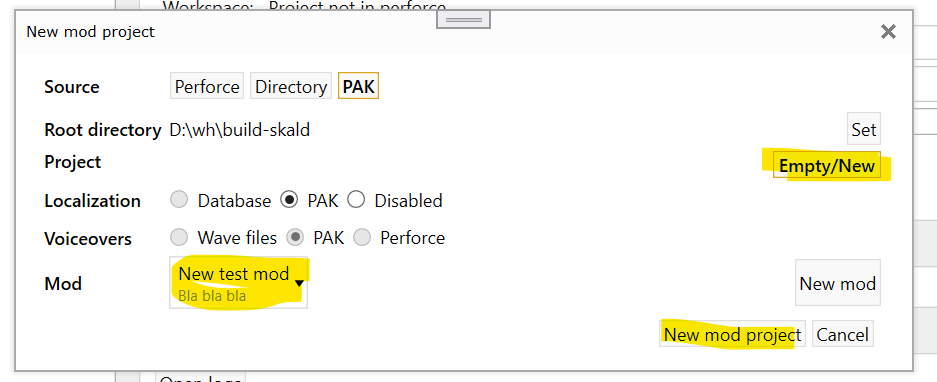
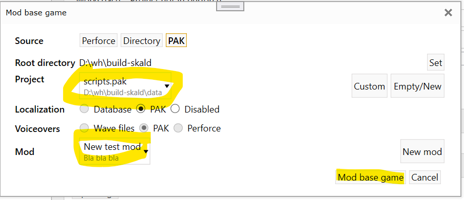
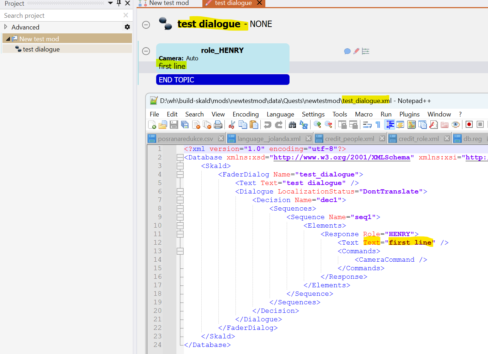
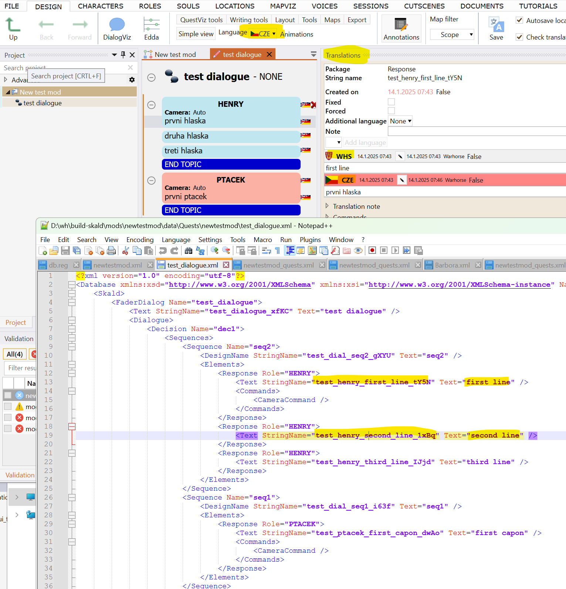
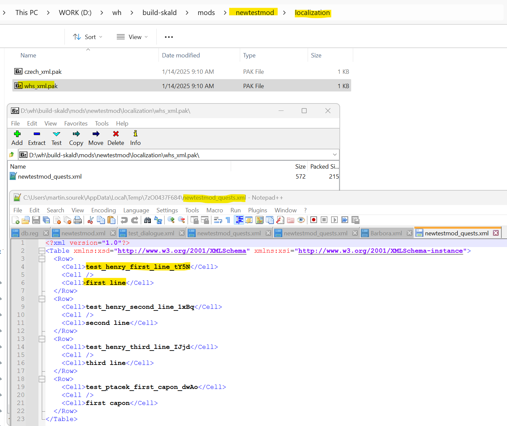
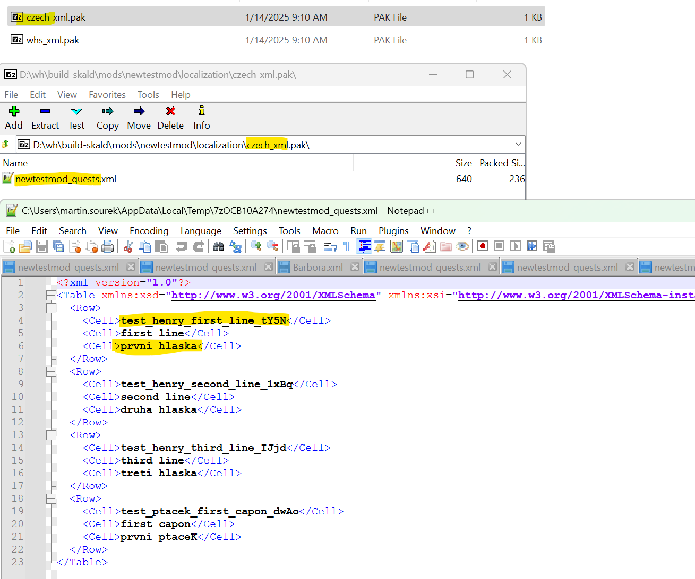

# Skald
Skald is a tool for modifying quests, dialogues and localization

## Projects

### Create/Open a project

Click the PAKs button to open/edit a project from game PAKs

Select the root directory of your game

Your root directory should contain

* Data/ folder with Developer,GameData,Script and tables.pak (and/or IPL_ variants).
* Localization folder with language.pak (voiceovers) and language_xml.pak (texts)
* Mods

{width=70%}

### Create a new mod

Just select **New mod** and fill **Name** and **Modid**

{width=70%}

### Create new project

Select your **mod** and **Empty/New** button, then create **New mod project**

Your project will be saved to *root\mods\modid\data\Quests\modid.xml*

{width=70%}

**Modify base game**

Select **script.pak** project and click **Mod base game** button

Changed and new xml files will be saved to *root\mods\tmodid\data\Quests\final\Barbora*...

{width=70%}

## Localization

### **Disabled**

all translations are saved in quest XML, Skald read and write it, but the game can load **Text** (WHS) attributes only.

{width=70%}

### **PAKs**

translations are saved to separated XMLs per language, each localized string has its own unique **StringName** attribute

*root\mods\modid\localization\language_xml.pak*

{width=70%}

### Translation

can be done in the **Translation panel,** or you can change the language of responses globally in **Languages** combobox

{width=70%}

### WHS

primary language, used in **Text attribute**, in our case it's a mix of **uncorrected** Czech and English, then corrected and translated to published languages (ENG,GER,CZE etc...)

{width=70%}

### Other languages

You can use Skald to translate, or you can take base WHS xmls, translate them manually to a target language and save them with another language name (*eg. you can take whs_xml.pak, translate content and save it as english_xml.pak, so both skald and game now load it as English localization)*

Format is following

`<Row>`

`<Cell>StringName</Cell>`

`<Cell>SourceLanguage (WHS) - optional, not loaded</Cell>`

`<Cell>TargetLanguage (CZE)</Cell>`

`</Row>`

{width=70%}

### 