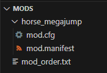
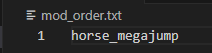
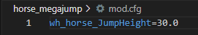

# Simple mod - Modifying cvars (console variables)
To create a mod that loads correctly, we must follow the structure listed in [KM-A-3](../../KM-A-36 Technical Overview/KM-A-3 Structure of a Mod/README.md). As an example, let's make a simple mod that modifies CVar `wh_horse_JumpHeight`:

1. Come up with a cool name for the mod, for this example let's call it `horse_megajump`
   * This will be the mod's `modid` identifier, it **must** contain only **lowercase** letters and **underscore**
   * We will use this identifier for the folder's name, mod_order and tables modifications
2. Locate a folder `mods` under KCD2's root
   * Create the folder if you can't find it, you probably haven't installed any mods yet
3. Inside the `mods` folder, create a new folder with our mod's modid - in our case `horse_megajump`.
4. The first thing we have to create is `mod.manifest`, this file will hold crucial information about the mod itself:

```
<?xml version="1.0" encoding="us-ascii"?>
<kcd_mod>
  <info>
    <name>Horse mega jump</name>
    <modid>horse_megajump</modid>
    <description>Your horse now jumps over buildings</description>
    <author>patrik.papso</author>
    <version>1.0.0</version>
    <created_on>2024-12-06</created_on>
    <modifies_level>false</modifies_level>
  </info>
</kcd_mod>
```

5. Since this mod only modifies a CVar - all we need is a `mod.cfg` file, the contents will be:

```
wh_horse_JumpHeight=30.0
```

6. For our great mod to load, we need to specify the ordering in `mod_order.txt`, this file should be located in the `mods` folder and include `modid` of the mods we wish to load. In our case it's only:

```
horse_megajump
```

---

## Finalized mod:

| Mods folder structure | horse_megajump files |
| --- | --- |
|  <br />**mod_order.txt**<br /> | **mod.manifest**<br />(above)<br /><br />**mod.cfg**<br />  |

## Additional debug

---

When launching the game, you can look through kcd.log to see if the mod loaded properly:

```
[Mod] 'mods/horse_megajump' has no version restrictions in manifest
...
[Mod] 'mods/horse_megajump' is not limited to any game version, it will be enabled
...
Loading config file 'mods/horse_megajump/mod.cfg' (mods\horse_catapult\mod.cfg)
...
<16:22:02> [Mod] Opening paks in mods/horse_megajump/data/*.pak
...
<16:22:20> [Error] XML reader: Can't open file 'Localization\text__horse_megajump.xml'
...
<16:22:30> Loading lua init script for mod horse_megajump...
<16:22:30> Loading and executing script file 'scripts/mods/horse_megajump.lua'...
```