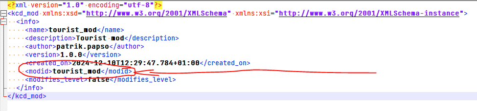

# Installing mods
Kingdom Come: Deliverance 2 supports Steam Workshop, which is intended as main avenue for installing mods. However, it is still possible to install mods manually, or with any 3rd party mod manager.

Installing mods does not disable achievements.

### Installing a mod from Steam Workshop

Click the Subscribe button in Steam Workshop. Mod will be automatically downloaded and used next time you launch the game

### Installing mod manually

Place the mod folder into mods/ folder in the game root. The mod needs to be unpacked, so that there is a folder (named after the mod) in the mods/ folder, that contains a mod.manifest file.
Example file structure after mod is installed:

```
KingdomComeDeliverance2
├ bin
├ data
├ ...
├ mods
│  ├ tourist_mod
│  │   ├ ...
│  │   └ mod.manifest
│  └ mod_order.txt (optional, see below)
├ ...
├ system.cfg
└ ...
```

### Mod loading order

By default, the game loads mods in following order:

* All mods subscribed to on Steam Workshop, in order provided by Steam API
* All mods in mods/ folder in the game root folder, in alphabetical order

You can customize mod loading by creating a mod_order.txt file in the mods/ folder. If this file exists, the game will read the file and interpret each line as an id of a mod to be loaded. The mods are then loaded in this order. If you have this file, mods NOT in this list will NOT be loaded at all.

ID of the mod is not necessarilly the same as the mod folder name (although it is recommended). The ID of the mod is whatever is specified in the mod.manifest file


### Troubleshooting

If you download a mod and it doesn't work, it could be caused by one of these problems:

* The mod doesn't support your vesion of the game - check the mod.manifest file for \<supports\> tag (you can read more at [KM-A-57](../KM-A-1 Modding Kingdom Come Deliverance 2/KM-A-36 Technical Overview/KM-A-3 Structure of a Mod/KM-A-57 Mod Manifest/README.md))
* You have a mod_order.txt file that doesn't include this new mod - if you have mod_order.txt, ONLY mods that are listed in this file are loaded, the rest are completely ignored (this includes steam mods)
* The mod requires manual installation steps - some mods that modify files outside data/ folder (such as shader paks) will not work out of the box and require manual setup, which should be provided by the mod author
* The mod is broken - maybe the mod is missing essential files, or uses the wrong pak format, or just has some bugs

To check for these issues, open kcd.log (in you game's root folder, e.g. **.../SteamLibrary/steamapps/common/KingdomComeDeliverance2**) and search for "[Mod]". If a mod is never mentioned, it means the game didn't find it at all (it is probably in a wrong folder altogether). Otherwise it will be at least mentioned, and if it isn't loaded, you will most likely find the reason here.